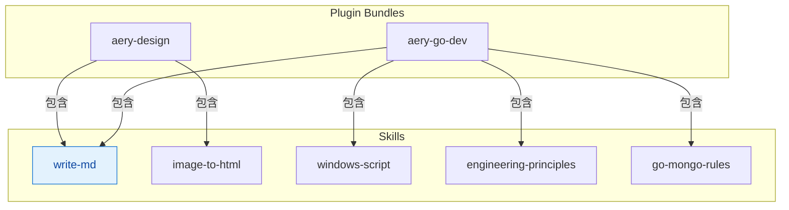

# aery-marketplace

將 Aery Lin 多年開發經驗與工程慣例收斂成可重複使用的 AI Agent Skills，並透過 Plugin Bundle 機制按情境組裝載入。

## 快速導覽

- [專案結構](#專案結構)
- [Plugin Bundle](#plugin-bundle)
- [Skills 清單](#skills-清單)

## 專案結構

本 repo 以 [`.claude-plugin/marketplace.json`](.claude-plugin/marketplace.json) 定義兩個 Plugin Bundle，每個 Bundle 各自聚合適合該情境的 Skills。Skills 本體放在 [`skills/`](skills/) 目錄下，部分 Skill 同時被多個 Bundle 引用。

> `write-md` 被兩個 Bundle 共享；藍色表示共用 Skill。

[返回開頭](#快速導覽)

## Plugin Bundle

| Bundle | 適用情境 | 包含 Skills |
|--------|---------|------------|
| `aery-design` | UI 刻版、視覺稿還原、文件撰寫 | write-md、image-to-html |
| `aery-go-dev` | Go 後端開發、MongoDB、Windows 腳本自動化、文件撰寫 | windows-script、write-md、engineering-principles、go-mongo-rules |

[返回開頭](#快速導覽)

## Skills 清單

### [write-md](skills/write-md/SKILL.md)

撰寫或編輯任何 Markdown 文件——包含功能文件、模組文件、架構總覽、README 與技術規格。

**觸發時機**：使用者要求撰寫、建立、更新或整理 Markdown 檔案時。

**特色**：
- 產出文件必須包含可快速跳轉的章節導覽，且每個主要章節提供返回開頭的 link
- 內建 Mermaid 判斷關卡，僅在視覺化能明顯降低理解難度時才嵌入圖表
- 語言規範：正文一律繁體中文，專有術語維持原文
- 附 [references/diagram-examples.md](skills/write-md/references/diagram-examples.md) 提供各圖表類型詳細語法範例

---

### [image-to-html](skills/image-to-html/SKILL.md)

將 PNG、JPG、screenshot、poster、banner、landing page mockup 等單張視覺稿轉成高擬真 HTML/CSS。

**觸發時機**：「把圖片轉成 html」「照圖刻版」「pixel perfect 對齊」「跟原稿差在哪」等任務。

**特色**：
- 內建三支 Python 工具（位於 [`skills/image-to-html/scripts/`](skills/image-to-html/scripts/)）：
  - `image_info.py` — 讀取圖片尺寸與 mode
  - `crop_image.py` — 精準裁切局部資產
  - `visual_diff.py` — 原圖與 render 的像素級視覺 diff
- 提供完整排錯流程，參見 [references/pixel-alignment-playbook.md](skills/image-to-html/references/pixel-alignment-playbook.md)
- 附 [evals/evals.json](skills/image-to-html/evals/evals.json) 與單元測試（[tests/](skills/image-to-html/tests/)）

---

### [windows-script](skills/windows-script/SKILL.md)

撰寫、修改、review 任何 Windows 腳本（`.ps1`、`.bat`、`.cmd`）。

**觸發時機**：任務涉及 `.ps1`、PowerShell encoding、BOM、line ending、Windows PowerShell 5.1 相容性、中文／非 ASCII 內容、hook script 或 Windows CLI 自動化時。

**核心守則摘要**：
- `.bat` / `.cmd` 一律改寫為 `.ps1`，不修補舊版 batch script
- 腳本開頭必須設定 `$ErrorActionPreference = 'Stop'` 與 UTF-8 console encoding
- 支援 PowerShell 5.1 且含非 ASCII 內容的 `.ps1` 必須以 **UTF-8 with BOM** 儲存
- `Get-Content` 讀取外部文字檔一律加 `-Encoding UTF8`，防止 Big5/GBK decoder 吃掉換行
- 禁止直接 `Set-Location` 污染呼叫端 CWD，改用 `$originalLocation + try/finally`

---

### [engineering-principles](skills/engineering-principles/SKILL.md)

軟體設計與架構的核心守則速查——涵蓋 SOLID、CUPID、Code-level 原則、架構層 HA／容錯模式、Observability 與工程哲學。

**觸發時機**：System design、code review、重構、技術選型、模組切分、API 設計、微服務拆分、評估技術債，或任何「怎麼寫才好」「架構怎麼切」「為什麼要這樣寫」的設計判斷場景。

**內容章節**：
- Code-Level 原則（SOLID、DRY、KISS、Law of Demeter 等）
- 架構層級（12-Factor、DDD、Hexagonal、CAP、容錯模式）
- 可維運性（Observability 三本柱、SLI/SLO、IaC）
- 安全與韌性（Least Privilege、Zero Trust、Secret Management）
- 開發流程紀律（Boy Scout Rule、Test Pyramid、Trunk-Based）
- 套用判準（Decision Framework）與 Anti-Patterns 警示

---

### [go-mongo-rules](skills/go-mongo-rules/SKILL.md)

MongoDB 開發守則與陷阱防範，專門針對 Go `mongo-go-driver` 與 MongoDB shell 腳本（`.js`）。

**觸發時機**：任何涉及 MongoDB 查詢、aggregation pipeline、Go `mongo-go-driver` 程式碼或 MongoDB shell 腳本的開發任務。

**四大守則**：
1. **型別安全** — JS shell 中 `NumberLong` / `ISODate` 的隱性轉型陷阱；Go 中 BSON 型別對應
2. **`bson.M` vs `bson.D`** — 依賴宣告順序的 stage（`$sort`、`$group`）必須用 `bson.D`
3. **查詢策略評估** — 按情境選擇 aggregation 單次 pipeline 或多次指令
4. **策略聲明** — 每個 MongoDB 任務必須在 comment 中聲明查詢策略與原因

[返回開頭](#快速導覽)

