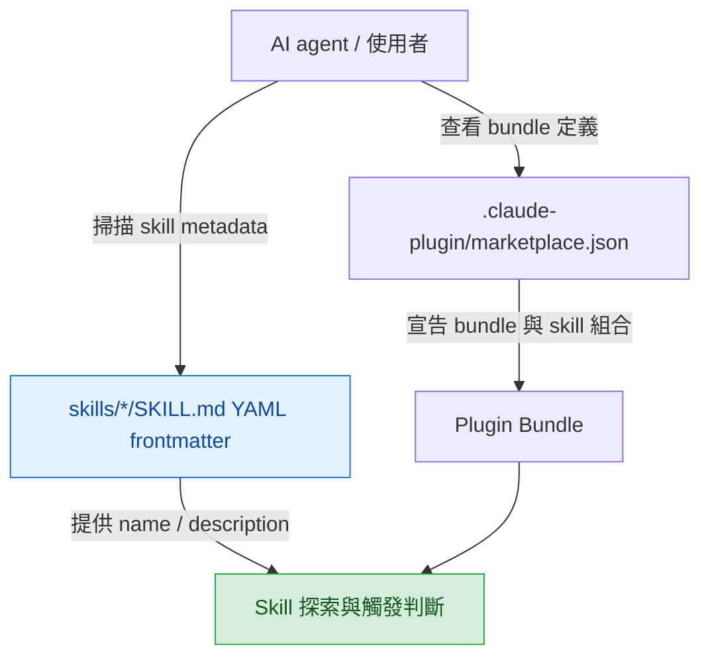

# aery-marketplace

將 Aery Lin 多年開發經驗與工程慣例收斂成可重複使用的 AI Agent Skills，並透過 Plugin Bundle 機制按情境組裝載入。

## 快速導覽

- [專案結構](#專案結構)
- [Plugin Bundle](#plugin-bundle)
- [Skills 探索方式](#skills-探索方式)
- [維護原則](#維護原則)

## 專案結構

本 repo 以 [`.claude-plugin/marketplace.json`](.claude-plugin/marketplace.json) 定義 Plugin Bundle；Skills 本體放在 [`skills/`](skills/) 目錄下。README 只描述探索方式，不手動列舉每個 skill，避免文件與 `SKILL.md` frontmatter 不同步。`SKILL.md` 是英文主入口；若 skill 另外提供繁體中文版本，會放在同目錄的 `*_zhTW.md`。

[`skills/`](skills/) 底下每個 skill 的 `SKILL.md` frontmatter 是 skill 名稱、用途與觸發條件的來源；需要了解有哪些 skills 時，應讀取這些 frontmatter，而不是依賴 README 的手動清單。若需要閱讀繁體中文說明，再讀對應的 `*_zhTW.md`。

[返回開頭](#快速導覽)

## Plugin Bundle

Plugin Bundle 是情境化的 skill 組合，實際 bundle 定義與包含關係以 [`.claude-plugin/marketplace.json`](.claude-plugin/marketplace.json) 為準。README 只保留機制說明，不複製 bundle 內的 skills 清單。

| 資訊 | 來源 |
|------|------|
| Bundle 名稱與描述 | [`.claude-plugin/marketplace.json`](.claude-plugin/marketplace.json) |
| Bundle 包含哪些 skills | [`.claude-plugin/marketplace.json`](.claude-plugin/marketplace.json) |
| Skill 名稱、描述與觸發語意 | [`skills/*/SKILL.md`](skills/) 的 YAML frontmatter |
| Skill 詳細規則與 references | 各 skill 目錄內的英文主檔 `SKILL.md` 與 `references/` |

[返回開頭](#快速導覽)

## Skills 探索方式

AI agent 需要掌握可用 skills 時，應掃描 [`skills/`](skills/) 底下所有 `SKILL.md` 的 YAML frontmatter，讀取 `name` 與 `description`。`description` 應提供足夠短而明確的用途、觸發時機與任務邊界，讓 agent 能判斷何時載入該 skill。若存在 `*_zhTW.md`，那是對應的繁體中文輔助版本，不是 discovery 入口。

建議流程：

1. 列出 [`skills/`](skills/) 底下所有第一層 skill 目錄。
2. 讀取每個 `SKILL.md` 開頭的 YAML frontmatter。
3. 用 `name` 作為 skill 識別名稱。
4. 用 `description` 判斷適用任務、觸發條件與是否需要進一步讀完整 `SKILL.md`。

[返回開頭](#快速導覽)

## 維護原則

新增、刪除或修改 [`skills/`](skills/) 內容時，必須同步檢查 [README.md](README.md) 是否仍能正確描述專案層級用途與探索方式。README 不應複製每個 skill 的完整描述；只需保留簡短說明，詳細資訊以各 `SKILL.md` frontmatter 與內容為準。新建 skill 時，`SKILL.md` 與 `references/` 內的原始 Markdown 檔必須以英文作為主檔，繁體中文版本使用同 basename 加上 `*_zhTW.md`；後續修改時，英文與 `*_zhTW.md` 兩邊都必須同步更新。

[返回開頭](#快速導覽)
