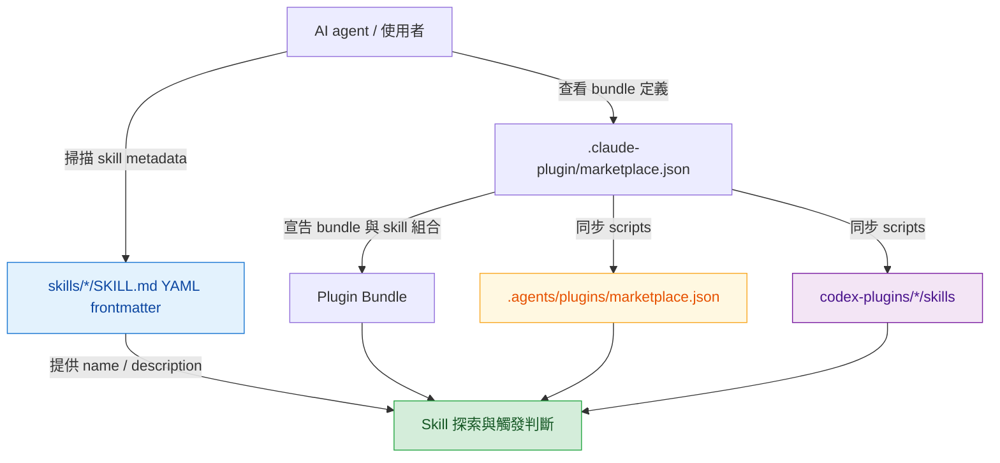

# aery-marketplace

Current version: v0.2.0

將 Aery Lin 多年開發經驗與工程慣例收斂成可重複使用的 AI Agent Skills，並透過 Plugin Bundle 機制按情境組裝載入。

## 快速導覽

- [專案結構](#專案結構)
- [Plugin Bundle](#plugin-bundle)
- [安裝 marketplace 與 plugin](#安裝-marketplace-與-plugin)
- [Skills 探索方式](#skills-探索方式)
- [維護原則](#維護原則)

## 專案結構

本 repo 以 [`.claude-plugin/marketplace.json`](.claude-plugin/marketplace.json) 定義 Plugin Bundle，且它是 bundle 與 skill 分組的 source of truth；Skills 本體放在 [`skills/`](skills/) 目錄下。給 Codex 使用的 [`.agents/plugins/marketplace.json`](.agents/plugins/marketplace.json) 與 [`codex-plugins/`](codex-plugins/) 則由 [`scripts/sync-codex-plugins.ps1`](scripts/sync-codex-plugins.ps1) / [`scripts/sync-codex-plugins.sh`](scripts/sync-codex-plugins.sh) 同步產生，其中 `codex-plugins/*/skills` 只保留英文主檔，不包含任何 `*_zhTW.md`。README 只描述探索方式，不手動列舉每個 skill，避免文件與 `SKILL.md` frontmatter 不同步。`SKILL.md` 是英文主入口；若 skill 另外提供繁體中文版本，會放在同目錄的 `*_zhTW.md`。



[`skills/`](skills/) 底下每個 skill 的 `SKILL.md` frontmatter 是 skill 名稱、用途與觸發條件的來源；需要了解有哪些 skills 時，應讀取這些 frontmatter，而不是依賴 README 的手動清單。若需要閱讀繁體中文說明，再讀對應的 `*_zhTW.md`。

[返回開頭](#快速導覽)

## Plugin Bundle

Plugin Bundle 是情境化的 skill 組合，實際 bundle 定義與包含關係以 [`.claude-plugin/marketplace.json`](.claude-plugin/marketplace.json) 為準；[`.agents/plugins/marketplace.json`](.agents/plugins/marketplace.json) 與 [`codex-plugins/`](codex-plugins/) 僅是由同步腳本產生的 Codex 封裝層。README 只保留機制說明，不複製 bundle 內的 skills 清單。

| 資訊 | 來源 |
|------|------|
| Bundle 名稱與描述 | [`.claude-plugin/marketplace.json`](.claude-plugin/marketplace.json) |
| Bundle 包含哪些 skills | [`.claude-plugin/marketplace.json`](.claude-plugin/marketplace.json) |
| Skill 名稱、描述與觸發語意 | [`skills/*/SKILL.md`](skills/) 的 YAML frontmatter |
| Skill 詳細規則與 references | 各 skill 目錄內的英文主檔 `SKILL.md` 與 `references/` |

[返回開頭](#快速導覽)

## 安裝 marketplace 與 plugin

本 repo 目前提供兩套 marketplace / plugin 入口：**Claude Code** 與 **GitHub Copilot CLI** 使用 [`.claude-plugin/marketplace.json`](.claude-plugin/marketplace.json)；**Codex** 使用 [`.agents/plugins/marketplace.json`](.agents/plugins/marketplace.json) 搭配 [`codex-plugins/`](codex-plugins/) 底下各自的 `.codex-plugin/plugin.json`。以下 GitHub Copilot 以 **GitHub Copilot CLI** 為準；若你主要在 VS Code 使用 GitHub Copilot，也可參考官方的 [agent plugins](https://code.visualstudio.com/docs/copilot/customization/agent-plugins) 說明。

| 維度 | Claude Code | GitHub Copilot CLI | Codex |
|------|------|------|------|
| 說明 | 依官方 [Discover and install plugins](https://code.claude.com/docs/en/discover-plugins) 與 [Create and distribute a plugin marketplace](https://code.claude.com/docs/en/plugin-marketplaces) 說明，Claude Code 可加入 GitHub repo、Git URL、local path 或 remote `marketplace.json`；此 repo 使用 `.claude-plugin/marketplace.json`，marketplace 名稱是 `aery-plugins`。 | 依官方 [Finding and installing plugins](https://docs.github.com/en/copilot/how-tos/copilot-cli/customize-copilot/plugins-finding-installing) 與 [CLI plugin reference](https://docs.github.com/en/copilot/reference/copilot-cli-reference/cli-plugin-reference) 說明，Copilot CLI 可註冊 marketplace 並用 `plugin@marketplace` 安裝；此 repo 使用 `.claude-plugin/marketplace.json`，marketplace 名稱是 `aery-plugins`。 | 依官方 [Plugins](https://developers.openai.com/codex/plugins) 與 [Build plugins](https://developers.openai.com/codex/plugins/build) 說明，Codex 可讀 `$REPO_ROOT/.agents/plugins/marketplace.json`；此 repo 提供 `Aery Codex Plugins`，並把 plugin package 放在 [`codex-plugins/`](codex-plugins/)。 |
| 安裝 | `/plugin marketplace add Aery9527/aery-marketplace`<br>`/plugin marketplace add .`<br>`/plugin install aery-design@aery-plugins`<br>`/plugin install aery-go-dev@aery-plugins`<br>`/reload-plugins` | `copilot plugin marketplace add Aery9527/aery-marketplace`<br>`copilot plugin marketplace add .`<br>`copilot plugin install aery-design@aery-plugins`<br>`copilot plugin install aery-go-dev@aery-plugins`<br>`copilot plugin list` | `codex plugin marketplace add Aery9527/aery-marketplace`<br>`codex plugin marketplace add .`<br>`codex`<br>`/plugins` |
| 更新 | `/plugin marketplace update aery-plugins`<br>`/reload-plugins`<br>或在 `/plugin` 的 Marketplaces tab 對 `aery-plugins` 啟用 auto-update。 | `copilot plugin update aery-design`<br>`copilot plugin update aery-go-dev`<br>`copilot plugin update --all`<br>官方 CLI reference 未列出 marketplace update 指令；若 marketplace source 本身變更，先移除再重新加入。 | `codex plugin marketplace upgrade aery-codex-plugins`<br>或更新全部：`codex plugin marketplace upgrade`<br>再進入 `codex` 的 `/plugins` 確認已安裝 plugin 狀態。 |
| 移除 | `/plugin uninstall aery-design@aery-plugins`<br>`/plugin uninstall aery-go-dev@aery-plugins`<br>`/plugin marketplace remove aery-plugins`<br>官方文件說移除 marketplace 會同時移除從它安裝的 plugins。 | `copilot plugin uninstall aery-design`<br>`copilot plugin uninstall aery-go-dev`<br>`copilot plugin marketplace remove aery-plugins`<br>若 marketplace 仍有已安裝 plugin，官方文件說可用 `--force` 一併移除。 | `codex plugin marketplace remove aery-codex-plugins`<br>若只要停用單一 plugin，進入 `codex` 後用 `/plugins` 管理。 |

[返回開頭](#快速導覽)

## Skills 探索方式

AI agent 需要掌握可用 skills 時，應掃描 [`skills/`](skills/) 底下所有 `SKILL.md` 的 YAML frontmatter，讀取 `name` 與 `description`。`description` 應提供足夠短而明確的用途、觸發時機與任務邊界，讓 agent 能判斷何時載入該 skill。若存在 `*_zhTW.md`，那是對應的繁體中文輔助版本，不是 discovery 入口。

建議流程：

1. 列出 [`skills/`](skills/) 底下所有第一層 skill 目錄。
2. 讀取每個 `SKILL.md` 開頭的 YAML frontmatter。
3. 用 `name` 作為 skill 識別名稱。
4. 用 `description` 判斷適用任務、觸發條件與是否需要進一步讀完整 `SKILL.md`。

[返回開頭](#快速導覽)

## 維護原則

新增、刪除或修改 [`skills/`](skills/) 內容時，必須同步檢查 [README.md](README.md) 是否仍能正確描述專案層級用途與探索方式，也要確認 [`.claude-plugin/marketplace.json`](.claude-plugin/marketplace.json) 是否仍正確反映 bundle 與 skill 分組。README 不應複製每個 skill 的完整描述；只需保留簡短說明，詳細資訊以各 `SKILL.md` frontmatter 與內容為準。新建 skill 時，`SKILL.md` 與 `references/` 內的原始 Markdown 檔必須以英文作為主檔，繁體中文版本使用同 basename 加上 `*_zhTW.md`；後續修改時，英文與 `*_zhTW.md` 兩邊都必須同步更新。

每次調整 skill 內容或 bundle 分組後，都必須重新執行同步腳本，讓 [`.agents/plugins/marketplace.json`](.agents/plugins/marketplace.json) 與 [`codex-plugins/*/skills`](codex-plugins/) 對齊 [`.claude-plugin/marketplace.json`](.claude-plugin/marketplace.json)：

```powershell
.\scripts\sync-codex-plugins.ps1
```

```sh
./scripts/sync-codex-plugins.sh
```

`codex-plugins/*/skills` 是封裝副本，不是 source of truth；不要直接編輯它們。同步腳本會先複製整個 skill tree，再移除整棵目錄中的 `*_zhTW.md`，因此 Codex 封裝只保留英文主檔。若新增新的 Codex plugin package，先補齊 `codex-plugins/<plugin>/.codex-plugin/plugin.json`，再執行同步腳本。

[返回開頭](#快速導覽)
