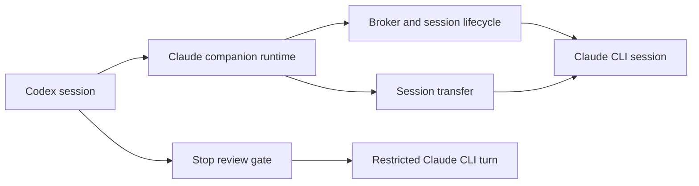

# Claude Code Bridge Runtime

## Quick Navigation

- [What This Assembly Delivers](#what-this-assembly-delivers)
- [Relationship and Data Flow](#relationship-and-data-flow)
- [Runtime Modules](#runtime-modules)

---

## What This Assembly Delivers

The bridge runtime lets a Codex session delegate work to a long-lived Claude
Code CLI session, observe and stop delegated work safely, require an optional
stop-time review, and hand the resulting context to a resumable Claude session.
It reports the host-specific limit each mechanism actually carries instead of
claiming native Claude Code behaviour the CLI cannot provide.

[Back to top](#quick-navigation)

---

## Relationship and Data Flow

The companion remains the single boundary for user-invoked bridge commands.
Codex hooks are separate host entry points: the stop hook invokes its restricted
Claude turn directly, while the session hook coordinates teardown. The broker
owns live-session coordination, and transfer creates a separate bridge-owned
Claude session that can be resumed.

[Back to top](#quick-navigation)

---

## Runtime Modules

- [Broker and session lifecycle](../sd-broker-session-lifecycle.md) — coordinates live bridge sessions, graceful interruption, and session cleanup without making job records secondary to broker state.
- [Stop review gate](../sd-stop-review-gate.md) — applies the saved review-gate preference to Codex stop events and fails safely when a review cannot establish an allow decision.
- [Session transfer](../sd-session-transfer.md) — converts Codex context into a bridge-owned Claude session and returns a resumable command without writing Claude's private project-session format directly.

[Back to top](#quick-navigation)
