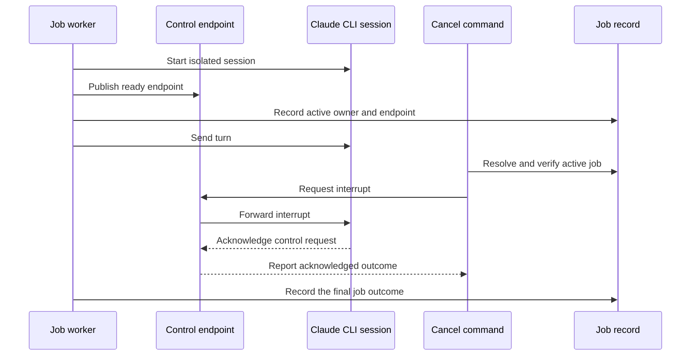

# Broker and Session Lifecycle

## Quick Navigation

- [Responsibility and Boundary](#responsibility-and-boundary)
- [Runtime Flow](#runtime-flow)
- [Interfaces and Data Views](#interfaces-and-data-views)
- [Caveats](#caveats)

---

## Responsibility and Boundary

This module gives another bridge process a bounded control channel to the
process that owns an active Claude CLI session. It owns endpoint creation,
control-message validation, graceful interrupt and shutdown requests, endpoint
liveness, and cleanup when either the job or its Codex session ends.

Each active job MUST own its control endpoint. The broker MUST NOT become a
workspace-wide Claude session: model, tool, schema, permission, and resume
options are fixed when the Claude CLI starts, so sharing one process across
commands would mix incompatible security and output contracts. The broker also
MUST NOT become a second job store; the existing job record remains the source
of truth for requests, progress, and outcomes.

[Back to top](#quick-navigation)

---

## Runtime Flow

The endpoint is ready before the job advertises brokered control. Cancellation
first targets the verified control channel. If the endpoint is absent,
unreachable, or cannot establish an interrupt, the existing verified process
termination remains the fallback and its narrower guarantee is reported.

[Back to top](#quick-navigation)

---

## Interfaces and Data Views

- [Broker server](scripts/claude-broker.mjs) — accepts bounded control requests for one active session owner and reports whether Claude acknowledged them.
- [Endpoint codec](scripts/lib/broker-endpoint.mjs) — creates platform-specific local endpoints and rejects unsupported or malformed endpoint values.
- [Broker lifecycle](scripts/lib/broker-lifecycle.mjs) — publishes, probes, shuts down, and removes per-job control endpoints.
- [Session lifecycle hook](scripts/session-lifecycle-hook.mjs) — consumes Codex session events and cleans only the jobs attributable to the ending session.
- [Claude CLI session](scripts/lib/claude-cli.mjs) — owns the stdin control channel and defines interrupt acknowledgement.
- [Companion command boundary](scripts/claude-companion.mjs) — starts tracked work, resolves cancellation, and reports the actual fallback used.
- [Job records](scripts/lib/state.mjs) — remain authoritative for the active owner, control endpoint, and terminal outcome.

[Back to top](#quick-navigation)

---

## Caveats

- Idempotency — shutdown and cleanup MUST tolerate an endpoint, process, or artifact that is already gone. Repeated cleanup MUST NOT change another job.
- Concurrency — one endpoint represents one active session owner and accepts control requests only; it MUST NOT multiplex independent Claude turns or accept a new owner while the recorded one is active.
- Ordering — endpoint readiness MUST precede publishing it in the job record. Publishing and clearing an endpoint MUST use a guarded write that refuses the update when it observes a terminal job.
- Failure behavior — failure to create a control endpoint MAY fall back to the direct runtime, but MUST remain observable and MUST NOT be reported as graceful interruption support. A failed or unanswered interrupt MAY fall back to verified process termination.
- Session scope — a session-end event MUST discover jobs from both the listing and authoritative job files, then clean only jobs carrying that Codex session identifier. When Codex provides no durable identifier, the hook MUST NOT guess one or remove every workspace job.
- Cleanup safety — an active job's files MUST remain unless its worker exit is observed after acknowledged broker shutdown or verified fallback termination. A stale record costs manual cleanup; terminating an unrelated process or deleting the only evidence is not an acceptable fallback.
- Host delivery — direct hook invocation verifies parsing and cleanup. An interactive Codex TUI probe verified `SessionStart` and `SessionEnd` delivery with the workspace and installed plugin environment. The hook process does not receive `CODEX_THREAD_ID`; its payload identifier matches the transcript's `session_meta.id`, which command-side `CODEX_THREAD_ID` identifies.
- Limits — an acknowledged interrupt proves that Claude accepted the control request, not that every child process has exited or that the job has already reached a terminal state.
- Guard limit — the endpoint guard narrows but does not close the interval between its final read and atomic rename. A terminal write landing in that interval can still be overwritten; closing it requires a real cross-process lock or compare-and-swap primitive that this runtime does not provide.

[Back to top](#quick-navigation)
