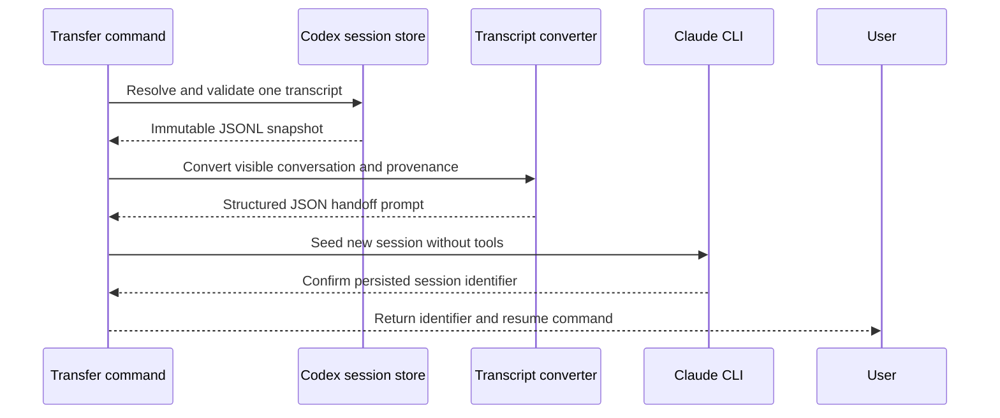

# Session Transfer

## Quick Navigation

- [Responsibility and Boundary](#responsibility-and-boundary)
- [Transfer Flow](#transfer-flow)
- [Interfaces and Data Views](#interfaces-and-data-views)
- [Caveats](#caveats)

---

## Responsibility and Boundary

This module turns a Codex transcript snapshot into the first turn of a new,
bridge-owned Claude session and returns that session's identifier and
`claude --resume` command. The handoff carries source provenance and the visible
user and assistant conversation in chronological order. Unsupported visible
content is represented by an explicit omission marker rather than disappearing
silently.

The result is a resumable Claude conversation, not a native import with separate
historical turns. The bridge MUST create and persist the target only through the
supported Claude CLI. It MUST NOT synthesize or edit files in Claude's private
session store, mutate the Codex source, include hidden reasoning or host control
records, or claim that omitted content was transferred.

[Back to top](#quick-navigation)

---

## Transfer Flow

By default, the command resolves the current transcript from `CODEX_THREAD_ID`.
An explicit source may select another Codex JSONL transcript. In both cases the
canonical source MUST be an existing file beneath the Codex session store, and
its metadata MUST identify one session. Resolution, complete snapshot reading,
conversion, and successful Claude initialization occur before a resume command
is reported.

[Back to top](#quick-navigation)

---

## Interfaces and Data Views

- [Transfer command](commands/claude-transfer.md) — invokes one transfer and presents the returned Claude session identifier and resume command without overstating native history import.
- [Codex transcript boundary](scripts/lib/codex-session-transfer.mjs) — resolves a safe source, validates its session identity, and converts supported conversation content into a provenance-bearing handoff.
- [Companion command boundary](scripts/claude-companion.mjs) — coordinates validation, conversion, Claude initialization, and human or JSON output.
- [Claude runtime](scripts/lib/claude.mjs) — verifies availability and performs the isolated seed turn.
- [Claude CLI session](scripts/lib/claude-cli.mjs) — creates the named session through supported CLI flags and reports the session identifier observed from Claude.
- [Session transfer core](scripts/lib/codex-session-transfer.mjs) — resolves and canonicalizes transcript paths before trusting a source.

[Back to top](#quick-navigation)

---

## Caveats

- Idempotency — transfer is intentionally non-idempotent: each successful invocation creates a distinct Claude session. It leaves the Codex source unchanged and MUST NOT overwrite an earlier target.
- Concurrency — concurrent transfers MUST use distinct target identifiers and independent immutable source snapshots. One transfer MUST NOT reuse another transfer's in-flight session.
- Ordering — the complete source snapshot MUST be read before Claude starts. The resume command MUST be emitted only after Claude reports the persisted target identifier.
- Source compatibility — only visible user and assistant text is carried as conversation. Non-conversation records are omitted; unsupported visible content is marked. Malformed JSONL, conflicting identity, or a source with no transferable conversation MUST fail explicitly.
- Prompt boundary — provenance and visible messages MUST be serialized as one JSON value. Conversation strings MUST NOT be interpolated as prompt markup or delimiters.
- Seed isolation — the initial handoff turn MUST disable built-in and MCP tools so transfer itself cannot change the workspace. Resuming the finished session is a separate user action with that invocation's permissions.
- Failure behavior — path validation, conversion, availability, initialization, or protocol failure MUST return no success claim. If Claude exposed an identifier before a later failure, the diagnostic MUST report that possibly incomplete session rather than pretending it was rolled back.
- Capacity — the transcript MUST NOT be silently truncated to fit a model context. If Claude rejects the complete handoff for size, the transfer fails and leaves the source untouched.
- Host compatibility — Codex does not document a stable transcript-reading API or a native Claude importer. The isolated parser MUST reject incompatible required records instead of treating the observed private JSONL shape as permanently stable.
- Acceptance — tests can verify conversion and CLI orchestration, but resumability requires a second-process probe that confirms provenance survives and that the bridge itself wrote no Claude session files.

[Back to top](#quick-navigation)
