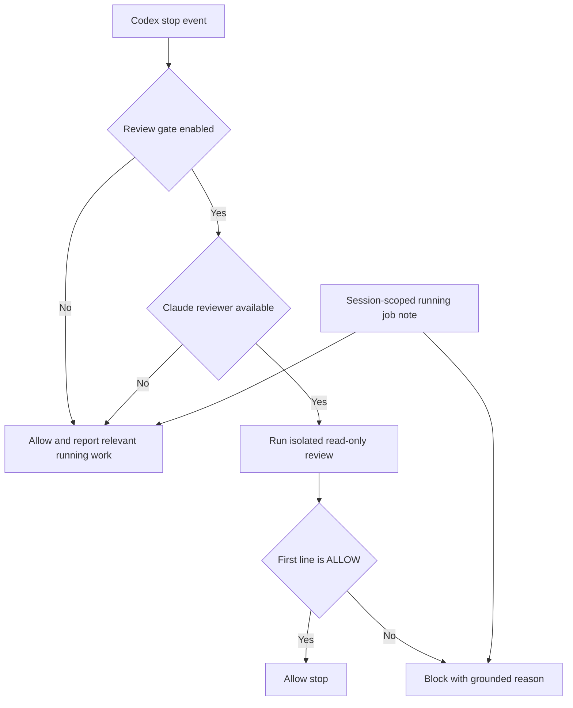

# Stop Review Gate

## Quick Navigation

- [Responsibility and Boundary](#responsibility-and-boundary)
- [Decision Flow](#decision-flow)
- [Interfaces and Data Views](#interfaces-and-data-views)
- [Caveats](#caveats)

---

## Responsibility and Boundary

This module applies a workspace's saved review-gate preference when Codex asks
whether the current turn may stop. When enabled and Claude is available, it
gives an isolated, read-only Claude reviewer the last Codex response and the
current repository state. The reviewer returns one explicit `ALLOW` or `BLOCK`
decision grounded in observable work.

The gate MUST NOT claim that the supplied response proves which files the last
turn changed. If the reviewer cannot establish reviewable code changes, it MUST
allow the stop. A running companion job is context for the user, not an
independent reason to block. The gate owns only the stop decision; it MUST NOT
alter job outcomes, terminate work, or write repository content.

[Back to top](#quick-navigation)

---

## Decision Flow

Disabled review or unavailable Claude fails open so the hook cannot trap the
user, while emitting an actionable diagnostic. Once enabled review begins,
`BLOCK`, timeout, nonzero exit, empty output, invalid output, or any first line
other than `ALLOW` fails closed. The block reason includes any relevant running
job note without treating that note as review evidence.

[Back to top](#quick-navigation)

---

## Interfaces and Data Views

- [Hook manifest](hooks.json) — registers session and stop hooks with bounded timeouts.
- [Stop hook](scripts/stop-review-gate-hook.mjs) — parses the host event, resolves scope, invokes review, and emits the host decision.
- [Review prompt](prompts/stop-review-gate.md) — constrains the reviewer to the previous response, observable repository evidence, and the exact decision protocol.
- [Workspace configuration](scripts/lib/state.mjs) — provides the saved `stopReviewGate` preference and session identifier convention.
- [Tracked jobs](scripts/lib/job-control.mjs) — supplies running-job context filtered to the event's session when an identifier is present.
- [Claude runtime](scripts/lib/claude.mjs) — provides installation and authentication readiness checks plus the restricted review invocation boundary.

[Back to top](#quick-navigation)

---

## Caveats

- Idempotency — repeated stop events MUST produce a fresh decision from current inputs and MUST NOT persist a latch or mutate repository state.
- Concurrency — when the event carries a session identifier, running-job context MUST be limited to that session. Missing identifiers MUST NOT be guessed.
- Ordering — configuration and reviewer availability are checked before review. Job context is collected before the final diagnostic or block reason is emitted.
- Reviewer isolation — review MUST expose only read operations needed to inspect the response and repository. It MUST NOT grant shell, edit, write, or write-capable MCP tools.
- Prompt boundary — the last response MUST enter the prompt as an escaped JSON string, so response text cannot close the surrounding prompt markup or replace the decision protocol.
- Failure behavior — disabled review and unavailable setup fail open with diagnostics. Review execution or protocol failures fail closed after review has been enabled and started.
- Decision protocol — the first output line MUST be exactly `ALLOW` or `BLOCK`. `BLOCK` requires a concrete reason tied to observable code; uncertainty about turn provenance MUST resolve to `ALLOW`.
- Host delivery — direct invocation and tests verify parsing and decisions; an interactive Codex TUI probe verified `Stop` delivery with the workspace and installed plugin environment. Re-run the host probe when that host contract changes.
- Limits — repository inspection can find defects in observable work, but cannot prove authorship, completeness outside the workspace, or safety of effects that already occurred.

[Back to top](#quick-navigation)
