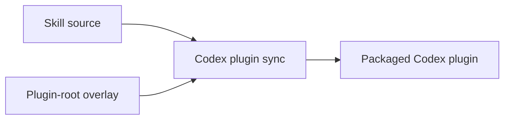

# Upstream Parity Record

This skill is a reverse port. `openai/codex-plugin-cc` lets Claude Code call
Codex; this package lets Codex call Claude Code. Because the source of the
behaviour lives in another repository, this file is the join between the two:
it pins the upstream revision the port was written against, maps every upstream
file to its counterpart here, and records what the reverse direction cannot
reproduce.

Read this file before changing anything under `codex-plugin/`, and update it in
the same change. It records **present state and current contract only** — why a
row changed belongs in the commit message, not here.

## Quick Navigation

- [Upstream Pin](#upstream-pin)
- [How To Read This File](#how-to-read-this-file)
- [Following Upstream](#following-upstream)
- [Verification Matrix](#verification-matrix)
- [Layout Mapping](#layout-mapping)
- [File Map](#file-map)
- [Host Capability Comparison](#host-capability-comparison)
- [Adaptations](#adaptations)
- [Gaps](#gaps)
- [Host Verification](#host-verification)

---

## Upstream Pin

| Field | Value |
|-------|-------|
| Repository | `https://github.com/openai/codex-plugin-cc` |
| Commit | `db52e28f4d9ded852ab3942cea316258ae4ef346` |
| Commit date | 2026-07-07 |
| Commit subject | Remove shell expansion for git commands (#447) |
| Upstream plugin version | `1.0.6` (`plugins/codex/.claude-plugin/plugin.json`) |
| Upstream licence | Apache-2.0 |

[Back to top](#quick-navigation)

---

## How To Read This File

Two independent facts are tracked per file, in separate columns, because they
drift for different reasons.

**Plan** — the intended relationship to upstream. It changes only when upstream
changes or when a host limitation is discovered.

| Plan | Meaning |
|------|---------|
| `port` | reproduce the behaviour directly |
| `adapt` | reproduce the behaviour through a different host mechanism, see [Adaptations](#adaptations) |
| `partial` | reproduce with a documented loss, see [Gaps](#gaps) |
| `open` | reproducibility not yet decided; a named probe must settle it, see [Host Verification](#host-verification) |
| `drop` | deliberately no counterpart, see [Gaps](#gaps) |
| `new` | this package needs the file; upstream has no counterpart |
| `n/a` | upstream infrastructure this repository already solves its own way |
| `removed` | upstream deleted the file; the row is kept so its counterpart stays under review |

**State** — delivery status of this row's upstream contract. One counterpart may
serve several rows whose contracts reach different states.

| State | Meaning |
|-------|---------|
| `todo` | a counterpart is expected and does not exist yet |
| `wip` | the counterpart exists but does not yet meet its Plan |
| `done` | the counterpart exists, meets its Plan, and its area's verification passes |
| `n/a` | no counterpart is expected, because the Plan is `drop`, `n/a` or `removed` |

`done` is never a declaration of intent. It requires the verification named for
that area in [Verification Matrix](#verification-matrix) to pass.

Sections after the File Map — [Adaptations](#adaptations), [Gaps](#gaps) —
describe the **contract** each counterpart must satisfy. Whether a given
counterpart satisfies it yet is the File Map's State column, never these
sections.

[Back to top](#quick-navigation)

---

## Following Upstream

The tracked upstream surface is every path that appears in the
[File Map](#file-map). Diff all of it:

```sh
git clone https://github.com/openai/codex-plugin-cc
cd codex-plugin-cc
git diff --stat db52e28f4d9ded852ab3942cea316258ae4ef346..origin/main \
  -- plugins/codex/ tests/ scripts/bump-version.mjs .github/workflows/ \
     .claude-plugin/marketplace.json package.json package-lock.json \
     tsconfig.app-server.json .gitignore README.md LICENSE NOTICE
```

Then:

1. Every changed path appears in the File Map. Revisit only those rows, and
   reset their State to `wip` until the port catches up.
2. A path that is new upstream and absent from the File Map means the map is
   stale — add the row, choose its Plan, set State to `todo`, then port.
3. A path upstream deleted keeps its row with Plan `removed` and State `n/a`.
   Deleting the row instead would silently drop its counterpart from review.
4. A path upstream renamed is one row, not two: rewrite the upstream path and
   leave the counterpart alone.
5. After porting, move the pin in [Upstream Pin](#upstream-pin) to the new
   commit and version.

Matching the diff against the File Map is a **manual step today**. The File Map
is keyed by upstream path so that it *can* be automated: the port's own test
suite must grow a parity test that walks upstream's tracked inventory, asserts
every path has exactly one File Map row, and fails on an addition, deletion or
rename. Until that test exists, steps 1–4 depend on the person doing the
upgrade.

[Back to top](#quick-navigation)

---

## Verification Matrix

What must pass before a row in that area may be marked `done`.

| Area | Verification |
|------|--------------|
| runtime libraries | `node --test "tests/*.test.mjs"` from `codex-plugin/` |
| companion subcommands | `codex-plugin/tests/commands.test.mjs` against the fake `claude` fixture |
| git target resolution | `codex-plugin/tests/git.test.mjs` |
| job state | `codex-plugin/tests/state.test.mjs`, `codex-plugin/tests/job-control.test.mjs` |
| rendering | `codex-plugin/tests/render.test.mjs` |
| the Claude session client | `codex-plugin/tests/claude-cli.test.mjs`, `codex-plugin/tests/stream-protocol.test.mjs` |
| session transfer resumability | deterministic `codex-plugin/tests/session-transfer.test.mjs` coverage plus a real two-process probe: create through `transfer`, resume the returned Claude session in another process, and recover an exact provenance token |
| static assets (prompts, schemas, licence, manifest) | `scripts/sync-codex-plugins.ps1` completes and `scripts/verify_codex_plugins.py` passes |
| commands, agents, skills (prose) | reviewed against the upstream file they map to; no automated gate |
| hooks | deterministic hook tests plus the interactive TUI probe in [Host Verification](#host-verification) |

There is no CI in this repository, so these are run locally before a release.

[Back to top](#quick-navigation)

---

## Layout Mapping

Upstream ships one Claude Code plugin at `plugins/codex/`. This repository is a
skills marketplace, so the same package is assembled from two source shapes:



| Upstream location | Source of truth here | Packaged to |
|-------------------|----------------------|-------------|
| `plugins/codex/skills/*` | `skills/claude-*/` (ordinary skill directories) | `codex-plugins/aery-claude-code/skills/*` |
| everything else under `plugins/codex/` | `skills/claude-code-bridge/codex-plugin/` (overlay) | `codex-plugins/aery-claude-code/` (plugin root) |

The overlay exists because a Codex plugin keeps `scripts/`, `commands/`,
`agents/` and `hooks.json` at the *plugin root*, not inside a skill, while this
repository requires every source file to live under `skills/`.
`scripts/sync-codex-plugins.ps1` copies the overlay's contents onto the plugin
root and excludes the overlay from the skill copy, the same way it excludes
`*_zhTW.md`.

[Back to top](#quick-navigation)

---

## File Map

Paths in the Counterpart column are relative to `skills/claude-code-bridge/`
unless they start with a repository-root segment.

### Repository root

| Upstream path | Counterpart | Plan | State |
|---------------|-------------|------|-------|
| `LICENSE` | `codex-plugin/LICENSE` (Apache-2.0 full text, unmodified) | port | done |
| `NOTICE` | `codex-plugin/NOTICE` (attribution, extended with this port) | adapt | done |
| `README.md` | `skills/claude-code-bridge/SKILL.md` | adapt | done |
| `package.json` | none — dependency-free ESM, tests run with `node --test` | n/a | n/a |
| `package-lock.json` | none — no dependencies to lock | n/a | n/a |
| `tsconfig.app-server.json` | `codex-plugin/scripts/lib/stream-protocol.mjs` (runtime validation replaces build-time types) | adapt | done |
| `.gitignore` | repository-root `.gitignore` | n/a | n/a |
| `.claude-plugin/marketplace.json` | repository-root `.claude-plugin/marketplace.json` | n/a | n/a |
| `scripts/bump-version.mjs` | `release` skill (repository-wide) | n/a | n/a |
| `.github/workflows/pull-request-ci.yml` | none | drop | n/a |

Upstream needs these three for its Node toolchain and to type-check the
app-server protocol. The stream-protocol probe showed the reverse runtime needs
no dependencies, so the toolchain files have no counterpart and the protocol
contract moved to a runtime validator instead of a build step.

### Manifest and packaging

| Upstream path | Counterpart | Plan | State |
|---------------|-------------|------|-------|
| `plugins/codex/.claude-plugin/plugin.json` | `codex-plugins/aery-claude-code/.codex-plugin/plugin.json` | adapt | done |
| `plugins/codex/CHANGELOG.md` | `release-note/vX.Y.Z.md` (repository-wide) | n/a | n/a |
| `plugins/codex/LICENSE` | `codex-plugin/LICENSE` | port | done |
| `plugins/codex/NOTICE` | `codex-plugin/NOTICE` | adapt | done |

### Entry points

| Upstream path | Counterpart | Plan | State |
|---------------|-------------|------|-------|
| `plugins/codex/commands/review.md` | `codex-plugin/commands/claude-review.md` | partial | done |
| `plugins/codex/commands/adversarial-review.md` | `codex-plugin/commands/claude-adversarial-review.md` | partial | done |
| `plugins/codex/commands/rescue.md` | `codex-plugin/commands/claude-rescue.md` | adapt | done |
| `plugins/codex/commands/transfer.md` | `codex-plugin/commands/claude-transfer.md` | adapt | done |
| `plugins/codex/commands/status.md` | `codex-plugin/commands/claude-status.md` | partial | done |
| `plugins/codex/commands/result.md` | `codex-plugin/commands/claude-result.md` | partial | done |
| `plugins/codex/commands/cancel.md` | `codex-plugin/commands/claude-cancel.md` | partial | done |
| `plugins/codex/commands/setup.md` | `codex-plugin/commands/claude-setup.md` | adapt | done |
| `plugins/codex/agents/codex-rescue.md` | none — Codex has no subagent declaration, see [Gaps](#gaps) | drop | n/a |
| — | `codex-plugin/agents/openai.yaml` | new | done |

### Runtime

| Upstream path | Counterpart | Plan | State |
|---------------|-------------|------|-------|
| `plugins/codex/scripts/codex-companion.mjs` | `codex-plugin/scripts/claude-companion.mjs` | adapt | done |
| `plugins/codex/scripts/lib/codex.mjs` | `codex-plugin/scripts/lib/claude.mjs` | adapt | done |
| `plugins/codex/scripts/lib/app-server.mjs` | `codex-plugin/scripts/lib/claude-cli.mjs` | adapt | done |
| `plugins/codex/scripts/lib/app-server-protocol.d.ts` | `codex-plugin/scripts/lib/stream-protocol.mjs` (runtime validation, not types) | adapt | done |
| `plugins/codex/scripts/app-server-broker.mjs` | `codex-plugin/scripts/claude-broker.mjs` | adapt | done |
| `plugins/codex/scripts/lib/broker-endpoint.mjs` | `codex-plugin/scripts/lib/broker-endpoint.mjs` | adapt | done |
| `plugins/codex/scripts/lib/broker-lifecycle.mjs` | `codex-plugin/scripts/lib/broker-lifecycle.mjs` | adapt | done |
| `plugins/codex/scripts/lib/claude-session-transfer.mjs` | `codex-plugin/scripts/lib/codex-session-transfer.mjs` | partial | done |
| `plugins/codex/scripts/lib/args.mjs` | `codex-plugin/scripts/lib/args.mjs` | port | done |
| `plugins/codex/scripts/lib/fs.mjs` | `codex-plugin/scripts/lib/fs.mjs` | port | done |
| `plugins/codex/scripts/lib/git.mjs` | `codex-plugin/scripts/lib/git.mjs` | adapt | done |
| `plugins/codex/scripts/lib/process.mjs` | `codex-plugin/scripts/lib/process.mjs` | adapt | done |
| `plugins/codex/scripts/lib/prompts.mjs` | `codex-plugin/scripts/lib/prompts.mjs` | port | done |
| `plugins/codex/scripts/lib/workspace.mjs` | `codex-plugin/scripts/lib/workspace.mjs` | port | done |
| `plugins/codex/scripts/lib/state.mjs` | `codex-plugin/scripts/lib/state.mjs` | adapt | done |
| `plugins/codex/scripts/lib/render.mjs` | `codex-plugin/scripts/lib/render.mjs` | adapt | done |
| `plugins/codex/scripts/lib/job-control.mjs` | `codex-plugin/scripts/lib/job-control.mjs` | adapt | done |
| `plugins/codex/scripts/lib/tracked-jobs.mjs` | `codex-plugin/scripts/lib/tracked-jobs.mjs` | adapt | done |

The four `adapt` rows at the end carry host semantics rather than pure logic:
`state.mjs` resolves state under `CLAUDE_PLUGIN_DATA`, `job-control.mjs` and
`tracked-jobs.mjs` model Claude stream progress as durable jobs, and `render.mjs`
emits `claude --resume` follow-up commands. Their host-specific halves are the
reason they are adaptations rather than direct ports.

`process.mjs` runs every executable without a shell. Upstream can afford one
because it only ever spawns `codex`; here `taskkill` takes `/PID`-style
switches, which a POSIX shell on Windows rewrites into paths, and a shell
receives arguments concatenated rather than escaped.

### Hooks and prompts

| Upstream path | Counterpart | Plan | State |
|---------------|-------------|------|-------|
| `plugins/codex/hooks/hooks.json` | `codex-plugin/hooks.json` | adapt | done |
| `plugins/codex/scripts/session-lifecycle-hook.mjs` | `codex-plugin/scripts/session-lifecycle-hook.mjs` | adapt | done |
| `plugins/codex/scripts/stop-review-gate-hook.mjs` | `codex-plugin/scripts/stop-review-gate-hook.mjs` | adapt | done |
| `plugins/codex/prompts/adversarial-review.md` | `codex-plugin/prompts/adversarial-review.md` | adapt | done |
| `plugins/codex/prompts/stop-review-gate.md` | `codex-plugin/prompts/stop-review-gate.md` | port | done |
| `plugins/codex/schemas/review-output.schema.json` | `codex-plugin/schemas/review-output.schema.json` | port | done |

Both hook scripts are `adapt`, not `port`, for different reasons.
`session-lifecycle-hook.mjs` accepts Codex `SessionStart` and `SessionEnd`
payloads and finds the ending session's jobs from both the listing and their
authoritative files. It asks active brokers to shut down before verified process
termination is used as fallback, then confirms that the worker exited after
either path; if exit cannot be observed after acknowledged shutdown or verified fallback, it
preserves the job evidence instead of deleting it.
`stop-review-gate-hook.mjs` reads `last_assistant_message`, applies the saved
workspace preference, checks installation and authentication readiness, and
runs an isolated Claude review with an explicit `ALLOW` or `BLOCK` protocol.
The response enters the prompt as an escaped JSON string rather than executable
prompt markup. Direct-invocation tests cover their behavior, and the interactive
TUI probe in [Host Verification](#host-verification) confirms host delivery.

### Skills

| Upstream path | Counterpart | Plan | State |
|---------------|-------------|------|-------|
| `plugins/codex/skills/codex-cli-runtime/SKILL.md` | none — its only consumer is the dropped rescue subagent, see [Gaps](#gaps) | drop | n/a |
| `plugins/codex/skills/codex-result-handling/SKILL.md` | `skills/claude-code-bridge/SKILL.md` | adapt | done |
| `plugins/codex/skills/gpt-5-4-prompting/SKILL.md` | none — rescue preserves the user's request, see [Gaps](#gaps) | drop | n/a |
| `plugins/codex/skills/gpt-5-4-prompting/references/prompt-blocks.md` | none — the owning prompting skill is dropped | drop | n/a |
| `plugins/codex/skills/gpt-5-4-prompting/references/codex-prompt-recipes.md` | none — the owning prompting skill is dropped | drop | n/a |
| `plugins/codex/skills/gpt-5-4-prompting/references/codex-prompt-antipatterns.md` | none — the owning prompting skill is dropped | drop | n/a |
| — | `skills/claude-code-bridge/SKILL.md` | new | done |
| — | `skills/claude-code-bridge/UPSTREAM-PARITY.md` | new | done |

The bridge skill owns result presentation because every command returns the
companion's stdout verbatim. The other two upstream skills only serve the
dropped rescue subagent or rewrite a request that this port deliberately
preserves, so duplicating them as standalone skills would create conflicting
instructions with no consumer.

### Tests

| Upstream path | Counterpart | Plan | State |
|---------------|-------------|------|-------|
| `tests/helpers.mjs` | `codex-plugin/tests/helpers.mjs` | port | done |
| `tests/git.test.mjs` | `codex-plugin/tests/git.test.mjs` | adapt | done |
| `tests/process.test.mjs` | `codex-plugin/tests/process.test.mjs` | port | done |
| `tests/state.test.mjs` | `codex-plugin/tests/state.test.mjs` | adapt | done |
| `tests/render.test.mjs` | `codex-plugin/tests/render.test.mjs` | adapt | done |
| `tests/commands.test.mjs` | `codex-plugin/tests/commands.test.mjs` | adapt | done |
| `tests/runtime.test.mjs` | `codex-plugin/tests/broker-session-lifecycle.test.mjs` | adapt | done |
| `tests/fake-codex-fixture.mjs` | `codex-plugin/tests/fake-claude-fixture.mjs` | adapt | done |
| `tests/broker-endpoint.test.mjs` | `codex-plugin/tests/broker-session-lifecycle.test.mjs` | adapt | done |
| `tests/bump-version.test.mjs` | none | n/a | n/a |
| — | `codex-plugin/tests/stream-protocol.test.mjs` | new | done |
| — | `codex-plugin/tests/claude-cli.test.mjs` | new | done |
| — | `codex-plugin/tests/job-control.test.mjs` | new | done |
| — | `codex-plugin/tests/stop-review-gate.test.mjs` | new | done |
| — | `codex-plugin/tests/session-transfer.test.mjs` | new | done |

`runtime.test.mjs` is `adapt`: its broker behavior is covered by the dedicated
broker lifecycle suite. Stop-gate and transfer behavior use separate new suites
because their host acceptance probes are distinct from runtime protocol tests.

[Back to top](#quick-navigation)

---

## Host Capability Comparison

The two hosts are not mirror images. Each claim below carries the evidence it
rests on. `help` means the local `--help` output, `probe` means a throwaway
plugin or process run locally, `docs` means vendor documentation, and
`unverified` means the claim still needs a probe before anything depends on it.

### What the delegated CLI offers

Upstream drives Codex through the Codex **app server**, a long-lived JSON-RPC
process. The reverse port drives the `claude` CLI. Verified against `claude`
2.1.227.

| Upstream app-server capability | Claude Code CLI counterpart | Evidence |
|--------------------------------|-----------------------------|----------|
| structured output (`schemas/review-output.schema.json`) | `--json-schema`; the final stream-json `result` carries both `structured_output` and the same JSON as `result` text | probe |
| turn streaming and progress events | `--output-format stream-json --verbose`; the turn ends on a `result` event. Token-level deltas additionally need `--include-partial-messages`, which the runtime does not pass yet | docs, probe |
| model selection | `--model <alias\|full-name>` | help |
| thread persistence and resume | `--session-id <uuid>`, `--resume <id>`, `--continue`, `--fork-session`; `--resume` finds a session in any project from v2.1.223 | docs, help |
| thread naming (`buildPersistentTaskThreadName`) | `--name <name>` | help |
| read-only versus write-capable runs | `--tools` narrows the **built-in** set only; `--strict-mcp-config` is additionally required, or the user's MCP servers stay registered and an MCP write tool remains reachable. There is no filesystem sandbox: a session that keeps `Bash` can write | probe — see [Gaps](#gaps) |
| native `/review` (`runAppServerReview`) | a stream-json user message whose text is `/code-review` expands and runs the real review skill | probe |
| long-lived process serving successive turns | `-p --input-format stream-json --output-format stream-json`; one process served two turns under one `session_id` and exited 0 on stdin close | probe |
| turn interruption (`interruptAppServerTurn`) | `control_request` with `{subtype: "interrupt"}`; answered by `control_response`, ends the turn as `result`/`error_during_execution`, and the session stays usable | probe |
| session metadata after a run | `system/init` event, or `session_id` in `--output-format json` | docs |
| detached background execution | **no counterpart** — `-p` rejects `--bg`; the bridge manages its own detached child, see [Adaptations](#adaptations) | docs |
| reasoning effort selection | `--effort <low\|medium\|high\|xhigh\|max>` | help — see [Gaps](#gaps) |
| clean shutdown semantics | SIGTERM aborts the turn, kills the Bash process tree, runs `SessionEnd` hooks, exits 143 | docs |

### What the host plugin system offers

Verified against `codex-cli` 0.147.0 and the plugins it ships (`figma`,
`replayio`).

| Claude Code plugin capability | Codex plugin equivalent | Evidence |
|-------------------------------|-------------------------|----------|
| `skills/*/SKILL.md` with `name` / `description` frontmatter | same, plus `disable-model-invocation` | probe, shipped plugin |
| `commands/*.md` slash commands | `commands/*.md`; no frontmatter observed in any shipped plugin | shipped plugin |
| `agents/*.md` subagents | not from a plugin. Codex's own subagents are TOML under `.codex/agents/`; a plugin's `agents/` holds `openai.yaml` alone — interface metadata | shipped plugins, `plugin.json` spec, binary strings |
| `hooks/hooks.json` | `hooks` entry in `plugin.json`, or the default `hooks/hooks.json` | docs, binary strings |
| `${CLAUDE_PLUGIN_ROOT}` | `${PLUGIN_ROOT}`, `${PLUGIN_DATA}`; `${CLAUDE_PLUGIN_ROOT}` still accepted | docs, binary strings |
| hook `command` accepts any shell string | supports an executable with arguments and `${PLUGIN_ROOT}` expansion; the interactive probe ran `node "${PLUGIN_ROOT}/scripts/hook-probe.mjs" <Event>` for each registered event | probe |
| `SessionStart`, `SessionEnd`, `Stop` hook events | same names, plus `PreToolUse`, `PostToolUse`, `PermissionRequest`, `PreCompact`, `PostCompact`, `UserPromptSubmit`, `SubagentStart`, `SubagentStop` | docs |
| `Stop` hook blocks with `decision: "block"` | same | docs |
| plugin hooks actually fire | `SessionStart`, `Stop`, and `SessionEnd` fire in both the interactive TUI and `codex exec`; their session identity shapes differ | probe — see [Host Verification](#host-verification) |

[Back to top](#quick-navigation)

---

## Adaptations

Contracts where behaviour is preserved but the mechanism differs. Nothing here
is a loss of function.

- **Command naming** — Codex plugin commands are not namespaced by plugin, so
  `/codex:review` becomes `/claude-review`, not `/claude:review`. Every command
  file carries the `claude-` prefix instead.
- **Structured output** — upstream asks the app server for output matching
  `schemas/review-output.schema.json`. The counterpart passes the same schema to
  `claude --json-schema`, so the schema file itself ports unchanged, and reads
  `structured_output` off the final stream-json `result` event. Two host quirks
  are absorbed by the runtime rather than by the schema file: the flag parses its
  value as JSON and rejects a file path, so the schema travels inline; and the
  validator resolves `$schema` as a remote reference and fails on the draft URL,
  so that key is stripped before the schema is passed.
- **Argument escaping on Windows** — a `claude` installed by npm is reached
  through a `.cmd` wrapper, so the command line is built by this package rather
  than by Node, and it has to satisfy two parsers at once. For the Claude binary
  it follows the `CommandLineToArgvW` convention, escaping a quote as `\"`; the
  `""` convention some parsers also accept is not usable, because the Claude
  binary rejects it and an inline JSON schema arrives torn. For cmd.exe every
  argument is quoted unconditionally, because `&`, `|`, `<`, `>` and `^` are
  control characters wherever they appear unquoted and would otherwise split the
  command line. Quoting does not stop `%VAR%` expansion and there is no escape
  for it on a `/c` command line, so an argument carrying `%` or a control
  character is refused rather than silently rewritten. Nothing multi-line may
  travel as an argument at all, which is why every prompt goes over stdin.
- **Review target reporting** — upstream names the target it resolved. The
  counterpart additionally prints the scope that target actually covers, because
  `auto` silently chooses between the working tree and a branch diff, and an
  explicit `--base` silently excludes every uncommitted change from the context
  this bridge assembles. It also prints what evidence Claude actually received:
  the tracked diff in full, or — when a threshold withheld it, named in the line
  because a file count and a diff size can each trip alone — a summary and a file
  list it was told to read from for tracked changes, with inlined contents for
  eligible untracked ones, plus every untracked entry the context had to leave
  out and why. The scope line is phrased as what was covered only on the
  adversarial path, where the bridge builds the context and reads the scope from
  the same working-tree state that collection started with — a sequence of git
  commands, not a snapshot, so a tree edited mid-collection is described in
  parts. See [Gaps](#gaps) for why the built-in reviewer's is phrased as a
  request.
- **Untracked file containment** — upstream reads untracked files with `stat`
  and `readFile`. `git ls-files --others` walks into a symlinked directory or an
  NTFS junction and reports what it finds there as an ordinary untracked path,
  which then reads as a plain file, so `lstat` alone does not help. The
  counterpart checks that the resolved path is still inside the repository and
  reports each skipped entry in the review context.
- **Background execution** — upstream's companion parses `--background` but does
  not detach: the host does, by running the command as a Claude Code background
  `Bash` task. The counterpart detaches itself instead. `--background` writes the
  job record with the request that was resolved — a review's target, a rescue's
  prompt and routing — spawns `claude-companion run-job`
  as a detached child, and records that child's pid; the worker reads the request
  back and runs the same code path the foreground uses. Nothing therefore depends
  on the host having a background shell mode. Two consequences follow: the target
  is resolved once, by the process the user typed the command into, because
  `auto` reads the working tree and a later re-resolution could pick a different
  target; and the worker's stdout goes nowhere, so a background run reports only
  through its job record and log. `-p` rejects `--bg` and `claude agents` manages
  Claude Code's own background sessions, so neither is a substitute for owning
  the child.
- **Job phase** — upstream's app server names the phase of a turn, and its
  `inferLegacyJobPhase` reconstructs one from log text for records written before
  it did. The CLI names no phase, so a phase here comes from one of two places
  and never from prose. The bridge sets the ones it decides itself — `queued`
  when a job is enqueued, `starting` when its run begins, and `done`, `failed` or
  `cancelled` when it ends. Everything between those is read off the stream:
  `system/init` means `starting`, a `tool_use` block means `working`, and an
  assistant text block means `responding`.
- **Job state writes** — upstream writes its state file in place. The same file
  here is read and rewritten by more processes: a detached worker records
  progress for minutes while the user runs other commands against the same
  repository. So the file is replaced by rename rather than written in place, and
  every write bumps a revision. A write states the revision it was built from and
  is abandoned if the file has moved on since, restarting the read-modify-write
  rather than landing on top of the other process's change.
  The rename is what Windows charges for that: it refuses to replace a file
  another process has open, so a command reading the listing while a run writes
  it makes the write fail with `EPERM`. The collision lasts as long as one read,
  so the replace is retried for a short while before it is reported as a failure.
  A run never ends because of one either: the listing is a projection, the job
  files are the record, and a worker that died mid-update would leave no outcome
  anywhere — so a run writes its row best-effort and carries on when it cannot.
  The rename removes torn reads outright — a half-written file would parse as
  corrupt and be answered with an empty job list. This is not a lock: the check
  is followed by the artifact cleanup and the replace, and a write landing in
  that stretch is still lost. Only the job list travels that way: preferences are
  kept in a file of their own, so a job write carries none of them and cannot put
  an older value back. A version of this package published on this repository's
  branch kept them in the state file instead, and that value is still read when no
  preference file exists — a job write copies it back exactly as it found it, from
  disk rather than from its caller, so it can neither drop it nor revive it. Once
  a preference file exists it answers on its own, including when it cannot be
  parsed: the value it replaced is not a setting the user still holds. What such an update ordinarily drops is a listing
  entry: the files a writer removes are only those of jobs its own list dropped,
  and the cap that drops them counts finished jobs alone, so a run the listing
  agrees is still going never has its files taken from under it. The exception is
  a job the listing calls finished while its run is not — which only the cancel
  race below produces. Retention then treats it as history and may delete a
  result that run wrote afterwards. Nothing rebuilds a deleted job file, and the
  listing never held the report: it carries a status and a summary line, so what
  is lost is the findings themselves.

  A dropped listing entry does not hide the job, because which jobs exist is read
  from the listing and the jobs directory together. The cost is that such a job is
  no longer counted against the cap: it stays until its file is removed, and
  `--all` lists it beyond the fifty.

  A job's own file is replaced the same way, for a sharper reason: it is where a
  result lands, and `cancel` can terminate the process writing it at any moment,
  including between a truncate and a write. Replacing means such a kill leaves
  either the old file or the new one, never half of either for the next reader to
  parse.
- **Unwritable job record** — a job's own file is the only place its outcome is
  recorded, and a replace that cannot be completed after its retries ends the
  worker. What usually survives is the run's rendered output: it is appended to
  the job log before the record is written, and an append does not take the rename
  that collides. Usually, not always — a log write that fails is swallowed rather
  than retried, because a log must never be what stops a run. `status` prints that
  log's path when asked about the one job. `/claude-result`
  does not read it: a log is not a second place a result may be claimed from, and
  a block half-written by a terminated worker would be indistinguishable from a
  whole one. The record left behind is active with a worker that is gone, which
  `status` reports as such, and `/claude-cancel` is what clears it.
- **Vanished worker** — an outcome is written by the job's own worker, by
  `cancel` on its behalf, or by the worker's startup path when it fails before
  the run begins. The broker and session-end hook clean up the paths they can
  attribute to a live job or ending Codex session, but either can be unavailable
  or undelivered. `status` and `result` therefore still check whether any process
  answers to the recorded pid. Only `ESRCH` counts as
  gone — `EPERM` means a process exists and is out of reach — and nothing is
  concluded from a pid that still resolves, because the operating system reuses
  them, nor from a job that has no pid recorded yet, because a job that has not
  started is not a job that died. A pid that has stopped resolving is not
  conclusive on its own either: the record supplying it was read first, so it can
  predate the outcome the worker wrote on its way out. The record is read once
  more after the probe, and only a record still active in that later read counts
  as abandoned, because every write a gone worker will ever make landed before
  its pid stopped resolving. The check reports; it never rewrites the record.
- **`hooks.json` location** — upstream keeps it at `hooks/hooks.json`. The
  counterpart keeps it at the plugin root and declares `"hooks": "./hooks.json"`
  in `plugin.json`, matching how Codex's own bundled plugins ship hooks.
- **Protocol contract** — upstream type-checks the app-server protocol with
  `app-server-protocol.d.ts` at build time. The counterpart has no build step,
  so the equivalent contract is enforced at runtime by `stream-protocol.mjs`.
  Every frame must be a JSON object with a string `type`. The frames the bridge
  acts on — `system`, `result` and `control_response` — are additionally checked
  field by field: a required field must be present and correctly typed, and an
  optional field may be absent or `null` but fails loudly when it carries any
  other wrong type.
  A frame whose `type` the bridge does not recognise is passed through
  untouched, because the CLI adds event types over time. Feature detection reads
  the `capabilities` array on `system/init` rather than comparing version
  strings; the version is advisory and never blocks a run.
- **Adversarial review prompt** — the attack surface, finding bar, grounding and
  calibration rules port unchanged. Two things differ: the role names Claude Code
  rather than Codex, and an `<available_tools>` block states the exact tool set
  the session registers. Upstream needs no such block because Codex's sandbox
  refuses a write at execution time, whereas here the restriction is which tools
  exist at all, and a reviewer that plans a command it cannot run wastes the turn.

[Back to top](#quick-navigation)

---

## Gaps

Behaviour the reverse direction cannot fully reproduce. Each entry names the
upstream file that implements it, so a future upstream change to that file lands
on a known limitation.

### Dropped

- **CI workflow** — `.github/workflows/pull-request-ci.yml`. This is a project
  choice, not a host limitation: this repository has no CI. The equivalent gate
  is [Verification Matrix](#verification-matrix), run locally before a release.
- **Rescue-only helper skills** — `skills/codex-cli-runtime/SKILL.md` and
  `skills/gpt-5-4-prompting/`. Upstream loads both only inside its declared
  rescue subagent. A Codex plugin cannot declare that subagent, so the
  counterpart command owns the runtime call directly. It also preserves the
  user's request instead of rewriting it, making a standalone prompting skill a
  conflicting rule with no consumer. Result presentation remains represented
  by the bridge skill itself.

### Degraded

- **Read-only review sandbox** — `commands/review.md`, and `sandbox: "read-only"`
  in `runAppServerReview`. Upstream runs both reviews inside Codex's read-only
  sandbox. The Claude CLI has no filesystem sandbox; the only enforcement is
  which tools get registered. The adversarial review needs no shell, so it runs
  with `--tools Read,Glob,Grep --permission-mode dontAsk --strict-mcp-config`
  and genuinely cannot write. The built-in reviewer collects its own evidence
  and therefore keeps `Bash`, so that path drops `Edit`, `Write` and
  `NotebookEdit` and shuts out MCP servers. A subagent inherits those denials,
  but the residual shell path is demonstrated rather than theoretical: a probe
  subagent was refused `Write` and then created the file with `Bash`. This path
  MUST NOT be described to a user as read-only.
- **Review scope control** — `commands/review.md`. Upstream hands the app server
  a typed target (`uncommittedChanges` or `baseBranch`) and the reviewer honours
  it. The counterpart can only put `/code-review <ref>` in a prompt, and the
  built-in reviewer decides its own final scope: given `--base main` on a branch
  with a staged file, it reviewed the branch diff **and** the staged file. The
  bridge therefore states the requested scope and says the reviewer may cover
  more. The adversarial path is unaffected, because there the bridge assembles
  the context and so knows what it handed over — which is what the scope line
  reports, rather than the state of a tree it read across several commands.
- **Self-collected review evidence** — `prompts/adversarial-review.md`. When the
  diff is withheld from the context, upstream tells the reviewer to gather it
  itself with read-only git commands. The counterpart's review session registers
  no shell, so it cannot. A tracked change reaches it as a summary and a file
  name instead, and it is told to read those files with `Read`; whether it did so
  is not observable from the runtime, which is why the evidence line says it was
  instructed to read rather than that it read. An eligible untracked file still
  arrives with its contents inlined, because it has no committed version to diff
  against. Either way the reviewer cannot see what the change removed, and the
  prompt requires it to say so in its summary rather than infer deletions.
- **Choosing the execution mode** — `commands/review.md`,
  `commands/adversarial-review.md`. Both hosts run a review in the foreground or
  in the background. Upstream additionally has its command body estimate the
  size of the change with `git` and then call `AskUserQuestion` exactly once to
  let the user choose, recommending background for anything not obviously tiny.
  No shipped Codex command file was observed doing either, so the counterpart
  takes the mode from the flag alone and defaults to the foreground. `--wait` is
  accepted as an explicit statement of that default rather than as a distinct
  mode, because there is no host prompt for it to suppress.
- **Cancelling a running turn** — `commands/cancel.md`,
  `interruptAppServerTurn`. Upstream reaches a live turn through its broker and
  interrupts it, leaving the thread resumable. The counterpart publishes a
  per-job control endpoint from the worker that owns Claude's stdin. `cancel`
  first asks that broker to send Claude's interrupt control frame and reports a
  graceful interruption only when Claude acknowledges it. An absent,
  unreachable, rejected, or unanswered endpoint falls back to verified process
  termination. What that fallback reaches is platform-shaped and the report
  says which: `taskkill /T /F` ends the tree under that pid, Claude session included;
  SIGTERM to
  a process group reaches the run's own processes, because a detached worker
  leads one; SIGTERM to a bare pid — the fallback when no group answers, which is
  where a foreground run lands — reaches only that process, and what it started
  keeps running, and a Windows install without `taskkill` ends the one process
  and no more. Broker acknowledgement keeps the session resumable but does not
  prove that the worker has recorded its terminal result yet. A terminated tree
  ends a run outright; a signal is a request, and a run that does not take it can finish and replace the
  cancellation with its own outcome. Two further cases stop nothing and
  are reported as such rather than as a kill — a job with no pid on record, where
  the pid is waited for first and a worker that was starting up may still finish
  and replace the cancellation with its own outcome, and a recorded pid nothing
  answers to, which says the pid is gone and nothing more about the run. A run
  that finished
  between being selected and being terminated is reported as finished and left
  alone, rather than relabelled `cancelled` on top of a result it already stored;
  the record is read again immediately before the cancellation is written, so
  the condition therefore travels with the write rather than being checked before
  it: the record is read again from inside the replace, one syscall before the
  file is swapped in, and a run that reached an outcome first keeps it — the
  cancellation is reported as having arrived too late instead. The window is
  narrowed, not closed. Nothing is held across the two processes, so this is not a
  compare-and-swap either: a run that records its outcome between that read and
  the rename still has it overwritten. Closing it needs a lock over the job file. A
  kernel lock would be released with the holder's handle, but Node offers no
  portable one; a lock file does not, and its holder here is a worker that cancel
  exists to terminate, so it buys the gap back as a lock nobody will release. Progress updates cannot reopen the gap: they
  write the listing only, and a running job takes its phase from there. What a pid
  names is checked immediately before anything is sent to it, against the argv
  this side spawns and nothing else: `<node> <this installation's companion>
  run-job --cwd <cwd> --job-id <id>`, seven arguments compared as a whole — the
  runtime by its full path rather than its name, since anything can be called
  `node.exe`, and the `--cwd` among them: a job id is unique within a workspace and not across them,
  so a worker running the same id for another repository is another run. Looking
  for those parts instead of the whole is what would let `--job-id=other` sit
  beside `--job-id <id>` — the worker's own parser takes the last value it is
  given, so a process carrying both is running a different job than the one being
  cancelled names. The arguments come from `/proc/<pid>/cmdline` where it exists,
  NUL-separated with only the trailing separator dropped, or from
  `Get-CimInstance Win32_Process` on Windows, one string split back by the rules
  that built it: a backslash is ordinary except before a quote, where an even run
  leaves the quote to open or close an argument and an odd run leaves it as a
  character; a doubled quote inside a quoted argument is one quote and the
  argument goes on; and only space and tab separate arguments, so a path holding
  any other space-like character is still one argument. What is not reproduced is
  the separate rule `CommandLineToArgvW` applies to the first argument alone,
  where backslashes are not escapes — a runtime path that the two rules read
  differently fails the comparison against this process's own, which refuses the
  termination rather than misdirecting it. A system with neither is answered with nothing: `ps` hands
  back an argv already flattened into a line, where a `--cwd` naming a directory
  that contains `--job-id` cannot be told from a second option, so nothing there
  can be established and nothing is signalled. Cancel still records the job and
  says the pid could not be confirmed, which leaves the user to end it themselves
  rather than leaving the bridge to end something else. What that establishes is how the command line reads, which is all a
  command line can establish. That narrows the window rather than closing it:
  nothing holds a handle on a process it did not start, so a worker that exits
  between the answer and the signal leaves the number free to be taken again.
  The broker closes this gap on the primary path by asking the worker to stop
  itself; the verified process route retains the narrower fallback window. A number the
  operating system has handed on is refused, and so is one whose process cannot be
  read at all: refusing costs a manual kill, while acting on an unchecked pid
  costs whatever now holds it, and on Windows its children too. Both refusals
  still record the job as cancelled, so neither leaves a record no command can
  clear.
  `ClaudeCliSession.interrupt` is the in-process path the broker uses for a
  graceful stop.
- **Session-scoped jobs** — `scripts/session-lifecycle-hook.mjs`. Upstream tags
  each job with the host session id its hook exported, and narrows the *default*
  target of `status` and `cancel` to it; a job named explicitly is still reached
  anywhere in the workspace, in both directions. The counterpart records
  `CLAUDE_COMPANION_SESSION_ID` when explicitly provided and otherwise uses
  `CODEX_THREAD_ID`. When neither exists it falls back to workspace scope. A
  delivered `SessionEnd` event asks matching brokers to shut down and removes
  only that session's job artifacts whose worker exit is observed after
  acknowledged shutdown or verified termination; uncertain active records
  remain for manual action. The interactive TUI probe confirms delivery of
  session-scoped `SessionStart` and `SessionEnd` payloads.
- **Reasoning effort range** — upstream's `VALID_REASONING_EFFORTS` accepts
  `none|minimal|low|medium|high|xhigh`; the counterpart's lives in
  `scripts/lib/claude.mjs` and every path that takes `--effort` goes through it.
  The `claude` CLI accepts `low|medium|high|xhigh|max`. `none` and `minimal`
  have no counterpart and must be rejected rather than silently remapped; `max`
  is available here and has no upstream counterpart.
- **Deterministic command bodies** — `commands/status.md`, `commands/result.md`,
  `commands/cancel.md`. Upstream executes the companion script directly from the
  command body with `` !`...` `` substitution, so the script always runs. No
  Codex command file observed uses substitution, so the counterpart instructs
  the model to run the script instead. The model can in principle paraphrase or
  skip the call.
- **Forwarded request text** — `commands/rescue.md`. Upstream hands the raw user
  request to its subagent as one string. A Codex command forwards its arguments as
  one string too, but the runtime has to split it to find the flags. The grammar
  it splits by is whole: whitespace separates arguments, a double quote groups
  until its matching double quote, one that never closes is an error rather than a
  group running to the end, and every other character stands for itself — an
  apostrophe because requests contain them, a backslash because paths do, and
  nothing escapes a quote,
  which is what lets a path like `C:\Program Files\` end where it appears to. What
  reaches Claude is therefore the request's words in their order, rejoined with
  single spaces; the quotes that grouped them and any run of whitespace between
  them do not survive.
- **Codex-only model names** — `commands/rescue.md`, `agents/codex-rescue.md`.
  Upstream maps `spark` to a Codex model. Nothing on this side answers to that
  name, so it is refused with what to do instead rather than forwarded to a CLI
  that would reject it as an unknown model.
- **Command metadata** — every file under `commands/`. Upstream declares
  `description`, `argument-hint`, `allowed-tools` and `disable-model-invocation`
  in frontmatter. No shipped Codex command file carries frontmatter, so argument
  hints live in prose and tool access is not constrained per command.
- **Subagent declaration** — `agents/codex-rescue.md`. Upstream declares a
  subagent in markdown — `model`, `tools` and `skills` in frontmatter — and its
  rescue command delegates to it, which pins the forwarder to one model with
  `Bash` alone and keeps the forwarding out of the command file. Codex has
  subagents of its own, but a plugin cannot declare one: they are standalone TOML
  files under `.codex/agents/` or `~/.codex/agents/`, and nothing a plugin ships
  becomes one. No shipped plugin contains an `agents/*.md` file, `plugin.json`
  names no `agents` key, and the binary describes `agents/openai.yaml` as
  something created "for a skill directory" — interface metadata, not a subagent.
  A plugin therefore has no forwarder of its own to constrain. `/claude-rescue`
  calls the runtime itself and carries the forwarding rules as its own, so the
  model and tool limits that upstream declares are stated there as instructions
  and are not enforced by the host.
- **Session transfer** — `commands/transfer.md`,
  `scripts/lib/claude-session-transfer.mjs`. Upstream uses Codex's documented
  external-agent session importer to turn a Claude Code transcript into a real
  Codex thread, producing visible, continuable turns. Claude Code exposes no
  session importer — `claude import` imports *configuration* from Codex, not
  conversations. The counterpart creates a bridge-owned Claude session from a
  handoff prompt whose single JSON value carries the converted Codex transcript
  and provenance without interpolating conversation text as prompt markup, and
  returns a `claude --resume <session-id>` command. Deterministic
  tests pass, and a second-process acceptance probe resumed the created session
  and recovered an exact provenance token. The bridge only reads the Codex
  transcript and invokes Claude CLI; Claude CLI, not the bridge, owns the private
  session file it creates. This promises continuable work, **not** natively
  visible imported history. Synthesising
  session files directly under `~/.claude/projects/` is deliberately rejected:
  that format is undocumented and private, and writing it would risk corrupting
  real user sessions.

[Back to top](#quick-navigation)

---

## Host Verification

The probe used a disposable plugin declaring `"hooks": "./hooks.json"` and
command handlers under `${PLUGIN_ROOT}`. Repeated complete TUI sessions each
delivered `SessionStart`, `Stop`, and `SessionEnd`. All payloads carried a
session identifier and the repository workspace; the hook process working
directory was that same workspace, while `${PLUGIN_ROOT}` and `${PLUGIN_DATA}`
identified the installed plugin paths. In the final complete TUI session, the
hook process did not receive `CODEX_THREAD_ID`, and all three events'
`session_id` values matched their transcript's `session_meta.id`. Commands use
`CODEX_THREAD_ID` to identify that same transcript, so TUI job creation and
hook cleanup share one session identity without exposing the identifier in the
probe record.

The probe also fired under `codex exec`. Those hook processes received
`CODEX_THREAD_ID`, but it did not equal the hook payload's `session_id`, and the
transcript did not expose a `session_meta.id` during those events. Plugin slash
commands run in the interactive TUI, so the verified bridge contract is TUI
delivery and identity. Both hosts select scripts absolutely through
`${PLUGIN_ROOT}` and do not depend on relative `./` command resolution. Re-run
the host probe when the pinned Codex CLI contract changes.

[Back to top](#quick-navigation)
