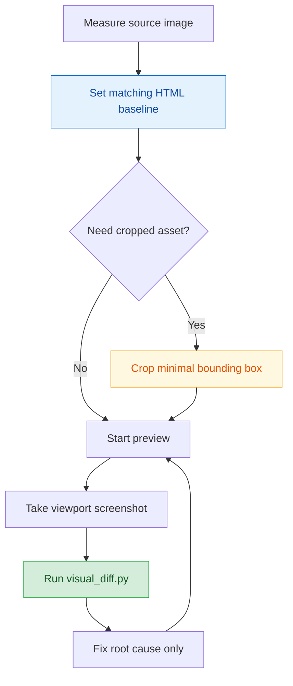

# Pixel Alignment Playbook

## Quick Navigation

- [Goal](#goal)
- [Alignment Flow](#alignment-flow)
- [Establishing Baselines](#establishing-baselines)
- [Asset Cropping Strategy](#asset-cropping-strategy)
- [Visual Comparison Workflow](#visual-comparison-workflow)
- [Interpreting Diff Results](#interpreting-diff-results)
- [Acceptance Checklist](#acceptance-checklist)

---

## Goal

This reference document supplements [SKILL.md](../SKILL.md) with hands-on details. The focus is moving "image-to-HTML" past "roughly looks right" and converging quickly to a high-fidelity, evidence-backed result.

[Back to top](#quick-navigation)

---

## Alignment Flow



[Back to top](#quick-navigation)

---

## Establishing Baselines

1. Measure the source image with [image_info.py](../scripts/image_info.py).
2. If there is no responsive requirement, use the source image's width and height as the initial HTML baseline.
3. Preview and screenshot must share the same dimensions.
4. If the comparison images have different sizes, fix the dimensions first — do not look at the diff yet.

Suggested command:

```bash
python scripts/image_info.py --image source.png --json
```

[Back to top](#quick-navigation)

---

## Asset Cropping Strategy

Before cropping, ask two questions:

1. Is this content complex enough that hand-coding it in CSS is not worth it?
2. Can this content stand alone, or would cropping it pull in part of its parent container?

### Should crop

- Book covers, photographs, character illustrations, complex decorations, hand-lettering, noise textures

### Should not crop

- Header bar
- Headline text
- Feature lists
- Solid color blocks, rounded corners, arrows, borders
- Entire column containers

### Cropping rules

- Always crop the minimum necessary bounding box
- Keep the asset's own boundary; do not include large surrounding whitespace
- If only one image within a block is complex, do not convert the entire block to an image for convenience

Suggested command:

```bash
python scripts/crop_image.py --source source.png --output asset.png --box 120,40,381,350 --json
```

[Back to top](#quick-navigation)

---

## Visual Comparison Workflow

1. Start a local preview server
2. Set the viewport to exactly match the source image dimensions
3. Take a viewport screenshot (no `fullPage`)
4. Run [visual_diff.py](../scripts/visual_diff.py) to compare
5. Check dimensions first, then inspect `diff_bbox`
6. Fix only the root cause of each difference

Suggested command:

```bash
python scripts/visual_diff.py ^
  --expected source.png ^
  --actual render.png ^
  --diff-out diff.png ^
  --overlay-out overlay.png ^
  --json
```

[Back to top](#quick-navigation)

---

## Interpreting Diff Results

### `changed_pixels`

- Reflects the number of differing pixels
- Use it to track whether the scope of differences is shrinking

### `mean_diff_ratio`

- Reflects overall difference intensity
- Use it to confirm each adjustment is converging in the right direction

### `diff_bbox`

- Most important: it tells you directly where differences are concentrated
- A narrow bbox usually points to a specific bar, border, font size, or single image position issue
- A bbox that covers nearly the full canvas usually means overall dimensions, spacing, fonts, or a large background area is wrong

[Back to top](#quick-navigation)

---

## Acceptance Checklist

1. First verify:
   - HTML text is selectable
   - Complex assets are not disguised as full-column screenshots
   - Screenshot dimensions match the source image
2. Then verify:
   - `mean_diff_ratio` is noticeably lower than the initial version
   - `diff_bbox` no longer falls in an obviously wrong region
3. Finally, review visually:
   - No double bars or double headings
   - No unexpected white gaps, odd boundaries, or proportion squashing
   - Repeated elements have consistent visual weight across all three columns

[Back to top](#quick-navigation)
