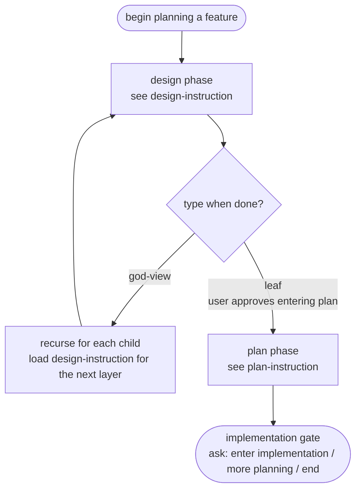

# task-decomposition

When performing any **planning** / **design** / **plan** task, you MUST strictly follow the rules in [Path & Filename Rules](references/name-rules.md). The path and filename are simultaneously the scope-decomposition criteria and the functional structure of the system; you MUST use this skill's rules to decide *how* to split before writing anything, not after the fact.

By enforcing a consistent functional structure and decomposition criteria, anyone can quickly understand the repo's feature landscape from *directory layout* and *file listing* alone — establishing a system overview with minimal resources rather than loading all content first and filtering afterwards.

## Core Concepts

- The terms `DIRS`, `DC`, `SUBNAME`, `SEQUENCE`, `draft`, `review` referenced below are defined in [name-rules.md](references/name-rules.md); load it on demand when you actually need the definitions.
- All documents live under some `docs/sys/`. A directory name represents the meaning of a feature; its content is the detail of that feature. The content may be another directory (further subdivided into independent / oversized sub-features), or actual `design.md` / `plan.md` files plus their corresponding `plan*-review*.md` peer-review artifacts.
- `design.md` filename format: `<DIRS>[-DC.SUBNAME]-design[-draft].md`
    - Audience is humans; this is an SA document. Content is an abstract feature description, with `user story` as the main body, and includes system-level requirements (idempotency, concurrency control, scheduling, caveats, etc.).
    - Content MUST NOT touch any programming language or system implementation detail; it only describes "what" and "why", never "how".
    - One `design.md` MUST NOT exceed 300 lines. Exceeding the limit means the scope is too large; you **MUST** split using one of the two ways below:
        - Split with `DC` — multiple `-DC.SUBNAME-design.md` files in the same directory, meaning this directory's feature is composed of these `-DC.SUBNAME-design.md` files.
        - Split into one or more sub-directories, deferring detail to a deeper abstraction layer.
    - This file plays one of two roles:
        - `god-view`: a high-abstraction narrative integrating multiple sub-features. Content links to sub-directories or other `design.md` files. **MUST NOT** have any corresponding `plan.md`.
        - `leaf`: a small, directly implementable feature. **MUST** have one or more corresponding `plan.md`.
- `plan.md` filename format: `<DIRS>[-DC.SUBNAME]-plan[-SUBNAME[.SEQUENCE]][-draft].md`
    - Audience is AI agents; this is an SD document. Content is a concrete implementation plan and **MUST** be expressed as `SBE` (Specification by Example); each input/output example is simultaneously the implementation target and acceptance criterion.
    - Content covers concrete implementation: programming language, module breakdown, function signatures, data structures, etc. — describing "how"; do NOT repeat "what" / "why" already covered in the `design.md`.
    - One `plan.md` MUST NOT exceed 500 lines. Beyond that, the implementation burden is too large; you **MUST** split by `SUBNAME` (topic). If a single `SUBNAME` still has too many SBE test cases, further split by 2-digit sequence `.01`, `.02`, ...
    - Every `plan.md` **MUST** have a corresponding `<plan-base>-review.md` (peer-review artifact) produced during the plan six-phase flow; an independent fork agent writes the review, the main agent personally appends the decision block, and an independent apply fork agent mechanically applies the decisions. See [plan-instruction.md](references/plan-instruction.md).
- `plan*-review*.md` filename format: `<DIRS>[-DC.SUBNAME]-plan[-SUBNAME[.SEQUENCE]]-review[-draft].md`
    - Audience is AI agents; this is the peer-review artifact for a plan and **MUST** only appear on top of a `plan`-series filename; it **MUST NOT** carry its own SUBNAME / SEQUENCE.
    - Records findings, suggestions, and the main agent's decisions about a single `plan.md`; line limit reuses plan's 500-line WARN.
- `draft` is the file suffix marking a "planned but not yet started" item. Its purpose is to record what has been planned but not yet authored, eliminating the need for an extra list registry. `-draft` may combine with `-review`: `<plan-base>-review-draft.md` means the review has been opened but its content is not yet written.
- `docs/sys/list.md` registry: when a project already has multiple independent sub-modules (e.g. monorepo submodule, microservice, subsystem, subproject, etc.), this registers the `docs/sys/` paths of each sub-module so documents can be naturally distributed at the project structure level — achieving good decoupling and modularity, while the root `list.md` still gives the full feature picture at a glance.

## Reconciling User Preferences with Rules

When the user explicitly instructs something that appears to violate this skill's rules (e.g. "put it under container X" while X holds only one sub-module and fails god-view's literal condition, or "they belong to the same scope" while the rules seem to demand sub-directory splitting), follow these steps:

1. **Classify the preference type**:
    - Naming / path preference (does not affect structural compliance — execute directly).
    - Structural preference (affects god-view / leaf / sub-directory / same-layer split decisions).
    - Rule-boundary preference (appears to violate but actually reveals a gap in the rules themselves).
2. **Identify rule gaps**: if the preference touches a missing rule branch (such as "business-domain container", "cross-sub-module shared rules"), **prefer broadening the rule interpretation** over pushing back; also record the gap for a future skill revision.
3. **If the conflict cannot be reconciled**: list the rule limitation and alternative options, and let the user decide; **NEVER** decide unilaterally.

CLAUDE.md / AGENTS.md / direct user instructions always override this skill's rules; this section only fills in the reconciliation flow that the skill itself was missing.

## Script Execution Convention

- All references to `<SKILL_ROOT>/scripts/check.py` in reference documents are **relative to this skill's installation path** — the directory containing `SKILL.md`.
- AI agents **MUST** dynamically resolve `<SKILL_ROOT>` to the actual installation path; **NEVER** hard-code any project-specific path like `.claude/skills/task-decomposition/...`. This skill is generic and may be placed anywhere.
- Resolution rule: `<SKILL_ROOT>` = the absolute directory containing this SKILL file; the actual script path = `<SKILL_ROOT>/scripts/check.py`.

## Workflow Overview

The two phases connect like this: `design` is the human-facing SA stage that decomposes scope; `plan` is the AI-agent-facing SD stage that turns each `leaf` design into executable SBE specs plus peer-reviewed and applied decisions. Always load the matching instruction reference before writing.

## Further Reading by Task

- For any task that **adds / modifies / extends** a `design.md`, load [design-instruction.md](references/design-instruction.md).
- For any task that **adds / modifies / extends** a `plan.md` (or its peer-review artifact `plan*-review*.md`), load [plan-instruction.md](references/plan-instruction.md).
- To see an end-to-end "directory + filename + content" demonstration, load [example.md](references/example.md) (uses an `order` system as scenario, covering god-view, leaf, `-draft`, `DC.SUBNAME` same-layer split, `.metadata.md` / `list.md`, and `check.py` output).
