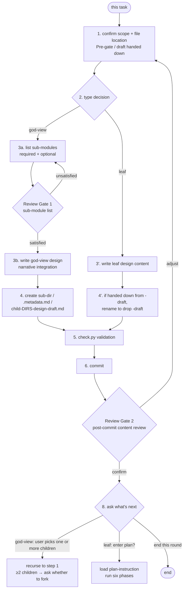
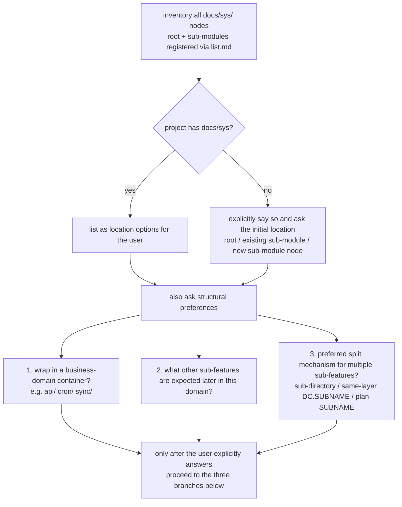
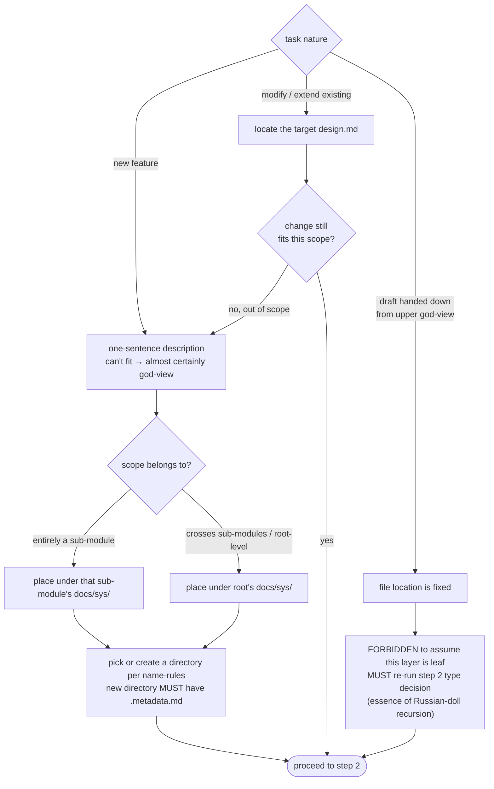
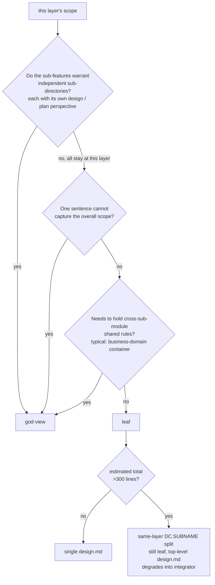
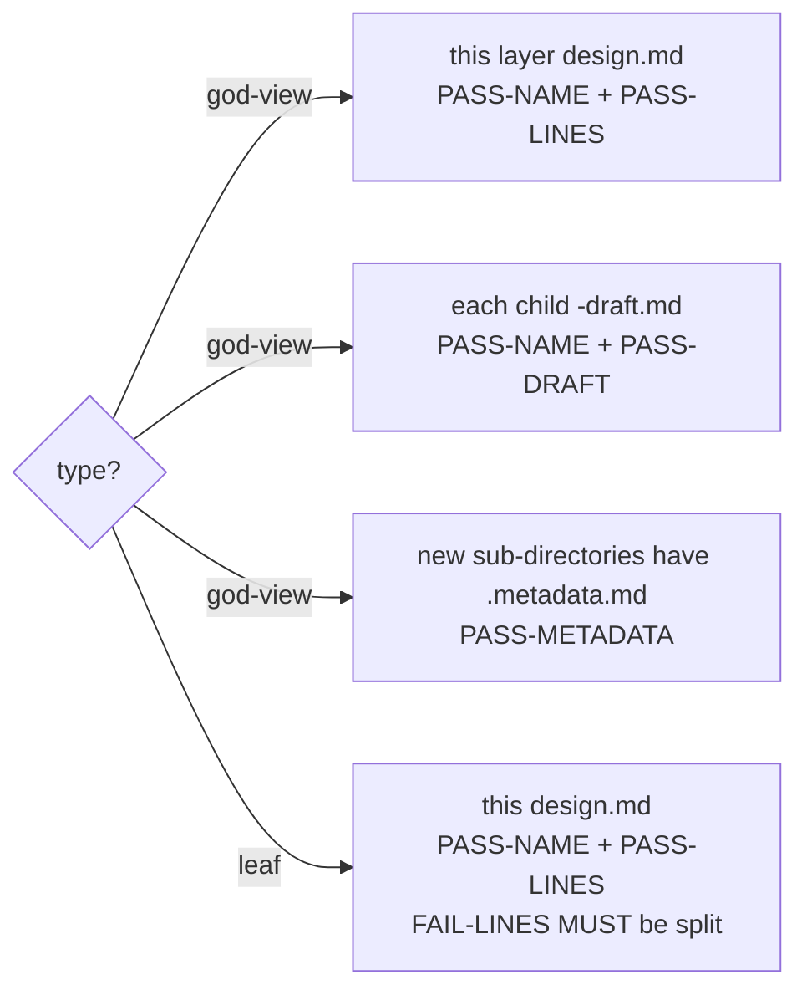
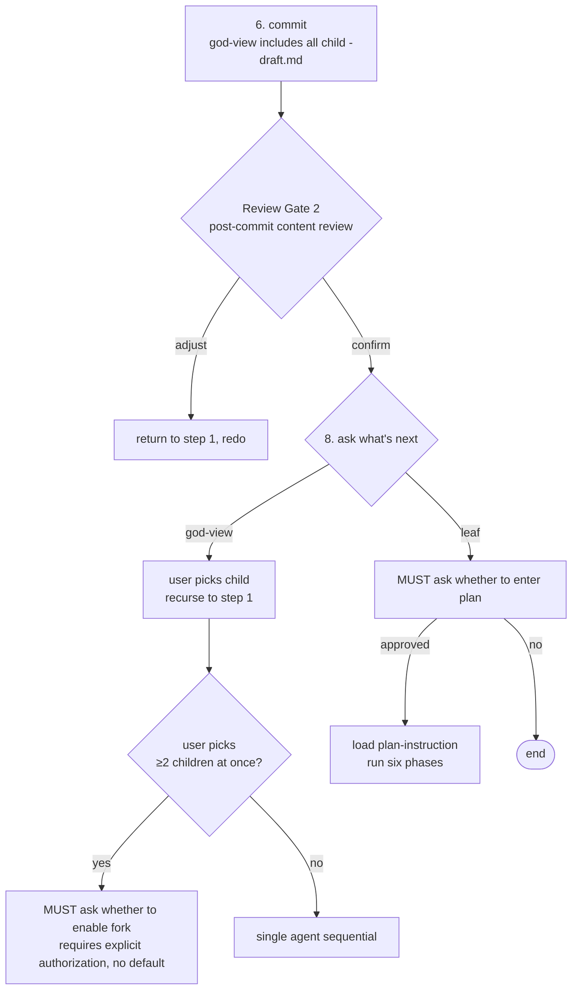

# design.md Authoring Guide

> For an end-to-end example (god-view / leaf / draft / `DC.SUBNAME` same-layer split), see [example.md](example.md).

> Entering this document means: you are about to **add / modify / extend** some `design.md`.
> By scope size, design splits into two types that interlock as a "Russian doll" recursive decomposition:
> 1. `god-view` (the integrator type): scope still contains multiple independent sub-modules; this layer's design describes the outline + lists sub-modules (required + optional), and creates a `<child-DIRS>-design-draft.md` placeholder for each sub-module; this layer's design **MUST NOT** correspond to any plan.
> 2. `leaf` (the implementation type): scope no longer needs to be split into sub-directories; this layer can write an implementation-type design with corresponding plan (same-layer `DC.SUBNAME` split is still allowed for multiple design / plan files; in that case the top-level `<DIRS>-design.md` decides whether it corresponds to a plan based on its specific role); when done, enter the six-phase flow in [plan-instruction.md](plan-instruction.md).
>
> Any `-draft.md` is the starting point for the next round, recursing downward until all `leaf`s are complete. Each layer: complete → commit → pause for user review → only proceed to next layer / phase after user approval.

## Authoring Flow Overview



Every design follows this flow; steps 3 / 4 / 8 branch by `god-view` / `leaf` type (in the diagram: G3a / G3b / G4 vs L3 / L4). `god-view` goes through 2 review gates (step 3 bullet + step 7); `leaf` only 1 (step 7).

## Step 1: Confirm Scope and File Location

### Pre-gate (MANDATORY for legacy projects first introducing this skill, or whenever a new scope is added)

If the user did not explicitly specify which `docs/sys/` this design goes into, you **MUST** first proactively inventory and ask. **MUST NOT** assume the location or auto-create `docs/sys/`.



### Three branches



Key rules:

- **Boundary judgment**: if a feature is mostly in one sub-module (rough estimate ≥ 80% of user story / system requirements belong to it), even with minor cross-module interactions, still place it in that sub-module's `docs/sys/`; cross-module dependencies go in the design's "Premises and Constraints" section.
- **Business-domain container**: when the scope belongs to a sub-module but that sub-module already has, or is expected to have, multiple semantically distinct business domains (e.g. "outward APIs", "cron jobs", "data sync"), you **SHOULD** create a domain-classification directory as a container (e.g. `api/`, `cron/`, `sync/`) and place sub-features of that domain inside. The container directory **SHOULD** be created even when it currently hosts only one sub-feature; the layer's design takes `god-view` per condition (c) below, holding cross-sub-module shared rules. Whether to use a container is decided at the Pre-gate ask step, not retrofitted later.
- When first using a sub-module's `docs/sys/`, you **MUST** create an empty `list.md` in it (even with no downstream nodes), and register the node in root or upper `list.md` (rules in [name-rules.md](name-rules.md)).

## Step 2: Decide Design Type



**Line count decides only "single file vs DC.SUBNAME split within `leaf`", NOT "god-view vs leaf".** A leaf whose content grows past 300 lines stays a leaf and splits via same-layer `DC.SUBNAME`; it does **not** automatically become god-view. god-view is reserved for cases where the sub-features genuinely deserve independent sub-directories (their own `docs/sys/<sub>/` perspective with separate design + plan).

- `god-view`: this layer's scope still requires further splitting into independent sub-directories (each sub-module gets its own `docs/sys/<sub>/` perspective with its own design / plan). A `god-view` directory **MUST NOT** contain any `plan.md` or any corresponding `plan*-review*.md`; it does narrative integration only.
- `leaf`: this layer's scope does not require further splitting into sub-directories; you can directly write the implementation-type design here with corresponding plan. If content grows too large, you may use same-layer `DC.SUBNAME` split for multiple design / plan files. In that case, `<DIRS>-design.md` degenerates into a god-view integrator (**no longer corresponds to any plan**), and plan is handled by each DC-split file (`<DIRS>-NNNN.SUBNAME-plan*.md`). Same-layer split does NOT count as downward decomposition.

## Step 3-4: Write Content + Handle Child Files / Rename

### god-view flow

1. List this layer's sub-modules; classify each as "Required" or "Optional":
    - Required: indispensable; without it the system / module cannot function.
    - Optional: nice-to-have; can be added later; does not affect core operation.
2. **Review Gate 1 (list review, no artifact)**: pause and present the sub-module list to the user (**no files created yet**); confirm the list is complete and the required / optional split is correct. If unsatisfactory, return to this step. Once approved, proceed.
3. Per the "`god-view` template" below, write this layer's `design.md`: this layer is narrative integration only and **MUST NOT** include implementation detail; the "Sub-modules" section lists required + optional with a link to each `<child-DIRS>-design-draft.md`.
4. For each sub-module, create the directory + `.metadata.md` (empty file is fine) + `<child-DIRS>-design-draft.md` placeholder (file existence is enough; content can be empty or just a placeholder title line).
    - `<child-DIRS>` **MUST** be "this layer's `DIRS` + sub-directory name" joined by `-` (e.g. this layer is `docs/sys/ecommerce/`; sub-directory `catalog/` has child-DIRS = `ecommerce-catalog`; filename `ecommerce-catalog-design-draft.md`; **NEVER** write `catalog-design-draft.md`).
    - If this layer needs same-layer `DC` split instead of downward sub-directories, each DC-split file **MUST** include `SUBNAME` (e.g. `ecommerce-1000.checkout-design.md`, `ecommerce-2000.fulfillment-design.md`); naming rules in [name-rules.md](name-rules.md), validated by `check.py`.

### leaf flow

- Per the "`leaf` template" below, directly write the actual design content with user story as main body; describe "what" and "why" only, **never** any programming implementation.
- If this file was handed down from an upper-level `-draft.md`, rename to remove the `-draft` suffix.

## Step 5: Rule Validation



- Command: `python <SKILL_ROOT>/scripts/check.py <file path>` (see SKILL "Script Execution Convention" for resolving `<SKILL_ROOT>`).
- **NEVER** compare filenames / paths / line counts yourself; legality is determined by the script.
- If `list.md` or new `docs/sys/` nodes are involved, **MUST** also run `check.py` against the relevant `docs/sys/` directory (`PASS-REGISTRY` / `FAIL-REGISTRY` / `FAIL-CYCLE`).

## Step 6-8: Commit / Review Gate 2 / Ask What's Next



Iron rules:

- Review Gate 2 **MUST** pause and wait for the user to confirm the committed content; **MUST NOT** enter sub-modules or plan without approval.
- `god-view` goes through 2 review gates (step 3 bullet + step 7); `leaf` only 1.
- A `leaf` design **MUST** have a corresponding `plan.md`; missing one means the feature is unimplemented. A `god-view` design **does not** correspond to plan or review (see SKILL strong-dependency relations).

## Split-Mechanism Decision

`design` / `plan` expose three split mechanisms that are easy to confuse. The key question driving the choice: **"Can a single design fully describe all sub-features' user stories and acceptance criteria?"**

| Situation | Split mechanism | Resulting structure |
|---|---|---|
| Each sub-feature has its own user story / system requirements that warrant a dedicated design | Sub-directory | One directory per sub-feature, each with its own `design.md` and `plan.md` |
| Same scope, but the design content is too large to fit in 300 lines | Same-layer `DC.SUBNAME` design | Multiple `design.md` in the same directory; the original `<DIRS>-design.md` degrades into a god-view integrator |
| Same design scope (shared user stories and acceptance criteria), only the implementation timing or facet differs | `plan` `SUBNAME` | One `design.md` shared by all sub-features; multiple `<DIRS>-plan-SUBNAME.md` (unfinished facets stay as `-draft`) |

Short logic:

- "User stories splittable into independent designs" → sub-directory.
- "Stories not splittable but design exceeds 300 lines" → same-layer `DC.SUBNAME` design.
- "Stories not splittable, design fits within 300 lines, sub-features only differ in implementation timing or facet" → `plan` `SUBNAME`.

## Common User-Intent Mapping

When the user gives a structural-preference instruction, translate it into the following structural action (do NOT execute the literal words while ignoring structural implications):

| User phrase | Structural action |
|---|---|
| "Put it under X" / "belongs to domain X" | Create a business-domain container `X/`; the layer carries at least one `god-view` design holding cross-sub-module shared rules (god-view condition c). |
| "Same scope, don't split too many directories" | Use `plan` `SUBNAME`; **do NOT** create sub-directories; one `design.md` covers all sub-features. |
| "Implement A first, B / C later" | One `design.md` covers A / B / C; split via `plan` `SUBNAME`; B / C stay as `-draft`. |
| "Keep it simple, don't over-engineer" | Skip the container; place the scope flat under the sub-module's `docs/sys/`. |
| "Many X will be added later" | Even if only one is planned now, create the container; list expected sub-feature names under the god-view's Optional section. |
| "Promote a sub-feature into the new container" / "wrap retroactively" | Move existing files into the new container, regenerate DIRS in filenames, re-run `check.py`; never leave the old location half-empty. |

When a user phrase does not appear in this table but feels structural, treat it as a structural preference and re-run the Pre-gate questions before writing anything.

## Required Elements

Required elements differ by type:

### `god-view` design

- Functional purpose: this layer's overall scope purpose (why).
- User Story: this layer's overall use cases (can be abstract; details handled per sub-module).
- System requirements: this layer's overall system-level requirements (idempotency, concurrency, scheduling, cross-module concerns).
- Sub-modules: list required + optional, each with a one-sentence responsibility, plus a link to each `<child-DIRS>-design-draft.md`.

### `leaf` design

- Functional purpose: a paragraph explaining why this feature exists (why).
- User Story: list use cases in "As a X, I want Y, so that Z" format (user-facing what).
- System requirements: list system-level guarantees that MUST hold (scheduling, idempotency, concurrency, consistency, failure recovery, performance, audit, authorization, etc.). Describe "what is needed", not "how"; if none, write "None".
- Acceptance criteria: human-readable "what state counts as done" (done definition).
- Premises and constraints: explicit dependencies and boundary assumptions.

## Document Templates

Pick the template matching the type. Section titles and order **MUST NOT** be changed, to keep all design files in a consistent format.

### `god-view` design template

````markdown
# <DIRS>[-DC.SUBNAME] design (god-view)

## Functional Purpose

<Overall purpose of this layer's scope, one paragraph.>

## User Story

- As a <role>, I want <overall goal>, so that <overall benefit>.
- As a <role>, I want <overall goal>, so that <overall benefit>.

## System Requirements

- <category>: <overall requirement at this layer>
- <category>: <overall requirement at this layer>

## Sub-modules

### Required

- [<sub-module name>](<relative path/<child-DIRS>-design-draft.md>) — <one-sentence responsibility>
- [<sub-module name>](<relative path/<child-DIRS>-design-draft.md>) — <one-sentence responsibility>

### Optional

- [<sub-module name>](<relative path/<child-DIRS>-design-draft.md>) — <one-sentence responsibility>
- [<sub-module name>](<relative path/<child-DIRS>-design-draft.md>) — <one-sentence responsibility>
````

### `leaf` design template

````markdown
# <DIRS>[-DC.SUBNAME] design

## Functional Purpose

<One paragraph explaining what problem this feature solves and why.>

## User Story

- As a <role>, I want <action>, so that <benefit>.
- As a <role>, I want <action>, so that <benefit>.

## System Requirements

- <category>: <concrete requirement>
- <category>: <concrete requirement>

## Acceptance Criteria

- <human-verifiable done state 1>
- <human-verifiable done state 2>

## Premises and Constraints

- <dependency, boundary assumption, or out-of-scope item>
````

## Forbidden Content (belongs to `plan.md`)

- Programming language, framework, library, function, or interface names.
- Data structures, API paths, database query syntax.
- Concrete input / output examples (these are SBE — go in `plan.md`).
- Concrete implementation techniques for "system requirements" (e.g. using a database unique index for idempotency, using a scheduler for scheduling, using distributed lock to prevent races). System requirements only describe the requirement itself; implementation goes in `plan.md`.

## Split on FAIL-LINES (reactive)

> Triggered only when `check.py` reports `FAIL-LINES`. For up-front "which mechanism to pick by intent", see "Split-Mechanism Decision" above.

When `check.py` reports `FAIL-LINES`, you **MUST** split (`leaf` only; `god-view` rarely exceeds because it's narrative). Splitting order:

1. First choice: split into sub-directories — when the feature can be cleanly divided into independent sub-domains (this layer typically becomes `god-view`).
2. Second choice: same-layer `DC.SUBNAME` split — when sub-domains are not easily distinguishable but the content can still be grouped, use `DC.SUBNAME` encoding (each DC-split file MUST carry SUBNAME); rules in [name-rules.md](name-rules.md).

## Completion Checklist

- [ ] `check.py` reports `PASS-NAME` + `PASS-LINES` (`leaf`), or `PASS-NAME` + `PASS-LINES` + all child `PASS-DRAFT` (`god-view`).
- [ ] No programming implementation detail anywhere in the file.
- [ ] `god-view`: every listed sub-module has its directory, `.metadata.md`, and `<child-DIRS>-design-draft.md` created.
- [ ] `god-view`: no `plan.md` and no `plan*-review*.md` in this directory (god-view MUST NOT correspond to either plan or review).
- [ ] `leaf`: proactively asked the user whether to enter plan planning next (the corresponding `plan.md` is handled in [plan-instruction.md](plan-instruction.md), not in this design's checklist).
- [ ] If handed down from `*-draft.md`, the `-draft` suffix has been removed by rename.
