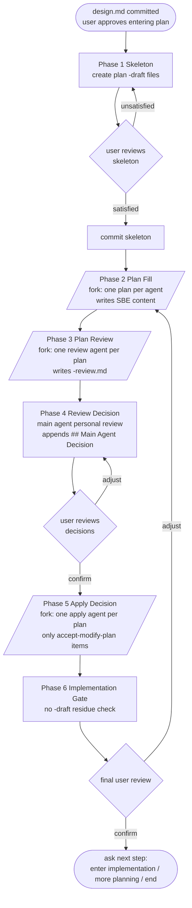
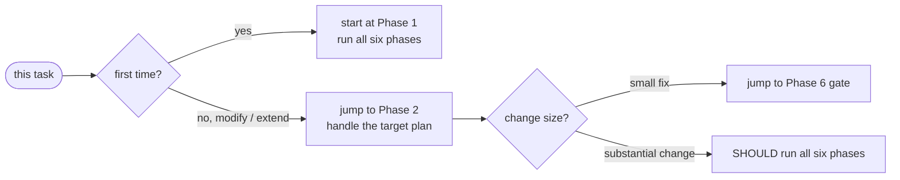
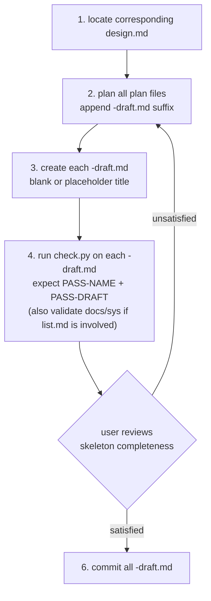
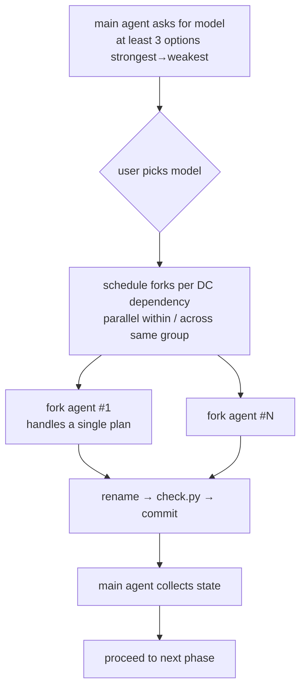
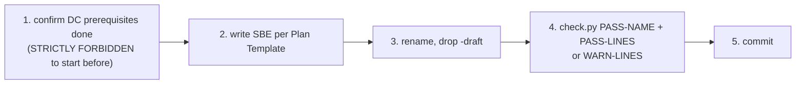
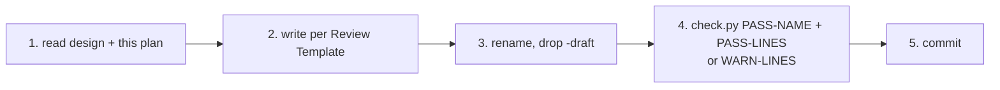
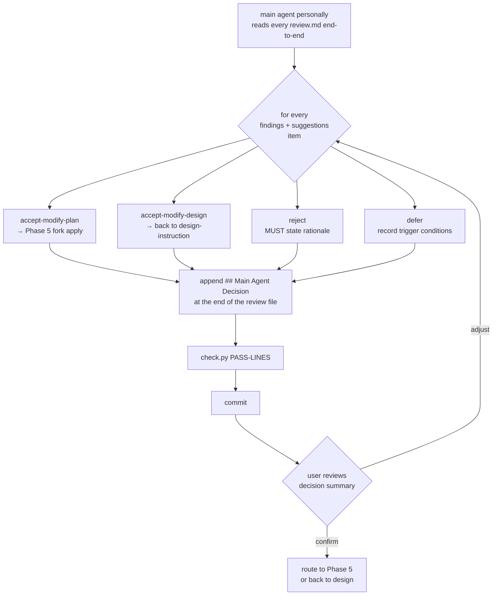
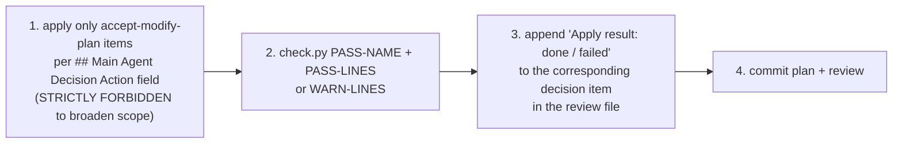
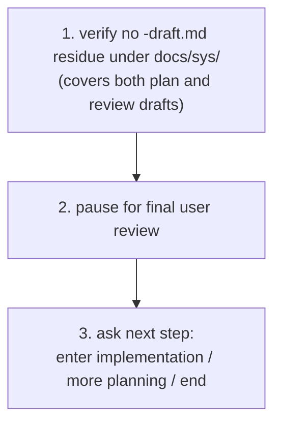

# plan.md Authoring Guide

> For an end-to-end example (including plan template, SBE writing, `.SEQUENCE` split), see [example.md](example.md).

> Entering this document means: you are about to **add / modify / extend** some `plan.md`.
> The corresponding `design.md` MUST already exist and MUST be `leaf` (a `god-view` directory **MUST NOT** contain any `plan.md` or any `plan*-review*.md`); if not yet existing or needs adjustment, return to [design-instruction.md](design-instruction.md).

## Six-Phase Overview



In the diagram, `[/.../]` denotes a fork-parallel phase (mandatory model prompt, one agent per plan); rectangles are sequential; diamonds are user review gates.

**Rules of iron**:

- **FORBIDDEN** to skip Phase 1 and write SBE directly — you would lose skeleton review and DC-based parallel scheduling.
- **FORBIDDEN** to skip Phase 3 / 4 and go straight to implementation; **FORBIDDEN** for a fork agent to evaluate its own plan; **FORBIDDEN** to enter Phase 5 before the user confirms the decisions.

## Entry-Point Selection



## Phase 1: Skeleton (planning the plan structure, sequential)

Entry condition: corresponding `design.md` is committed; the user has approved entering the plan phase; the design is `leaf`.



Rules:

- Every `leaf` design MUST have a corresponding `plan.md` in the same `docs/sys/` as the design; missing it means the feature is unimplemented.
- Naming follows [name-rules.md](name-rules.md): `<DIRS>[-DC.SUBNAME]-plan[-SUBNAME[.SEQUENCE]]-draft.md`.
- Step 3 **FORBIDS** writing actual SBE content (this stage builds only the skeleton).
- Step 4 **STRICTLY FORBIDS** the AI from comparing filenames / paths itself; legality is determined by `check.py`. See SKILL "Script Execution Convention" for resolving `<SKILL_ROOT>`.

## Phase 2 / 3 / 5 Common Fork Pattern

Phase 2 (Plan Fill), Phase 3 (Plan Review), and Phase 5 (Apply Decision) share the same fork-flow skeleton; they differ only in "context minimum set" and "single-task steps".



Shared rules of iron:

- **Mandatory fork**: one plan corresponds to one independent fork agent; applies regardless of inter-plan DC relationships.
- **DC dependencies MUST be respected**: main agent schedules per DC encoding — higher digits depend on lower; do not fork a dependent before its prerequisites finish.
- **Model prompt is MANDATORY**: before launching any fork, the main agent **MUST** ask the user "which model should this phase's fork agents use" and **MUST** list **at least 3 options ordered from strongest to weakest** (strongest / balanced / fastest, using model names available in the current execution environment; e.g. Opus 4.7 / Sonnet 4.6 / Haiku 4.5); **STRICTLY FORBIDDEN** to launch any fork before the user has explicitly chosen.
- **Context purity**: each fork agent's context **MUST** contain only the minimum set defined for that phase; **STRICTLY FORBIDDEN** to inject any other plan, sub-module, or unrelated project rules.
- **Per-item review concentrates in Phase 4**: Phase 2 / 3 / 5 **DO NOT** pause for per-file review, to avoid breaking the parallel flow.
- **Main agent responsibility**: ask for model → schedule forks → collect state → trigger the next phase; **FORBIDDEN** to silently wait or let the flow stop naturally.

## Phase 2: Plan Content Fill

Entry condition: Phase 1 skeleton committed.

Context minimum set (each fork agent):

1. The corresponding `design.md` content (or its file path).
2. The plan's `-draft.md` file path.
3. The single-task rules below.

Single `-draft.md` fill task:



Model option examples: Opus 4.7 (complex SBE, multi-facet implementation) / Sonnet 4.6 (average complexity) / Haiku 4.5 (simple / repetitive SBE).

**Termination**: every plan `-draft.md` is renamed and all plan `check.py` validations pass.

## Phase 3: Plan Review

Entry condition: Phase 2 ended.

Extra sequential skeleton step: the main agent creates `<plan-base>-review-draft.md` placeholders for every `<plan-base>.md`, and runs `check.py` on each, expecting `PASS-NAME` + `PASS-DRAFT`. Naming rules in [name-rules.md](name-rules.md) section `review.md` (review **MUST NOT** carry its own SUBNAME / SEQUENCE).

Context minimum set (each review fork agent):

1. The corresponding `design.md` content (or its file path).
2. The corresponding `<plan-base>.md` content (or its file path).
3. The `<plan-base>-review-draft.md` file path.
4. The single-task rules below.

Extra iron rule: **STRICTLY FORBIDDEN** for "the same fork agent that filled the plan" to review its own plan; the review fork agent **MUST** be a different instance from the plan's fill agent, to avoid self-blindspots.

Single review task:



Model option examples: Opus 4.7 (deep SBE-logic gap hunting, missing boundaries, potential races) / Sonnet 4.6 (average complexity) / Haiku 4.5 (structurally simple plan).

**Termination**: every `*-review-draft.md` is renamed and all review `check.py` validations pass.

## Phase 4: Review Decision (main-agent personal review + user confirmation)

Entry condition: Phase 3 ended.



Rules of iron:

- The main agent **MUST personally** read every `<plan-base>-review.md` end-to-end; **STRICTLY FORBIDDEN** to delegate decisions to fork agents, otherwise the cross-plan global view is lost.
- Every "Findings and Suggestions" item in every review **MUST** map to exactly one `## Main Agent Decision` entry.
- At the Review Gate pause, the main agent **MUST** present the decision summary per plan (counts of the four categories + key points); **STRICTLY FORBIDDEN** to enter Phase 5 before the user explicitly confirms.

### Decision categories

- `accept-modify-plan`: accept the suggestion; modify the corresponding plan content; Phase 5 forks an apply agent.
- `accept-modify-design`: accept the suggestion but require an upper `design.md` change; **MUST** pause this flow and return to [design-instruction.md](design-instruction.md); after the design change, affected plans typically need to rerun Phase 2-4.
- `reject`: do not accept the suggestion; **MUST** state the rationale.
- `defer`: accept but defer; record rationale and trigger conditions; not handled in this round's Phase 5.

### Main-agent decision template (appended at the end of the review file)

````markdown
## Main Agent Decision

### 1. <Number matching a "Findings and Suggestions" item>

- Decision: <accept-modify-plan / accept-modify-design / reject / defer>
- Rationale: <why this decision; may quote design, existing rules, or implementation trade-offs>
- Action: <for accept-modify-plan, the concrete change to apply, ready for a fork agent to execute mechanically; other types may omit>

### 2. <Number matching a "Findings and Suggestions" item>

- Decision: ...
- Rationale: ...
- Action: ...
````

## Phase 5: Apply Decision

Entry condition: Phase 4 decisions committed and confirmed by the user.

Scope:

- **Only** `accept-modify-plan` items are handled here; `reject` / `defer` are skipped; `accept-modify-design` is handled by the main agent returning to [design-instruction.md](design-instruction.md) (out of this phase's scope).
- If none of a plan's decisions is `accept-modify-plan`, Phase 5 does not fork an apply agent for that plan.

Context minimum set (each apply fork agent):

1. The corresponding `design.md` content (or its file path).
2. The corresponding `<plan-base>.md` content (or its file path).
3. The corresponding `<plan-base>-review.md` content (or its file path); the `## Main Agent Decision` block is the **sole** instruction source.
4. The single-task rules below.

Single apply task:



**Termination**: every `accept-modify-plan` decision has been applied, the affected plan and review `check.py` all pass, and no unprocessed decisions remain.

## Phase 6: Implementation Gate

Entry condition: Phase 5 ended.



Residue-check commands (pick by environment):

- POSIX (bash / zsh): `find <docs/sys path> -name "*-draft.md"`
- Windows PowerShell: `Get-ChildItem -Path <docs/sys path> -Filter "*-draft.md" -Recurse`
- Cross-platform: `python -c "import pathlib; [print(p) for p in pathlib.Path('<docs/sys path>').rglob('*-draft.md')]"`

Iron rule: **MUST NOT** enter implementation without user approval. If the user approves entering implementation, the executor **MUST** use TDD (write a failing test first, make it pass with the smallest implementation, then refactor) and **MUST NOT** skip the red phase; see "Implementation Phase Discipline" below.

## Required Elements

- Implementation boundary: list involved package / module / file paths. **After implementation lands in commits**, every path in this section **MUST** be rewritten as a working markdown link pointing to the actual file or directory. The presence and validity of these links is the canonical signal that a plan item has been implemented — a missing or broken link means the item is unimplemented or has drifted. See "Implementation Boundary as Implementation Index" below.
- Interface definitions: function / type / interface signatures to add or modify.
- System requirements mapping: for every "system requirement" item in the corresponding `design.md`, list the implementation technique used (e.g. database unique index for idempotency, scheduler for scheduling, distributed lock for race protection). The design says "what is needed"; the plan says "how".
- SBE specs: each behavior in "Input → Output" form; examples MUST be concrete and executable.
- External dependencies: required packages, external services, prerequisite plans.

## Document Templates

### Plan template (used in Phase 2)

````markdown
# <DIRS>[-DC.SUBNAME] plan[-SUBNAME[.SEQUENCE]]

> Corresponds to design: [<DIRS>[-DC.SUBNAME]-design.md](<relative path>)

## Implementation Boundary

- package / module: <path>
- Files involved: <file path list>

## Interface Definitions

<List function / type / interface signatures to add or modify.>

## System Requirements Mapping

- <design system-requirement category>: <implementation technique used here>
- <design system-requirement category>: <implementation technique used here>

## SBE Specs

### 1. <behavior description>

- Input: <concrete executable value>
- Output: <concrete return value and side-effects>

### 2. <behavior description>

- Input: ...
- Output: ...

## External Dependencies

- <dependent package / external service / prerequisite plan>
````

Section titles and order **MUST NOT** be changed, to keep all plan files consistent.

### Review template (used in Phase 3; Phase 4 appends the decision block)

````markdown
# <DIRS>[-DC.SUBNAME] plan[-SUBNAME[.SEQUENCE]] review

> Corresponds to plan: [<plan filename>](<plan filename>)
> Corresponds to design: [<DIRS>[-DC.SUBNAME]-design.md](<relative path>)

## Review Summary

<One paragraph summarizing the plan's overall quality and the focus of this review: SBE coverage, boundary-case sufficiency, alignment with design, any implementation-technique concerns, etc.>

## Findings and Suggestions

### 1. <Topic: nature of finding / section>

- Observation: <Concrete description of the problem, optimization opportunity, or potential risk>
- Suggestion: <Concrete actionable direction (e.g. add a boundary SBE, fix a wrong input example, clarify an interface definition)>
- Impact: <only this plan / also touches design / cross-plan (needs upper-level design handling)>

### 2. <Next topic>

- Observation: ...
- Suggestion: ...
- Impact: ...

<!-- Phase 4 appends a ## Main Agent Decision block; Phase 5 adds the "Apply result" line per item. -->
````

## Forbidden Content (belongs to `design.md`)

- Repeating "why this feature exists" — link to the `design.md` instead.
- Abstract user stories — they are already in the corresponding `design.md`.

## SBE Authoring Points

Every SBE group **MUST** satisfy:

1. Concrete input: provide values that can be pasted and executed (e.g. `userID = "u-12345"`); do not write abstract descriptions (e.g. `a valid userID`).
2. Concrete output: explicitly list return values and side-effects (e.g. `returns success; one record added in the target storage layer`).
3. Boundary coverage: besides the happy path, include at least one failure or boundary case.

## Implementation Phase Discipline

Once Phase 3 Implementation Gate completes and the user approves entering implementation, the executor (main agent or fork agents) **MUST** apply TDD discipline:

1. **Red**: write a failing test for the next unimplemented SBE; the executor **MUST** observe the test actually fail with an expected message (e.g. "function not found", "value mismatch") before moving on.
2. **Green**: write the smallest implementation that makes that test pass. **DO NOT** write more code than that test requires; **DO NOT** add branches or fields that no red test covers, even if it feels convenient.
3. **Refactor**: with all tests still green, clean up structure / naming / duplication. **MUST NOT** change any SBE behavior during refactor.
4. Loop back to Red for the next SBE until every SBE in the plan has a written-first test and passing implementation.

SBE specs in each `plan.md` provide the input / output examples that serve directly as the first red tests. **"Implement first, retrofit tests" is strictly forbidden** — that mode produces tests that follow the implementation's accidental shape rather than the specification, which violates the core spirit of TDD (only test-first can expose drift between spec and implementation).

When fork agents run Phase 2 / implementation in parallel, each fork agent **MUST** independently apply TDD inside its own scope; the main agent **MUST** verify (during integration) that every plan SBE has a corresponding test and that the test was written before, not after, the implementation it covers.

**Remediation path**: if implementation has already landed without TDD discipline (legacy code or a speed-driven shortcut), the executor **MUST** run a remediation audit before treating the implementation as complete: spawn an auditor with the TDD red-green-refactor lens, list SBE / branch / boundary gaps, and backfill failing-first tests for each gap. Audit + backfill is a recoverable path, not a license to skip TDD.

## Implementation Boundary as Implementation Index

The Implementation Boundary section doubles as the **single canonical index** linking plan items to actual code. Rules:

- **Phase 1 / Phase 2 (during specification / SBE writing)**: list paths as inline code (e.g. `` `pkg/foo/bar.go` ``); no link expected because the code may not exist yet.
- **After implementation lands in commits (post-merge)**: every path **MUST** be rewritten as a working markdown link to the actual file or directory. For paths that point at a specific method, link to the containing file and describe the method in the surrounding sentence; do not rely on platform-specific line anchors (e.g. `#L42`) — they break with line shifts.

**Why this matters**: a reader can verify "has this been implemented?" by simply clicking through. Broken links surface drift immediately — no separate tracking matrix or status field needed. The plan **is** the implementation index.

**Operational rule**: once implementation actually lands in commits, the responsible author **MUST** run a backfill pass to convert paths into markdown links and re-commit the plan as a `docs:` change (separate from the implementation commit). This pass is part of finishing the plan, not optional polish.

## Split Decision

When `check.py` reports `WARN-LINES`, splitting is recommended (not mandatory; depends on whether the topic can be split cleanly). Splitting order:

1. First choice: split by `SUBNAME` topic — e.g. by function name (must be in snake_case), `<DIRS>-plan-<func_name>.md`. SUBNAME only allows `[a-z0-9_]`; camelCase / kebab-case are forbidden.
2. Second choice: under the same `SUBNAME`, further split by sequence — when a single `SUBNAME` still has too many SBE test cases, split into `.01`, `.02`, etc. (SEQUENCE uses `.NN`, NOT `-NN`).

## Completion Checklists

### Phase 2 — each plan content completion check

- [ ] Corresponding `design.md` exists.
- [ ] Every behavior has concrete input / output examples.
- [ ] Every "system requirement" in the design has a corresponding implementation technique listed.
- [ ] No abstract "why this feature exists" content.
- [ ] `-draft` suffix has been removed by rename.
- [ ] `check.py` reports `PASS-NAME` + `PASS-LINES`, or `WARN-LINES` but split sensibly.
- [ ] If the `design.md` needs synced adjustment (caught during fill), the sync is done.

### Phase 3 — each review content completion check

- [ ] The corresponding `plan.md` and `design.md` have both been read carefully.
- [ ] Every "Findings and Suggestions" item has the three fields: Observation, Suggestion, Impact.
- [ ] **No** cross-plan comparison inside this review (cross-plan issues belong in the Impact field, to be handled by the main agent).
- [ ] The `-review-draft.md` suffix has been removed by rename.
- [ ] `check.py` reports `PASS-NAME` + `PASS-LINES` (or `WARN-LINES` but split sensibly).

### Phase 4 — each review decision completion check (main agent)

- [ ] Every "Findings and Suggestions" item in the review has a corresponding `## Main Agent Decision` entry.
- [ ] Each decision is one of the four categories (accept-modify-plan / accept-modify-design / reject / defer) with rationale.
- [ ] `accept-modify-plan` decisions include an "Action" concrete enough to be mechanically executed by a fork agent.
- [ ] The decision summary has been presented to the user for confirmation.

### Phase 5 — each plan apply completion check

- [ ] Only `accept-modify-plan` items from the `## Main Agent Decision` block were applied.
- [ ] An "Apply result" line is appended to each applied item in the review file.
- [ ] After modification, `check.py` re-validates the plan successfully.
- [ ] If the change also triggers a design adjustment, it has been routed via `accept-modify-design` back to design-instruction.

### Phase 6 — implementation gate + post-implementation check

- [ ] Implementation was executed strictly under TDD red-green-refactor discipline: every SBE has a failing-first test → minimal implementation to pass → refactor; no "implement first, retrofit tests" (or, if not, a remediation audit + failing-first backfill was completed before treating implementation as done).
- [ ] After the corresponding implementation lands in commits, every path under `Implementation Boundary` has been backfilled into a working markdown link (separate `docs:` commit).
