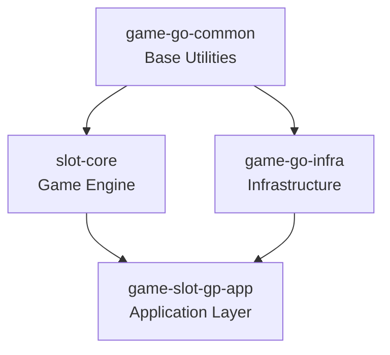
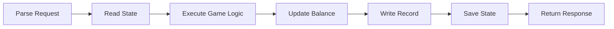
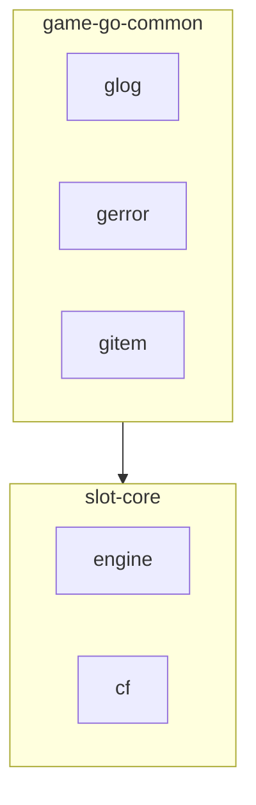
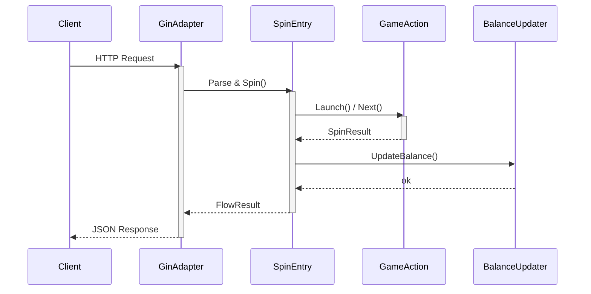
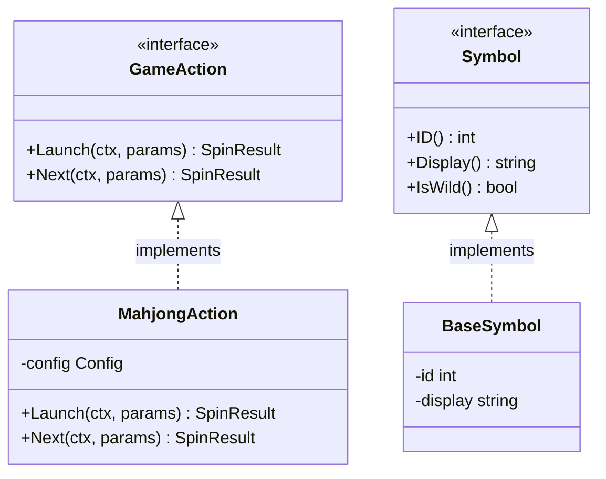
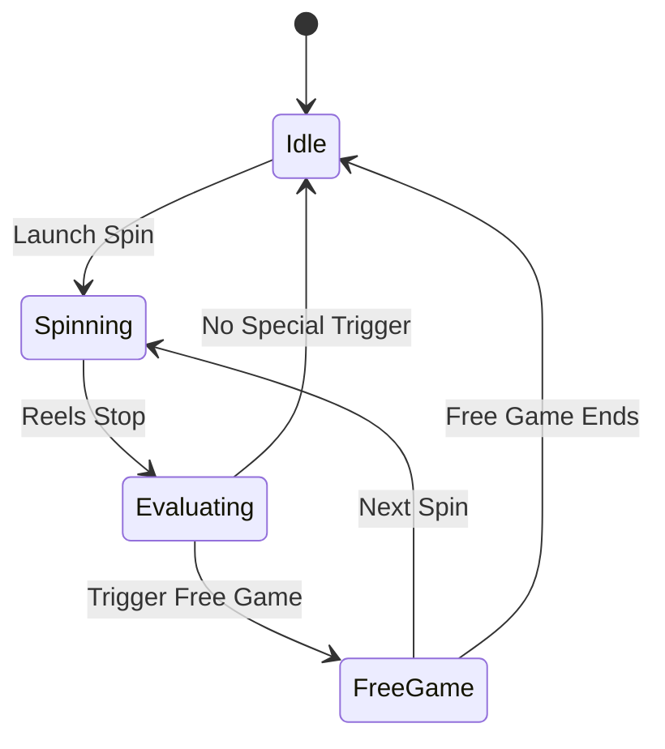
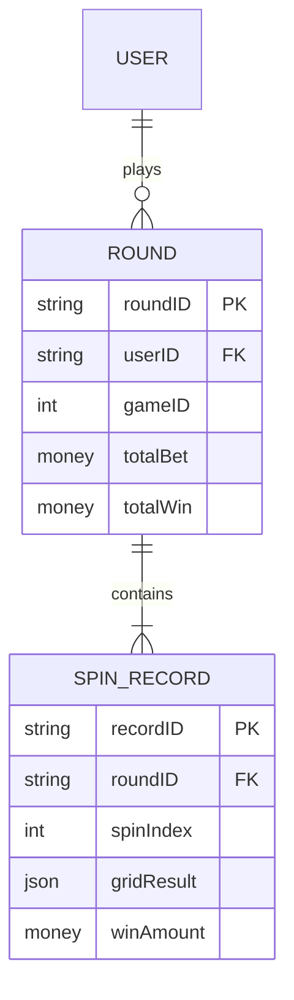

# Mermaid Diagram Examples

Per-type syntax examples for reference. Load this file when producing Mermaid diagrams.

---

## Flowchart (Module Dependencies / Pipeline)

Top-down for hierarchies:

Left-to-right for pipelines:

With subgraph grouping:

---

## Sequence Diagram (Component Interaction)

---

## Class Diagram (Interface / Struct Relationships)

---

## State Diagram (Game State / Lifecycle)

---

## ER Diagram (Data Model)

---

## Type-Specific Syntax Rules

- In sequence diagrams, place `:` between each message receiver and its message text, and close every `alt`, `opt`, and `loop` block with a matching `end`.
- In sequence diagrams, message and `Note` text MUST NOT contain a bare semicolon (`;`): Mermaid treats it as a statement terminator and parses the remaining text as a new instruction. Use a period or ` ` instead.
- In class diagrams, enclose relationship cardinalities in double quotes and include `()` in every method signature, including zero-argument methods.
- In ER diagrams, write each attribute as `<type> <name>`, e.g. `string userId PK`; MUST NOT reverse the order.
- Pie-chart values MUST be greater than zero; non-positive values may be rejected or produce no visible slice, depending on the renderer.

---

## Combining Diagrams

When documenting a complex feature, use multiple diagram types in one document:

1. **flowchart** for the high-level architecture or module dependency
2. **sequenceDiagram** for the runtime interaction between components
3. **stateDiagram-v2** for any state machine or lifecycle
4. **classDiagram** for interface/struct type relationships if needed

Choose the minimum set of diagrams that fully conveys the feature. Avoid redundancy between diagrams.
