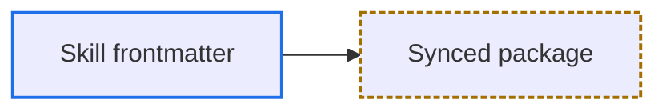

# Human Reader Markdown Rules

Load this file only when the Markdown target audience is human. Human-facing
documents focus on scannability, navigability, and ease of building a mental model.

## Applicable Contexts

- README, user guide, feature doc, architecture overview, API reference, design proposal, technical docs shared with a team.
- Content goal: help readers quickly understand background, architecture, flow, decisions, or usage.
- Documents live in repos, Wikis, PRs, Notion, or other shared knowledge bases.

## Required Output Spec

- MUST include `## Quick Navigation` or `## Table of Contents`.
- Quick Navigation MUST use Markdown links pointing to major sections within the document.
- Default to listing all major `##` sections; for long or complex documents, extend to important `###` sections.
- Each major section MUST end with a back-to-top link; default to `[Back to top](#quick-navigation)`.
- If the document uses `## Table of Contents` instead of `## Quick Navigation`, use `[Back to top](#table-of-contents)`.
- Each major section MUST be separated from the next section by a standalone `---` horizontal rule.
- By default, place `---` after the section's back-to-top link and before the next heading.
- When renaming headings or reordering sections, MUST update Quick Navigation and back-to-top links to avoid dead links or name mismatches.

## Normative Wording in Human Prose

- When a human-reader document written in Traditional Chinese needs strict requirement wording, MUST use `必須`.
- When a human-reader document written in Traditional Chinese needs strict prohibition wording, MUST use `嚴禁`.

## Mermaid Rules

- Human-reader documents MUST use Mermaid to visualize core relationships, flows, states, or data flows.
- Even for simple content, include at least one brief Mermaid diagram to organize the main structure, flow, or decision relationship.
- Mermaid diagrams MUST complement prose; they MUST NOT merely restate paragraph content.
- MUST NOT draw decorative diagrams unrelated to the document.
- When Mermaid syntax details or diagram-type examples are needed, additionally load `references/diagram-examples.md`.

## Mermaid Selection Guide

| Context | Diagram type | When to use |
|---------|-------------|-------------|
| Module dependencies, call hierarchy | `flowchart TD` | When the dependency chain between packages/modules is non-obvious |
| Cross-service request/response flow | `sequenceDiagram` | Temporal interactions among 3+ components |
| Interface/struct type relationships | `classDiagram` | Type hierarchy, interface implementations, struct composition |
| Lifecycle, state transitions | `stateDiagram-v2` | Entity flows between states with branching |
| Database schema, entity relationships | `erDiagram` | Data models with multiple foreign-key relationships |
| Processing pipeline | `flowchart LR` | Linear processing flows where direction and labels both matter |
| Decision logic, branching flow | `flowchart TD` | Conditional branches that are hard to express in prose |

If a feature spans multiple aspects, combine diagram types only when each type provides independent insight; SHOULD NOT stack diagrams just for completeness.

## Typical Structure

```markdown
# {Feature / Module Name}

## Quick Navigation

- [Overview](#overview)
- [Architecture](#architecture)
- [Flow](#flow)
- [Core Components](#core-components)
- [Notes](#notes)

## Overview

Purpose, scope, key design decisions.

[Back to top](#quick-navigation)

---

## Architecture

[Mermaid: one diagram showing core component relationships; even simple relationships deserve a minimal structural diagram.]

[Back to top](#quick-navigation)

---

## Flow

[Mermaid: one diagram showing main flow, data flow, or decision path.]

[Back to top](#quick-navigation)

---

## Core Components

Description of each component.

[Back to top](#quick-navigation)

---

## Notes

Edge cases, design constraints, unresolved issues.

[Back to top](#quick-navigation)
```

Omit inapplicable sections; add domain-specific sections as needed.

## Mermaid Best Practices

- Each diagram SHOULD focus on one concept; split complex systems into multiple diagrams.
- Node labels use English; identifiers stay ASCII.
- Add meaningful labels to flowchart edges to clarify relationship types.
- Keep diagram depth to 3-4 levels for readability.
- Use `subgraph` to group when there are 6+ nodes.
- Use `activate` / `deactivate` and `note` in sequence diagrams to mark key behaviors.
- Use `-->` solid lines for direct dependencies; `-.->` dashed lines for optional/indirect relationships.
- If the document contains multiple diagrams, Quick Navigation should allow readers to jump directly to each diagram's section.
- Sections containing diagrams MUST still include a back-to-top link; MUST NOT omit it just because a Mermaid diagram is present.

## Mermaid Syntax Safety

- In Mermaid labels, escape syntax-significant characters with Mermaid's bare numeric form (no leading `&`): `#34;` for `"`, `#40;` for `(`, `#41;` for `)`, `#123;` for `{`, `#125;` for `}`. The `&#NN;` form MUST NOT be used; the `&` survives as a literal character.
- Diamond nodes `{}` MUST NOT contain bare parentheses: `()` is parsed as a rounded-rectangle token. Wrap the entire label in double quotes, e.g. `T1{"Is FormatStack implemented?"}`, or escape as above.
- For flowchart nodes, identifiers MUST use PascalCase ASCII and display text MUST appear in a quoted label, e.g. `ParseRequest["Parse request"]`. This avoids the lowercase reserved words and the `o` / `x` edge-marker ambiguity. Other diagram types follow their own identifier and alias syntax, where the identifier is often the display text itself.
- In `classDef` property lists, use comma-separated `property:value` pairs without CSS braces; MUST NOT use semicolons as property separators.
- The first non-blank, non-comment line MUST contain only the diagram declaration and its direction, e.g. `flowchart TD`; diagram content starts on the next line.
- Before finalizing a diagram, MUST render it with the target renderer, or the same Mermaid version, when one is available, and confirm the expected nodes, edges, messages, or slices actually appear in the output. If no compatible renderer is available, MUST review every rule in this section and state that rendering was not verified. MUST NOT present a manual review as proof that the diagram renders.

## Mermaid Color and Readability

`style` and `classDef` literals do not respond to theme changes. A hardcoded light `fill` stays light when the canvas flips to dark, leaving styled nodes as bright islands while unstyled nodes, edge labels, and subgraph titles follow the theme.

- MUST NOT hardcode `fill` or text `color` in `style`, `classDef`, or init directives; leave both to the renderer theme.
- Role distinctions MUST stay understandable without color, including in grayscale and for color-blind readers; encode them with label text, node shape, or line style.
- To distinguish roles visually, set only `stroke`, `stroke-width`, and `stroke-dasharray`.
- `stroke` MUST come from the approved palette: `#1f6feb` blue, `#2ea043` green, `#a37000` amber, `#cf222e` red, `#8250df` purple, `#797979` gray.
- Adding a palette color requires a measured contrast ratio of at least 3:1 against both `#ffffff` and `#0d1117` (WCAG 1.4.11). The approved values sit within OKLCH `L 0.55-0.63`, but L predicts contrast rather than proving it, so MUST NOT derive a new color from lightness alone.
- Style roles with `classDef` plus `class`; MUST NOT repeat per-node `style` lines.

Example:


