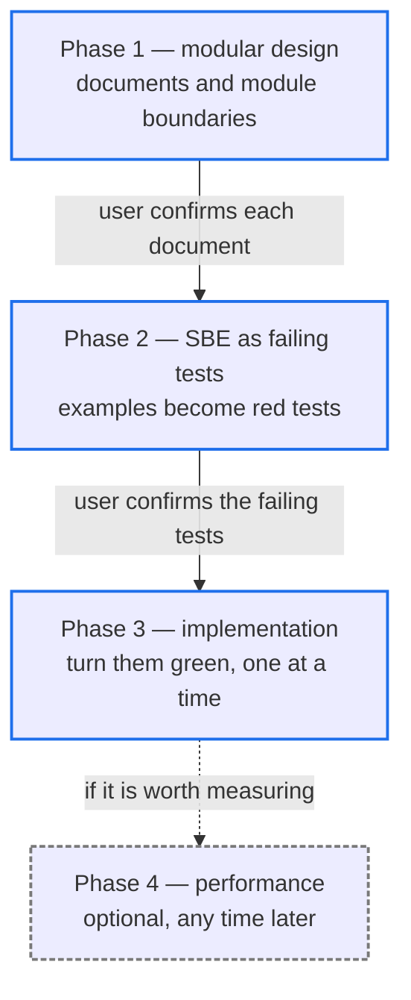
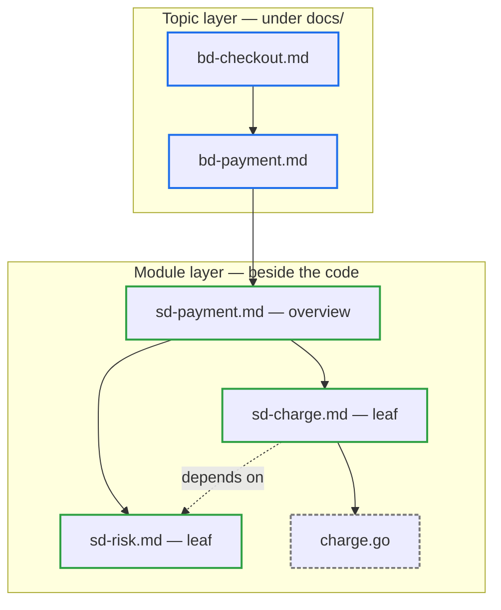

# sys-design

A development workflow whose only specification document is a design document.
Everything else it produces is tests, implementation code, and an optional
performance record.

## Quick Navigation

- [What Problem It Solves](#what-problem-it-solves)
- [The Four Phases](#the-four-phases)
- [Document Model](#document-model)
- [File Naming](#file-naming)
- [Decisions Worth Knowing](#decisions-worth-knowing)
- [Where The Rules Live](#where-the-rules-live)

---

## What Problem It Solves

Design documents rot. They describe how something works, the code moves on, and
a year later nobody trusts the document enough to read it.

This skill's answer is to give the document less to be wrong about. A design
document states what a module does, what it owns, and what to watch out for —
never how it does it. Interfaces are Markdown links into the real code rather
than copies of it. Behavior is pinned by tests rather than prose. What remains
in the document is the part that changes slowly.

There is no implementation-plan document, and no document holding the examples.
Those live as failing tests, which cannot drift from the code without turning
red.

[Back to top](#quick-navigation)

---

## The Four Phases

Each phase is loaded on its own. A phase states what it needs before starting
and what it produces, so any one of them can be picked up cold.

The two solid arrows are user gates. Nothing proceeds past them on the agent's
own judgement: the user confirms every document before its modules are opened,
and confirms the failing tests before a line of implementation is written.

Phases 2 and 3 run once per leaf module, not once per tree.

[Back to top](#quick-navigation)

---

## Document Model

Documentation descends through two layers. A topic layer says what the assembled
whole delivers; a module layer says what one component does and where its
boundary lies. Readers enter through a topic and descend into components.

Solid arrows are composition — what a node is made of. The dashed arrow is
dependency — what a module needs from elsewhere. Depending on a module is not
composing with it, so `sd-charge.md` stays a leaf even though it links out.

Phase 3 walks this graph in reverse from the leaf it just implemented, which is
why every edge has to be a real link rather than an implied relationship.

[Back to top](#quick-navigation)

---

## File Naming

| Name | Lives | Subject |
|------|-------|---------|
| `bd-<topic>.md` | `docs/` at a scope root | What the assembled whole delivers — a business requirement, an architectural account, an end-to-end data flow |
| `sd-<feature>.md` | Beside the code it describes | One module: its responsibility, boundary, and caveats |
| `sd-<feature>-perf.md` | Beside the code it measures | The three most recent performance measurements, each pinned to a commit |

A monorepo nests the same model: one `docs/` at the repository root for how
submodules assemble, plus one at each submodule root for its own internals.

[Back to top](#quick-navigation)

---

## Decisions Worth Knowing

These are the choices most likely to surprise someone reading the rules for the
first time.

**Examples are never written into a document.** They go straight into failing
tests. A document restating what tests already state is a second source of truth
that will disagree with the first one eventually.

**A design document is capped at 300 lines, diagrams excluded.** Going over is
read as the module carrying too much, and the only permitted response is
splitting it — compressing the prose to fit is explicitly forbidden.

**The user prunes the tests, not a checklist.** Judging concrete inputs and
outputs is easier than judging abstract descriptions of them, so what gets
reviewed is the tests themselves rather than a list of cases to tick off.

**Every test file names its design document in a header comment.** Inferring the
owner from what sits next to the code works right up until a folder gains a
second design document, and then it breaks silently.

[Back to top](#quick-navigation)

---

## Where The Rules Live

This file is an overview. The rules an agent actually follows are in
[SKILL.md](SKILL.md) and the phase references it routes to:

- [Phase 1 — Modular Design](references/phase1-design.md)
- [Phase 2 — SBE As Failing Tests](references/phase2-sbe.md)
- [Phase 3 — Implementation](references/phase3-tdd.md)
- [Phase 4 — Performance Verification](references/phase4-benchmark.md)

Two scripts support the phases: [count_lines.py](scripts/count_lines.py) for the
line limit, and [list_planned.py](scripts/list_planned.py) for links whose target
does not exist yet.

[Back to top](#quick-navigation)
