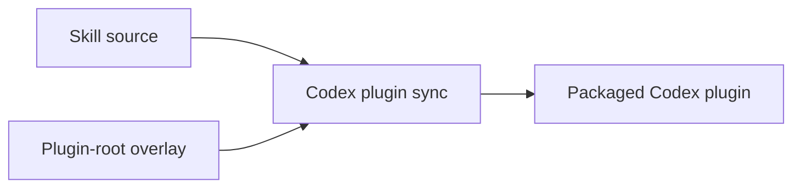

# 上游對齊記錄

此 skill 是一次反向移植。`openai/codex-plugin-cc` 讓 Claude Code 呼叫 Codex；本套件
讓 Codex 呼叫 Claude Code。由於行為的來源存在於另一個 repository，本檔案就是兩者之間
的接合點：它釘住移植所依據的上游修訂版本、把每個上游檔案對應到此處的對應物，並記錄
反向方向無法重現的部分。

修改 `codex-plugin/` 底下任何內容前必須先讀本檔案，並在同一次變更中更新它。本檔案只
記錄**當前狀態與當前契約** — 某一列為何改變屬於 commit message，不屬於這裡。

指向本套件自身檔案的路徑相對於 `skills/claude-code-bridge/`，除非它以 repository 根層級
的路徑段開頭，例如 `docs/` 或 `scripts/`。上游路徑則相對於上游 repository。

## 快速導覽

- [上游釘選](#上游釘選)
- [如何閱讀本檔案](#如何閱讀本檔案)
- [追隨上游](#追隨上游)
- [驗證矩陣](#驗證矩陣)
- [版面對應](#版面對應)
- [File Map](#file-map)
- [宿主能力比較](#宿主能力比較)
- [調適](#調適)
- [缺口](#缺口)
- [宿主驗證](#宿主驗證)

---

## 上游釘選

| 欄位 | 值 |
|------|-----|
| Repository | `https://github.com/openai/codex-plugin-cc` |
| Commit | `db52e28f4d9ded852ab3942cea316258ae4ef346` |
| Commit 日期 | 2026-07-07 |
| Commit 標題 | Remove shell expansion for git commands (#447) |
| 上游 plugin 版本 | `1.0.6`（`plugins/codex/.claude-plugin/plugin.json`） |
| 上游授權 | Apache-2.0 |

[回到頂端](#快速導覽)

---

## 如何閱讀本檔案

每個檔案追蹤兩項互相獨立的事實，分列兩欄，因為兩者漂移的原因不同。

**Plan** — 與上游的預期關係。只有當上游變動，或發現宿主限制時才會改變。

| Plan | 意義 |
|------|------|
| `port` | 直接重現行為 |
| `adapt` | 以不同的宿主機制重現行為，見[調適](#調適) |
| `partial` | 重現但有已記錄的損失，見[缺口](#缺口) |
| `open` | 可重現性尚未定案；必須由指名的 probe 決定，見[宿主驗證](#宿主驗證) |
| `drop` | 刻意不提供對應物，見[缺口](#缺口) |
| `new` | 本套件需要此檔案，上游沒有對應物 |
| `n/a` | 上游的基礎設施，本 repository 已用自己的方式解決 |
| `removed` | 上游已刪除此檔案；保留該列讓其對應物仍在審視範圍內 |

**State** — 此列上游契約的交付狀態。同一個對應物可服務多列，而各列契約可能處於不同狀態。

| State | 意義 |
|-------|------|
| `todo` | 預期會有對應物，但尚不存在 |
| `wip` | 對應物存在，但尚未滿足其 Plan |
| `done` | 對應物存在、滿足其 Plan，且其所屬區域的驗證通過 |
| `n/a` | 不預期有對應物，因為 Plan 是 `drop`、`n/a` 或 `removed` |

`done` 絕不是意圖宣告。它要求[驗證矩陣](#驗證矩陣)中該區域對應的驗證通過。

File Map 之後的章節 — [調適](#調適)、[缺口](#缺口) — 描述的是每個對應物必須滿足的
**契約**。某個對應物是否已經滿足，一律由 File Map 的 State 欄表示，絕不由這些章節表示。

[回到頂端](#快速導覽)

---

## 追隨上游

追蹤的上游範圍是所有出現在 [File Map](#file-map) 中的路徑。全部一起 diff：

```sh
git clone https://github.com/openai/codex-plugin-cc
cd codex-plugin-cc
git diff --stat db52e28f4d9ded852ab3942cea316258ae4ef346..origin/main \
  -- plugins/codex/ tests/ scripts/bump-version.mjs .github/workflows/ \
     .claude-plugin/marketplace.json package.json package-lock.json \
     tsconfig.app-server.json .gitignore README.md LICENSE NOTICE
```

接著：

1. 每個變動的路徑都會出現在 File Map。只需重新檢視那些列，並把其 State 重設為 `wip`
   直到移植跟上為止。
2. 上游新增但 File Map 中不存在的路徑，代表對照表已過期 — 新增該列、選定其 Plan、把
   State 設為 `todo`，然後移植。
3. 上游刪除的路徑保留該列，Plan 改為 `removed`、State 改為 `n/a`。直接刪除該列會讓其
   對應物悄悄脫離審視。
4. 上游改名的路徑是一列而非兩列：改寫上游路徑，對應物保持不動。
5. 移植完成後，把[上游釘選](#上游釘選)的 pin 移到新的 commit 與版本。

把 diff 與 File Map 比對**目前是人工步驟**。File Map 以上游路徑為 key，正是為了讓它
*可以*被自動化：本移植自己的測試套件必須長出一個 parity test，走訪上游的受追蹤清單、
斷言每個路徑都恰好對應一列 File Map，並在新增、刪除或改名時失敗。在該測試存在之前，
步驟 1–4 都依賴執行升級的人。

[回到頂端](#快速導覽)

---

## 驗證矩陣

某區域的列要被標記為 `done` 之前必須通過的驗證。

| 區域 | 驗證 |
|------|------|
| runtime libraries | 於 `codex-plugin/` 執行 `node --test "tests/*.test.mjs"` |
| companion 子指令 | `codex-plugin/tests/commands.test.mjs` 搭配 fake `claude` fixture |
| git 目標解析 | `codex-plugin/tests/git.test.mjs` |
| job 狀態 | `codex-plugin/tests/state.test.mjs`、`codex-plugin/tests/job-control.test.mjs` |
| 輸出渲染 | `codex-plugin/tests/render.test.mjs` |
| Claude session client | `codex-plugin/tests/claude-cli.test.mjs`、`codex-plugin/tests/stream-protocol.test.mjs` |
| session transfer resumability | `codex-plugin/tests/session-transfer.test.mjs` 的 deterministic coverage，加上真實雙行程 probe：透過 `transfer` 建立、在另一個行程 resume 回傳的 Claude session，並取回完全一致的 provenance token |
| 靜態資產（prompts、schemas、授權、manifest） | `scripts/sync-codex-plugins.ps1` 完成且 `scripts/verify_codex_plugins.py` 通過 |
| commands、agents、skills（文字） | 對照其映射的上游檔案人工審閱；無自動化關卡 |
| hooks | deterministic hook tests，加上[宿主驗證](#宿主驗證)中的互動式 TUI probe |

本 repository 沒有 CI，因此這些都在 release 前於本機執行。

[回到頂端](#快速導覽)

---

## 版面對應

上游在 `plugins/codex/` 出貨單一 Claude Code plugin。本 repository 是 skills
marketplace，因此同一個套件由兩種來源形狀組裝：



| 上游位置 | 此處的 source of truth | 封裝到 |
|----------|------------------------|--------|
| `plugins/codex/skills/*` | `skills/claude-*/`（一般 skill 目錄） | `codex-plugins/aery-claude-code/skills/*` |
| `plugins/codex/` 底下其餘全部 | `skills/claude-code-bridge/codex-plugin/`（overlay） | `codex-plugins/aery-claude-code/`（plugin root） |

overlay 之所以存在，是因為 Codex plugin 把 `scripts/`、`commands/`、`agents/` 與
`hooks.json` 放在 *plugin root*，而不是放在某個 skill 內；但本 repository 要求所有原始
檔案都住在 `skills/` 底下。`scripts/sync-codex-plugins.ps1` 會把 overlay 的內容複製到
plugin root，並把 overlay 從 skill 複本中排除，方式與排除 `*_zhTW.md` 相同。

[回到頂端](#快速導覽)

---

## File Map

### Repository root

| 上游路徑 | 對應物 | Plan | State |
|----------|--------|------|-------|
| `LICENSE` | `codex-plugin/LICENSE`（Apache-2.0 全文，未修改） | port | done |
| `NOTICE` | `codex-plugin/NOTICE`（attribution，已加入本移植） | adapt | done |
| `README.md` | `skills/claude-code-bridge/SKILL.md` | adapt | done |
| `package.json` | 無 — 零相依 ESM，測試以 `node --test` 執行 | n/a | n/a |
| `package-lock.json` | 無 — 沒有相依可鎖定 | n/a | n/a |
| `tsconfig.app-server.json` | `codex-plugin/scripts/lib/stream-protocol.mjs`（runtime 驗證取代 build 期型別） | adapt | done |
| `.gitignore` | repository 根層級 `.gitignore` | n/a | n/a |
| `.claude-plugin/marketplace.json` | repository 根層級 `.claude-plugin/marketplace.json` | n/a | n/a |
| `scripts/bump-version.mjs` | `release` skill（repository 層級） | n/a | n/a |
| `.github/workflows/pull-request-ci.yml` | 無 | drop | n/a |

上游用這三個檔案處理 Node toolchain 與 app-server protocol 的型別檢查。
stream-protocol probe 證實反向 runtime 不需要任何相依，因此 toolchain 檔案沒有對應物，
protocol 契約則改由 runtime validator 承擔，而非 build 步驟。

### Manifest 與封裝

| 上游路徑 | 對應物 | Plan | State |
|----------|--------|------|-------|
| `plugins/codex/.claude-plugin/plugin.json` | `codex-plugins/aery-claude-code/.codex-plugin/plugin.json` | adapt | done |
| `plugins/codex/CHANGELOG.md` | `release-note/vX.Y.Z.md`（repository 層級） | n/a | n/a |
| `plugins/codex/LICENSE` | `codex-plugin/LICENSE` | port | done |
| `plugins/codex/NOTICE` | `codex-plugin/NOTICE` | adapt | done |

### 進入點

| 上游路徑 | 對應物 | Plan | State |
|----------|--------|------|-------|
| `plugins/codex/commands/review.md` | `codex-plugin/commands/claude-review.md` | partial | done |
| `plugins/codex/commands/adversarial-review.md` | `codex-plugin/commands/claude-adversarial-review.md` | partial | done |
| `plugins/codex/commands/rescue.md` | `codex-plugin/commands/claude-rescue.md` | adapt | done |
| `plugins/codex/commands/transfer.md` | `codex-plugin/commands/claude-transfer.md` | adapt | done |
| `plugins/codex/commands/status.md` | `codex-plugin/commands/claude-status.md` | partial | done |
| `plugins/codex/commands/result.md` | `codex-plugin/commands/claude-result.md` | partial | done |
| `plugins/codex/commands/cancel.md` | `codex-plugin/commands/claude-cancel.md` | partial | done |
| `plugins/codex/commands/setup.md` | `codex-plugin/commands/claude-setup.md` | adapt | done |
| `plugins/codex/agents/codex-rescue.md` | 無 — Codex 沒有 subagent 宣告，見[缺口](#缺口) | drop | n/a |
| — | `codex-plugin/agents/openai.yaml` | new | done |

### Runtime

| 上游路徑 | 對應物 | Plan | State |
|----------|--------|------|-------|
| `plugins/codex/scripts/codex-companion.mjs` | `codex-plugin/scripts/claude-companion.mjs` | adapt | done |
| `plugins/codex/scripts/lib/codex.mjs` | `codex-plugin/scripts/lib/claude.mjs` | adapt | done |
| `plugins/codex/scripts/lib/app-server.mjs` | `codex-plugin/scripts/lib/claude-cli.mjs` | adapt | done |
| `plugins/codex/scripts/lib/app-server-protocol.d.ts` | `codex-plugin/scripts/lib/stream-protocol.mjs`（runtime 驗證，非型別） | adapt | done |
| `plugins/codex/scripts/app-server-broker.mjs` | `codex-plugin/scripts/claude-broker.mjs` | adapt | done |
| `plugins/codex/scripts/lib/broker-endpoint.mjs` | `codex-plugin/scripts/lib/broker-endpoint.mjs` | adapt | done |
| `plugins/codex/scripts/lib/broker-lifecycle.mjs` | `codex-plugin/scripts/lib/broker-lifecycle.mjs` | adapt | done |
| `plugins/codex/scripts/lib/claude-session-transfer.mjs` | `codex-plugin/scripts/lib/codex-session-transfer.mjs` | partial | done |
| `plugins/codex/scripts/lib/args.mjs` | `codex-plugin/scripts/lib/args.mjs` | port | done |
| `plugins/codex/scripts/lib/fs.mjs` | `codex-plugin/scripts/lib/fs.mjs` | port | done |
| `plugins/codex/scripts/lib/git.mjs` | `codex-plugin/scripts/lib/git.mjs` | adapt | done |
| `plugins/codex/scripts/lib/process.mjs` | `codex-plugin/scripts/lib/process.mjs` | adapt | done |
| `plugins/codex/scripts/lib/prompts.mjs` | `codex-plugin/scripts/lib/prompts.mjs` | port | done |
| `plugins/codex/scripts/lib/workspace.mjs` | `codex-plugin/scripts/lib/workspace.mjs` | port | done |
| `plugins/codex/scripts/lib/state.mjs` | `codex-plugin/scripts/lib/state.mjs` | adapt | done |
| `plugins/codex/scripts/lib/render.mjs` | `codex-plugin/scripts/lib/render.mjs` | adapt | done |
| `plugins/codex/scripts/lib/job-control.mjs` | `codex-plugin/scripts/lib/job-control.mjs` | adapt | done |
| `plugins/codex/scripts/lib/tracked-jobs.mjs` | `codex-plugin/scripts/lib/tracked-jobs.mjs` | adapt | done |

最後四個 `adapt` 列帶的是宿主語意而非純邏輯：`state.mjs` 在 `CLAUDE_PLUGIN_DATA` 底下
解析狀態、`job-control.mjs` 與 `tracked-jobs.mjs` 將 Claude stream progress 建模成 durable
jobs，`render.mjs` 則輸出 `claude --resume` 後續指令。它們的 host-specific halves 正是其
屬於 adaptation 而非直接 port 的原因。

`process.mjs` 執行任何執行檔時都不經過 shell。上游可以用 shell，因為它只會 spawn
`codex`；此處的 `taskkill` 使用 `/PID` 這類參數，Windows 上的 POSIX shell 會把它改寫成
路徑，而 shell 收到的參數是串接而非逐一轉義的。

### Hooks 與 prompts

| 上游路徑 | 對應物 | Plan | State |
|----------|--------|------|-------|
| `plugins/codex/hooks/hooks.json` | `codex-plugin/hooks.json` | adapt | done |
| `plugins/codex/scripts/session-lifecycle-hook.mjs` | `codex-plugin/scripts/session-lifecycle-hook.mjs` | adapt | done |
| `plugins/codex/scripts/stop-review-gate-hook.mjs` | `codex-plugin/scripts/stop-review-gate-hook.mjs` | adapt | done |
| `plugins/codex/prompts/adversarial-review.md` | `codex-plugin/prompts/adversarial-review.md` | adapt | done |
| `plugins/codex/prompts/stop-review-gate.md` | `codex-plugin/prompts/stop-review-gate.md` | port | done |
| `plugins/codex/schemas/review-output.schema.json` | `codex-plugin/schemas/review-output.schema.json` | port | done |

兩個 hook script 都是 `adapt` 而非 `port`，但理由不同。
`session-lifecycle-hook.mjs` 接受 Codex `SessionStart` 與 `SessionEnd` payload，從 listing
與 authoritative files 共同找出結束 session 的 jobs。它先要求 active broker shutdown，
失敗才 fallback 到經驗證的 process termination，並在任一路徑後確認 worker 已退出；
acknowledged shutdown 或 verified fallback 後仍無法觀察到 exit 時會保留 job evidence，
不會逕自刪除。`stop-review-gate-hook.mjs` 讀取 `last_assistant_message`、套用已儲存的 workspace
偏好、檢查 installation 與 authentication readiness，並執行有明確 `ALLOW` 或 `BLOCK`
協定的隔離 Claude review。Response 會以 escaped JSON string 進入 prompt，而不是可執行的
prompt markup。直接呼叫測試涵蓋其行為，而[宿主驗證](#宿主驗證)中的互動式 TUI probe
確認了宿主送達。

### Skills

| 上游路徑 | 對應物 | Plan | State |
|----------|--------|------|-------|
| `plugins/codex/skills/codex-cli-runtime/SKILL.md` | 無 — 唯一 consumer 是已捨棄的 rescue subagent，見[缺口](#缺口) | drop | n/a |
| `plugins/codex/skills/codex-result-handling/SKILL.md` | `skills/claude-code-bridge/SKILL.md` | adapt | done |
| `plugins/codex/skills/gpt-5-4-prompting/SKILL.md` | 無 — rescue 保留使用者請求，見[缺口](#缺口) | drop | n/a |
| `plugins/codex/skills/gpt-5-4-prompting/references/prompt-blocks.md` | 無 — 所屬 prompting skill 已捨棄 | drop | n/a |
| `plugins/codex/skills/gpt-5-4-prompting/references/codex-prompt-recipes.md` | 無 — 所屬 prompting skill 已捨棄 | drop | n/a |
| `plugins/codex/skills/gpt-5-4-prompting/references/codex-prompt-antipatterns.md` | 無 — 所屬 prompting skill 已捨棄 | drop | n/a |
| — | `skills/claude-code-bridge/SKILL.md` | new | done |
| — | `docs/claude-code-bridge/UPSTREAM-PARITY.md` | new | done |

bridge skill 負責結果呈現，因為每個 command 都原樣回傳 companion 的 stdout。另兩個上游
skill 只服務已捨棄的 rescue subagent，或改寫本移植刻意保留的請求；把它們複製成獨立 skill
只會產生互相衝突且沒有 consumer 的指示。

### Tests

| 上游路徑 | 對應物 | Plan | State |
|----------|--------|------|-------|
| `tests/helpers.mjs` | `codex-plugin/tests/helpers.mjs` | port | done |
| `tests/git.test.mjs` | `codex-plugin/tests/git.test.mjs` | adapt | done |
| `tests/process.test.mjs` | `codex-plugin/tests/process.test.mjs` | port | done |
| `tests/state.test.mjs` | `codex-plugin/tests/state.test.mjs` | adapt | done |
| `tests/render.test.mjs` | `codex-plugin/tests/render.test.mjs` | adapt | done |
| `tests/commands.test.mjs` | `codex-plugin/tests/commands.test.mjs` | adapt | done |
| `tests/runtime.test.mjs` | `codex-plugin/tests/broker-session-lifecycle.test.mjs` | adapt | done |
| `tests/fake-codex-fixture.mjs` | `codex-plugin/tests/fake-claude-fixture.mjs` | adapt | done |
| `tests/broker-endpoint.test.mjs` | `codex-plugin/tests/broker-session-lifecycle.test.mjs` | adapt | done |
| `tests/bump-version.test.mjs` | 無 | n/a | n/a |
| — | `codex-plugin/tests/stream-protocol.test.mjs` | new | done |
| — | `codex-plugin/tests/claude-cli.test.mjs` | new | done |
| — | `codex-plugin/tests/job-control.test.mjs` | new | done |
| — | `codex-plugin/tests/stop-review-gate.test.mjs` | new | done |
| — | `codex-plugin/tests/session-transfer.test.mjs` | new | done |

`runtime.test.mjs` 是 `adapt`：其 broker 行為由專用 broker lifecycle suite 覆蓋。
Stop gate 與 transfer 使用各自的新 suite，因為兩者的宿主 acceptance probe 與 runtime
protocol 測試不同。

[回到頂端](#快速導覽)

---

## 宿主能力比較

兩個宿主並非互為鏡像。以下每項宣稱都附上其依據。`help` 指本機 `--help` 輸出、`probe`
指本機跑過的拋棄式 plugin 或 process、`docs` 指官方文件、`unverified` 指該宣稱在任何東西
依賴它之前仍需要一次 probe。

### 被委派的 CLI 提供什麼

上游透過 Codex **app server**（長壽命 JSON-RPC process）驅動 Codex。反向移植驅動的是
`claude` CLI。對照版本為 `claude` 2.1.227。

| 上游 app-server 能力 | Claude Code CLI 對應物 | 依據 |
|----------------------|------------------------|------|
| 結構化輸出（`schemas/review-output.schema.json`） | `--json-schema`；stream-json 最終的 `result` 同時帶有 `structured_output` 與內容相同的 `result` 文字 | probe |
| turn streaming 與進度事件 | `--output-format stream-json --verbose`；turn 以 `result` 事件結束。token 級的 delta 另需 `--include-partial-messages`，runtime 目前未傳 | docs, probe |
| 模型選擇 | `--model <alias\|full-name>` | help |
| thread 持久化與 resume | `--session-id <uuid>`、`--resume <id>`、`--continue`、`--fork-session`；自 v2.1.223 起 `--resume` 可跨 project 尋找 session | docs, help |
| thread 命名（`buildPersistentTaskThreadName`） | `--name <name>` | help |
| 唯讀與可寫入執行 | `--tools` 只能縮限**內建**工具集；還必須加上 `--strict-mcp-config`，否則使用者的 MCP server 仍會註冊，可寫入的 MCP 工具依然可達。沒有檔案系統 sandbox：保留 `Bash` 的 session 就能寫入 | probe — 見[缺口](#缺口) |
| 原生 `/review`（`runAppServerReview`） | 內容為 `/code-review` 的 stream-json user message 會展開並執行真正的 review skill | probe |
| 長壽命 process 服務連續 turn | `-p --input-format stream-json --output-format stream-json`；單一 process 在同一個 `session_id` 下服務兩個 turn，stdin 關閉後以 0 結束 | probe |
| turn 中斷（`interruptAppServerTurn`） | 帶 `{subtype: "interrupt"}` 的 `control_request`；由 `control_response` 回應，該 turn 以 `result`/`error_during_execution` 結束，且 session 仍可繼續使用 | probe |
| 執行後的 session metadata | `system/init` 事件，或 `--output-format json` 中的 `session_id` | docs |
| 分離式背景執行 | **無對應物** — `-p` 會拒絕 `--bg`；bridge 自行管理分離的子行程，見[調適](#調適) | docs |
| 推理強度選擇 | `--effort <low\|medium\|high\|xhigh\|max>` | help — 見[缺口](#缺口) |
| 乾淨關閉語意 | SIGTERM 會中止該 turn、終止 Bash process tree、執行 `SessionEnd` hooks，並以 143 結束 | docs |

### 宿主 plugin 系統提供什麼

對照版本為 `codex-cli` 0.147.0 及其出貨的 plugin（`figma`、`replayio`）。

| Claude Code plugin 能力 | Codex plugin 對應物 | 依據 |
|-------------------------|---------------------|------|
| 帶 `name` / `description` frontmatter 的 `skills/*/SKILL.md` | 相同，另加 `disable-model-invocation` | probe, shipped plugin |
| `commands/*.md` slash commands | `commands/*.md`；在任何已出貨 plugin 中都未觀察到 frontmatter | shipped plugin |
| `agents/*.md` subagents | plugin 無法提供。Codex 自己的 subagent 是 `.codex/agents/` 底下的 TOML；plugin 的 `agents/` 只有 `openai.yaml` — 那是介面中繼資料 | shipped plugins、`plugin.json` 規格、binary 字串 |
| `hooks/hooks.json` | `plugin.json` 的 `hooks` 欄位，或預設的 `hooks/hooks.json` | docs, binary strings |
| `${CLAUDE_PLUGIN_ROOT}` | `${PLUGIN_ROOT}`、`${PLUGIN_DATA}`；`${CLAUDE_PLUGIN_ROOT}` 仍被接受 | docs, binary strings |
| hook `command` 接受任意 shell 字串 | 支援帶參數的 executable 與 `${PLUGIN_ROOT}` 展開；互動式 probe 對每個已註冊 event 實際執行了 `node "${PLUGIN_ROOT}/scripts/hook-probe.mjs" <Event>` | probe |
| `SessionStart`、`SessionEnd`、`Stop` hook 事件 | 名稱相同，另有 `PreToolUse`、`PostToolUse`、`PermissionRequest`、`PreCompact`、`PostCompact`、`UserPromptSubmit`、`SubagentStart`、`SubagentStop` | docs |
| `Stop` hook 以 `decision: "block"` 阻擋 | 相同 | docs |
| plugin hooks 確實會觸發 | 互動式 TUI 與 `codex exec` 都會觸發 `SessionStart`、`Stop` 與 `SessionEnd`；兩者的 session identity 形態不同 | probe — 見[宿主驗證](#宿主驗證) |

[回到頂端](#快速導覽)

---

## 調適

行為被保留、但機制不同的契約。此處沒有任何功能損失。

- **指令命名** — Codex plugin 的 command 不依 plugin 加 namespace，因此 `/codex:review`
  變成 `/claude-review` 而非 `/claude:review`。每個 command 檔案改帶 `claude-` 前綴。
- **結構化輸出** — 上游要求 app server 產出符合 `schemas/review-output.schema.json` 的
  輸出。對應物把同一份 schema 傳給 `claude --json-schema`，因此 schema 檔案本身可原樣
  移植，並從最終的 stream-json `result` 事件讀取 `structured_output`。有兩個宿主怪癖
  由 runtime 吸收，而非改動 schema 檔案：該旗標會把值當 JSON 解析並拒絕檔案路徑，因此
  schema 以 inline 形式傳遞；驗證器會把 `$schema` 當成遠端參照解析並在 draft URL 上失敗，
  因此傳入前會先移除該鍵。
- **Windows 參數轉義** — 由 npm 安裝的 `claude` 透過 `.cmd` wrapper 觸及，因此命令列由
  本套件而非 Node 組出，且必須同時滿足兩個解析器。對 Claude 執行檔，它遵循
  `CommandLineToArgvW` 慣例，把引號轉義為 `\"`；某些解析器也接受的 `""` 慣例在此不可用，
  因為 Claude 執行檔會拒絕它，inline JSON schema 會被扯碎。對 cmd.exe，每個參數都無條件
  加引號，因為 `&`、`|`、`<`、`>`、`^` 只要未被引號包住就是控制字元，否則會把命令列切斷。
  加引號無法阻止 `%VAR%` 展開，而 `/c` 命令列上沒有任何跳脫方式，因此帶有 `%` 或控制字元
  的參數會被拒絕，而不是被悄悄改寫。含換行的內容完全無法以參數傳遞，這也是每一段 prompt
  都走 stdin 的原因。
- **審查範圍回報** — 上游會標示它解析出的目標。對應物額外印出該目標實際涵蓋的範圍，
  因為 `auto` 會自行在 working tree 與 branch diff 之間選擇，而明確的 `--base` 會悄悄
  把所有未提交的變更排除在本 bridge 組出的 context 之外。它也會印出 Claude 實際收到的
  證據：完整的 tracked diff；或在門檻擋下 diff 時（該行會指名是哪一個門檻，因為檔案數與
  diff 大小各自都可能單獨觸發），tracked 變更只給摘要與一份「請自行讀取」的檔案清單、
  符合條件的 untracked 檔案則直接內嵌內容，並逐項附上 context 不得不略過的未追蹤項目
  及其原因。
  只有在 bridge 自行組 context 的對抗式路徑上，Scope 行才會寫成「已涵蓋」；該路徑的 Scope
  取自蒐集開始時的同一份 working tree 狀態——那是一連串 git 指令依序讀出的，不是快照，
  因此蒐集期間被改動的工作目錄會被分段描述。內建 reviewer 的寫法為何是「已請求」，
  見[缺口](#缺口)。
- **未追蹤檔案的容納邊界** — 上游以 `stat` 與 `readFile` 讀取未追蹤檔案。
  `git ls-files --others` 會走進 symlink 目錄或 NTFS junction，並把在那裡找到的東西當成
  一般的未追蹤路徑回報，讀起來就是普通檔案，因此單靠 `lstat` 沒有幫助。對應物改為檢查
  解析後的路徑是否仍在 repository 內，並在 review context 中回報每一個被跳過的項目。
- **背景執行** — 上游的 companion 會解析 `--background`，但分離動作不由它完成：由宿主
  以 Claude Code 的背景 `Bash` 任務執行該指令。對應物改為自行分離。`--background` 會把
  已解析的請求寫進 job 紀錄（review 是它的目標，rescue 是它的提示與路由）、以分離子行程啟動 `claude-companion run-job`，並記下該
  子行程的 pid；worker 讀回該 request，走與前景完全相同的程式路徑。因此整個機制不依賴
  宿主是否具備背景 shell 模式。由此帶出兩個結果：目標只在使用者輸入指令的那個行程解析
  一次，因為 `auto` 會讀取 working tree，稍後重新解析可能選到不同目標；以及 worker 的
  stdout 無處可去，因此背景執行只透過 job 紀錄與 log 回報。`-p` 會拒絕 `--bg`，而
  `claude agents` 管理的是 Claude Code 自己的背景 session，兩者都不是「自行擁有子行程」
  的替代品。
- **Job phase** — 上游的 app server 會為一個 turn 命名 phase，其 `inferLegacyJobPhase`
  則從 log 文字重建出更早期紀錄的 phase。CLI 不會命名 phase，因此此處的 phase 只有兩個
  來源，且絕不來自文字推測。由 bridge 自己決定的那些由 bridge 寫入：排入佇列時的
  `queued`、開始執行時的 `starting`，以及結束時的 `done`、`failed` 或 `cancelled`。
  其間的一切都從 stream 讀出：`system/init` 代表 `starting`、`tool_use` block 代表
  `working`、assistant 的文字 block 代表 `responding`。
- **Job 狀態寫入** — 上游直接就地覆寫其 state 檔。此處同一個檔案會被更多行程讀寫：
  分離的 worker 會持續數分鐘記錄進度，而使用者同時在同一個 repository 執行其他指令。
  因此此處改以 rename 替換整個檔案而非就地覆寫，且每次寫入都會遞增一個 revision。
  每次寫入都會聲明自己是基於哪個 revision 建立的，若檔案在那之後已被改動就放棄該次寫入
  並重跑整個 read-modify-write，而不是覆蓋到別的行程的變更之上。
  Windows 為 rename 索取的代價是：它拒絕替換任何被其他行程開著的檔案，因此某個指令正在讀
  清單、而某次執行同時要寫它時，該次寫入會以 `EPERM` 失敗。這種碰撞只持續一次讀取的時間，
  所以替換會先重試一小段時間，再回報為失敗。執行本身也絕不會因此結束：清單是投影，job
  檔才是紀錄，而在更新途中死掉的 worker 會讓結果無處可尋——因此執行以 best-effort 寫入
  自己那一列，寫不進去就繼續跑。
  rename 直接消除讀到半個檔案的問題 — 半寫入的檔案會被視為損毀並以空 job 清單回應。
  它不是鎖：檢查之後還有 artifact 清理與 replace，落在這段之間的寫入仍會遺失。只有 job
  清單會這樣傳遞：偏好設定另存於自己的檔案，因此 job 寫入不會夾帶任何一項，也無從把較舊
  的值放回去。本套件曾有一個版本發布在此 repository 的分支上，當時偏好設定放在 state
  檔案裡；在偏好檔案尚不存在時，那個值仍會被讀取——job 寫入會把它原樣抄回，來源是磁碟而
  非呼叫者，因此既不會丟棄它也不會讓它復活。一旦偏好檔案存在，就由它自己作答，包含它
  無法被解析的情況：它所取代的那個值，不是使用者現在還持有的設定。這種遺失
  通常只是清單中的一筆：寫入者只會刪除自己那份清單中被丟棄的 job 的檔案，而決定丟棄的
  cap 只計算已完成的 job，因此清單認定仍在進行的執行不會被抽走檔案。例外是「清單說它已
  結束、但執行其實還沒」的 job——只有下面的 cancel 競態會造成這種狀態。此時 retention 會
  把它當成歷史，並可能刪掉該執行之後才寫入的結果。沒有任何機制會重建被刪除的 job 檔案，
  而清單從來不存放報告——它只帶狀態與一行摘要，因此遺失的正是結論本身。

  清單少了一筆並不會讓該 job 消失，因為「有哪些 job」是由清單與 jobs 目錄一起決定的。
  代價是這樣的 job 不再被計入 cap：它會留到其檔案被移除為止，`--all` 也會把它列在
  五十筆之外。

  job 自己的檔案也以同樣方式替換，理由更直接：結果就落在那個檔案裡，而 `cancel` 可能在
  任何一刻終止正在寫入它的行程——包括 truncate 與 write 之間。改以替換寫入，代表這種終止
  留下的要嘛是舊檔案、要嘛是新檔案，不會留下半個給下一個讀取者解析。
- **無法寫入的 job 紀錄** — job 自己的檔案是唯一記錄其結果的地方，而一次在重試之後仍無法
  完成的替換會終結該 worker。通常會留存下來的是該次執行已渲染的輸出：它在紀錄被寫入之前
  就已附加到 job log，而 append 不會走上會碰撞的那個 rename。是「通常」而不是「必然」——
  寫 log 失敗會被吞掉而不重試，因為 log 絕不該是讓執行中止的原因。`status` 在被詢問這一個
  job 時會印出那個 log 的路徑。
  `/claude-result` 不會去讀它：log 不是第二個可以宣稱結果的來源，而被終止的 worker 寫到一半
  的區塊，與完整的區塊無法區分。留下的紀錄會是「進行中、但 worker 已消失」，`status` 會如實
  回報，而 `/claude-cancel` 是清除它的方式。
- **消失的 worker** — 結果由 job 自己的 worker 寫入，或由 `cancel` 代為寫入，或由
  worker 啟動路徑在執行開始前失敗時寫入。broker 與 session-end hook 會清理由 active job
  或結束中的 Codex session 可歸屬的路徑，但兩者仍可能無法使用或未被宿主送達。因此
  `status` 與 `result` 仍會檢查是否還有行程回應所記下的 pid。只有 `ESRCH` 算作消失 — `EPERM` 代表行程存在
  但無法觸及 — 而 pid 仍可解析時不下任何結論，因為作業系統會重用 pid；尚未記錄 pid 的
  job 同樣不下結論，因為「還沒開始」不等於「已經死了」。pid 已無法解析本身同樣不足以定論：
  提供該 pid 的紀錄是先讀出來的，可能早於 worker 收尾時寫下的結果。因此探測之後會再讀一次
  紀錄，只有在那次較晚的讀取中仍屬進行中的紀錄才算被遺棄——已消失的 worker 這輩子會寫的每
  一筆，都落在它的 pid 停止解析之前。此檢查只負責回報，絕不改寫紀錄。
- **`hooks.json` 位置** — 上游放在 `hooks/hooks.json`。對應物放在 plugin root 並在
  `plugin.json` 宣告 `"hooks": "./hooks.json"`，與 Codex 自家出貨 plugin 的做法一致。
- **協定契約** — 上游以 `app-server-protocol.d.ts` 在 build 期做型別檢查。對應物沒有
  build 步驟，因此等價契約由 `stream-protocol.mjs` 在 runtime 強制執行。每個 frame 都
  必須是帶字串 `type` 的 JSON object；bridge 實際依賴的 `system`、`result` 與
  `control_response` 三種 frame 會逐欄位檢查：必填欄位必須存在且型別正確，選填欄位可以
  缺席或為 `null`，但帶其他錯誤型別時明確失敗。`type` 無法辨識的
  frame 則原樣放行，因為 CLI 會隨時間新增事件型別。feature detection 讀取 `system/init`
  上的 `capabilities` 陣列，而非比對版本字串；版本只是建議，絕不阻擋執行。
- **對抗式審查 prompt** — attack surface、finding bar、grounding 與 calibration 規則
  原樣移植。有兩處不同：role 指名 Claude Code 而非 Codex，且新增 `<available_tools>`
  區塊載明該 session 實際註冊的工具集。上游不需要這個區塊，因為 Codex 的 sandbox 會在
  執行當下拒絕寫入；而此處的限制是工具根本不存在，reviewer 若規劃了跑不了的指令就白費
  一個 turn。

[回到頂端](#快速導覽)

---

## 缺口

反向方向無法完整重現的行為。每一項都指名實作它的上游檔案，讓未來上游對該檔案的變動能
落在一個已知的限制上。

### 已捨棄

- **CI workflow** — `.github/workflows/pull-request-ci.yml`。這是專案選擇而非宿主限制：
  本 repository 沒有 CI。取代它的品質關卡是[驗證矩陣](#驗證矩陣)，在 release 前於本機
  執行。
- **Rescue 專用 helper skills** — `skills/codex-cli-runtime/SKILL.md` 與
  `skills/gpt-5-4-prompting/`。上游只在其宣告的 rescue subagent 內載入兩者。Codex plugin
  無法宣告該 subagent，因此對應 command 直接擁有 runtime 呼叫；它也保留使用者請求而不
  改寫，使獨立 prompting skill 成為沒有 consumer 的衝突規則。結果呈現仍由 bridge skill
  本身承接。

### 已降級

- **唯讀審查 sandbox** — `commands/review.md`，以及 `runAppServerReview` 中的
  `sandbox: "read-only"`。上游把兩種審查都放在 Codex 的唯讀 sandbox 內執行。Claude CLI
  沒有檔案系統 sandbox；唯一的強制手段是註冊了哪些工具。對抗式審查不需要 shell，因此以
  `--tools Read,Glob,Grep --permission-mode dontAsk --strict-mcp-config` 執行，確實無法
  寫入。內建 reviewer 會自行蒐集證據，因此必須保留 `Bash`；該路徑只移除 `Edit`、`Write`
  與 `NotebookEdit` 並排除 MCP server。subagent 會繼承這些拒絕，但殘留的 shell 途徑是
  已實證而非理論上的：probe 中的 subagent 被拒絕 `Write` 後，改以 `Bash` 建立了檔案。
  嚴禁向使用者把此路徑描述為唯讀。
- **審查範圍控制** — `commands/review.md`。上游把型別化的目標
  （`uncommittedChanges` 或 `baseBranch`）交給 app server，reviewer 會遵守它。對應物只能
  在 prompt 中寫下 `/code-review <ref>`，而內建 reviewer 會自行決定最終範圍：在有 staged
  檔案的 branch 上指定 `--base main` 時，它審查了 branch diff **加上**那個 staged 檔案。
  因此 bridge 只陳述所請求的範圍，並註明 reviewer 可能涵蓋更多。對抗式路徑不受影響，
  因為該路徑由 bridge 組出 context，確知自己交出了什麼——Scope 行報告的正是這個，而不是
  一棵它分好幾個指令才讀完的工作樹的狀態。
- **自行蒐集的審查證據** — `prompts/adversarial-review.md`。diff 被擋在 context 之外時，
  上游要求 reviewer 以唯讀 git 指令自行蒐集 diff。對應物的審查 session 沒有註冊任何
  shell，因此做不到。tracked 變更改為只以摘要與檔名送達，並要求它自行以 `Read` 讀取那些
  檔案；runtime 無法觀測它是否真的讀了，因此 evidence 行只寫「已被要求讀取」，不寫
  「已讀取」。符合條件的 untracked 檔案仍會直接內嵌內容，因為它沒有可供 diff 的已提交
  版本。無論哪一種，reviewer 都看不到變更刪除了什麼；prompt 因此要求它在 summary 中明說
  這一點，而不是推測看不到的刪除內容。
- **執行模式的選擇** — `commands/review.md`、`commands/adversarial-review.md`。兩邊宿主
  都能在前景或背景執行審查。上游額外由 command 內文以 `git` 估算變更規模，再呼叫一次
  `AskUserQuestion` 讓使用者選擇，並在變更不是明顯很小時建議背景。目前沒有觀察到任何
  出貨的 Codex command 檔案做這兩件事，因此對應物只從旗標取得模式，並以前景為預設。
  `--wait` 只是把該預設明講出來，而不是另一種模式，因為此處沒有需要被抑制的宿主提問。
- **中斷執行中的 turn** — `commands/cancel.md`、`interruptAppServerTurn`。上游透過
  broker 觸及執行中的 turn 並中斷它，thread 仍可續用。對應物由持有 Claude stdin 的 worker
  公開 per-job control endpoint。`cancel` 先要求 broker 傳送 Claude interrupt control frame，
  只有 Claude acknowledgement 才回報 graceful interruption。endpoint 不存在、無法連線、
  拒絕或未回答時，fallback 到經驗證的 process termination。該 fallback 實際觸及到什麼由
  平台決定，報告也會說明是哪一種：`taskkill /T /F`
  會結束該 pid 底下的整棵行程樹，Claude session 也包含在內；對 process group 送 SIGTERM
  會觸及該次執行自己的行程，因為分離的 worker 就是 group leader；對單一 pid 送 SIGTERM
  ——沒有 group 回應時的 fallback，前景執行正好落在這裡——只觸及該行程本身，它啟動的東西
  會繼續跑；Windows 上若沒有 `taskkill`，同樣只結束那一個行程。
  broker acknowledgement 會保留可 resume 的 session，但不代表 worker 已記錄 terminal
  result。被結束的行程樹代表該次執行確定結束；訊號只是一項請求，不接受它的執行仍可能跑完
  並以自己的結果取代這次取消。另有兩種情況什麼都沒停止，報告會如實這麼說而不是宣稱已經
  終止：
  一是 job 沒有記錄 pid，此時會先等待 pid 出現，若始終沒有就記為 cancelled，而正在啟動
  的 worker 仍可能跑完並以自己的結果取代該紀錄；二是記錄了 pid 但沒有任何行程回應它，
  這只說明該 pid 已不存在，對該次執行的下場沒有任何說明。
  若某次執行在被選中之後、被終止之前剛好完成，它會被回報為已完成並原樣保留，而不是在
  已儲存的結果之上改標為 `cancelled`；該紀錄會在寫入取消狀態的前一刻再讀一次，因此剩下
  的縫隙是「那次讀取到寫入之間」，因此判斷條件改為隨寫入一起帶下去，而不是寫入前先檢查：
  紀錄會在替換動作內部再讀一次，距離檔案被換上只剩一個 syscall，先抵達結果的執行得以保留
  自己的結果——取消改為回報成「來得太晚」。這是把縫隙縮小，不是關閉。跨行程之間沒有任何
  東西被持有，因此它也不是 compare-and-swap：在那次讀取與 rename 之間寫下結果的執行，其
  結果仍會被覆寫。要關掉它需要對 job 檔上鎖。核心層級的鎖會隨持有者的 handle 關閉而釋放，
  但 Node 沒有可攜的實作；鎖檔案不會自己釋放，而此處它的持有者正是 cancel 存在要終止的
  worker，因此它會把縫隙以「沒有人會釋放的鎖」的形式再買回來。進度更新不會再打開這個縫隙：它只寫清單，而進行中的
  job 的 phase 就是從清單讀取的。至於 pid 指向什麼，在送出任何東西之前會緊接著先核對。
核對的對象是此處自己 spawn 出來的那組 argv，除此之外一概不算：
  `<node> <本安裝的 companion> run-job --cwd <cwd> --job-id <id>`，七個參數整組比對——
  runtime 比的是完整路徑而非名稱，因為任何東西都能被命名為 `node.exe`——其中也包含 `--cwd`：job id 只在單一 workspace 內唯一、跨 workspace 並不唯一，因此同一個 id
  在另一個 repository 底下執行的 worker 是另一次執行。
  若改成去尋找其中的各個部分，`--job-id=other` 就能與 `--job-id <id>` 並存——worker 自己的
  解析器取的是最後一個值，因此同時帶著兩者的行程，實際在跑的並不是取消動作所指名的那個 job。
  參數的來源有二：有 `/proc/<pid>/cmdline` 就從那裡讀，以 NUL 分隔且只丟掉結尾那個分隔符；
  Windows 用 `Get-CimInstance Win32_Process`，交回的是一整個字串，並依當初組成它的規則切回
  參數：反斜線是普通字元，除非它出現在引號之前——偶數個時該引號負責開啟或關閉一個參數，
  奇數個時該引號只是參數裡的一個字元；引號參數內的連續兩個引號代表一個引號、該參數繼續；
  而且只有空白與 tab 會分隔參數，因此路徑中其他類空白字元不會把它切成兩段。未重現的是
  `CommandLineToArgvW` 對第一個參數另外適用的規則（該處反斜線不是跳脫字元）——若某個
  runtime 路徑在兩套規則下讀法不同，它會無法通過與本行程 `process.execPath` 的比對，
  結果是拒絕終止，而不是終止到別的東西。兩者皆無的系統則得到「什麼都沒有」：
  `ps` 已經把 argv 壓成一行，`--cwd` 指向的目錄名稱若含有 `--job-id`，就無法與第二個選項區分，
  因此那裡什麼都無法確立，也就什麼都不送。取消仍會記錄該 job，並回報「無法確認這個 pid」，
  把動手的權利留給使用者，而不是讓 bridge 去終止別的東西。這確立的是這條命令列「讀起來是什麼」，而那也是一條
  命令列所能確立的全部。這是把
  窗口縮小，不是關閉：對於不是自己啟動的行程，此處無法持有任何 handle，因此在回答與訊號
  之間退出的 worker，會讓那個號碼重新可被取用。broker 的 primary path 會要求 worker 自行
  停下而關閉此縫隙；經驗證的 process 路徑仍保留較窄的 fallback window。已被作業系統轉交出去的號碼會被拒絕，
  讀不到行程內容的號碼也會被拒絕：拒絕的代價是使用者得自己動手殺，而對未經核對的 pid 動手
  的代價是當下持有它的東西，在 Windows 上還包含它的子行程。兩種拒絕仍然會把 job 記為
  cancelled，因此都不會留下任何指令都清不掉的紀錄。
  `ClaudeCliSession.interrupt` 是 broker 執行 graceful stop 時使用的 in-process 路徑。
- **Job 的 session 範圍** — `scripts/session-lifecycle-hook.mjs`。上游為每個 job 標上其
  hook 匯出的宿主 session id，並據此限縮 `status` 與 `cancel` 的**預設**對象；明確指名的
  job 在兩個方向都仍可觸及整個 workspace。對應物優先記錄明確提供的
  `CLAUDE_COMPANION_SESSION_ID`，否則使用 `CODEX_THREAD_ID`；兩者都沒有時才退回 workspace
範圍。宿主送達 `SessionEnd` 時，hook 會要求相符 broker shutdown，且只移除該 session 中
  acknowledged shutdown 或 verified termination 後已觀察到 worker exit 的 job artifacts；
  不確定的 active record 會保留供人工處理。互動式 TUI probe 已確認會送達帶有 session
  scope 的 `SessionStart` 與 `SessionEnd` payload。
- **推理強度範圍** — 上游的 `VALID_REASONING_EFFORTS` 接受
  `none|minimal|low|medium|high|xhigh`；對應物的那一份放在 `scripts/lib/claude.mjs`，
  每一條接受 `--effort` 的路徑都會經過它。`claude` CLI 接受 `low|medium|high|xhigh|max`。
  `none` 與 `minimal` 沒有對應物，必須明確拒絕而非默默改寫；`max` 在此可用，且沒有上游
  對應物。
- **決定性的 command 內文** — `commands/status.md`、`commands/result.md`、
  `commands/cancel.md`。上游用 `` !`...` `` 替換在 command 內文直接執行 companion
  script，因此該 script 一定會跑。在已出貨的 Codex command 檔案中未觀察到任何替換語法，
  因此對應物改為指示模型去執行該 script。模型原則上可能改寫或跳過該呼叫。
- **轉發的請求文字** — `commands/rescue.md`。上游把使用者的原始請求整串交給它的
  subagent。Codex command 同樣是把參數整串轉發，但 runtime 必須切開它才能找出旗標。
  它所依據的文法是完整的：空白分隔參數、雙引號分組直到配對的雙引號、永不閉合的雙引號
  視為錯誤而不是一路延伸到結尾的分組、其餘每個字元都代表它自己——單引號因為請求裡會有、
  反斜線因為路徑裡會有——沒有
  任何東西可以跳脫引號，這正是 `C:\Program Files\` 這種路徑能在看起來結束的地方結束的原因。
  因此抵達 Claude 的是該請求的「詞」及其順序，以單一空白重新接起；分組用的引號與詞之間的
  連續空白則不會留存。
- **Codex 專屬的模型名稱** — `commands/rescue.md`、`agents/codex-rescue.md`。上游把 `spark`
  映射到一個 Codex 模型。此處沒有任何東西回應那個名字，因此會連同「該怎麼做」一起拒絕，
  而不是把它轉交給一個只會回報未知模型的 CLI。
- **Command metadata** — `commands/` 底下所有檔案。上游在 frontmatter 宣告
  `description`、`argument-hint`、`allowed-tools` 與 `disable-model-invocation`。已出貨
  的 Codex command 檔案都沒有 frontmatter，因此參數提示改寫在內文，工具存取也無法逐一
  指令限制。
- **Subagent 宣告** — `agents/codex-rescue.md`。上游以 markdown 宣告一個 subagent
  （frontmatter 中的 `model`、`tools` 與 `skills`），其 rescue 指令再委派給它；這把轉發者
  釘在單一模型且只有 `Bash`，也讓轉發規則不必寫進指令檔。Codex 自己有 subagent，但 plugin 無法宣告它：
  那是放在 `.codex/agents/` 或 `~/.codex/agents/` 底下的獨立 TOML 檔案，plugin 出貨的任何
  東西都不會成為 subagent。已出貨的 plugin 沒有任何 `agents/*.md`，`plugin.json` 規格沒有
  `agents` 鍵，而 binary 自己把 `agents/openai.yaml` 描述為「為某個 skill 目錄建立」的
  東西——那是介面中繼資料，不是 subagent。因此 plugin 沒有屬於自己、可加以約束的轉發者：`/claude-rescue` 直接呼叫 runtime，並自行
  承載轉發規則，所以上游用宣告釘住的模型與工具限制，在此處只是寫下來的指示，宿主並不強制。
- **Session transfer** — `commands/transfer.md`、
  `scripts/lib/claude-session-transfer.mjs`。上游使用 Codex 官方文件化的 external-agent
  session importer，把 Claude Code transcript 轉成真正的 Codex thread，產生可見且可延續
  的 turn。Claude Code 沒有 session importer — `claude import` 匯入的是 Codex 的
  *設定*，不是對話。因此對應物會以一段 handoff prompt 建立 bridge 自有的 Claude
  session；其中的單一 JSON value 承載轉換後的 Codex transcript 與 provenance，不會把
  conversation text 插值成 prompt markup，並回傳 `claude --resume <session-id>`
  指令。Deterministic tests 已通過，而第二個 process 的 acceptance probe 也成功 resume
  所建立的 session，並取回完全一致的出處 token。Bridge 只讀取 Codex transcript 並呼叫
  Claude CLI；私有 session 檔案由 Claude CLI 建立與擁有，不是由 bridge 寫入。它承諾的是
  可延續的工作，**不是**原生可見的匯入歷史。直接在
  `~/.claude/projects/` 底下合成 session 檔案的做法被刻意否決：該格式未文件化且屬私有，
  寫入它有損毀真實使用者 session 的風險。

[回到頂端](#快速導覽)

---

## 宿主驗證

Probe 使用一個宣告 `"hooks": "./hooks.json"` 的拋棄式 plugin，command handler 則位於
`${PLUGIN_ROOT}` 底下。多次完整 TUI session 都各自送達 `SessionStart`、`Stop` 與
`SessionEnd`。所有 payload 都帶有 session identifier 與 repository workspace；hook
process 的工作目錄也是同一個 workspace，而 `${PLUGIN_ROOT}` 與 `${PLUGIN_DATA}` 則指向
安裝後的 plugin 路徑。在最後一個完整 TUI session 中，hook process 沒有收到
`CODEX_THREAD_ID`，且三個 event 的 `session_id` 都等於其 transcript 的
`session_meta.id`。Command 以 `CODEX_THREAD_ID` 識別同一份 transcript，因此 TUI 中的
job creation 與 hook cleanup 共用同一個 session identity，而 probe record 不會揭露該
identifier。

同一個 probe 在 `codex exec` 下也會觸發。那些 hook process 會收到 `CODEX_THREAD_ID`，
但它不等於 hook payload 的 `session_id`，而 transcript 在這些 event 發生時也沒有提供
`session_meta.id`。Plugin slash command 在互動式 TUI 中執行，因此 bridge 已驗證的契約是
TUI 送達與 identity。兩種宿主都透過 `${PLUGIN_ROOT}` 絕對選取 script，不依賴相對 `./`
command resolution。釘選的 Codex CLI 契約改變時，必須重跑宿主 probe。

[回到頂端](#快速導覽)
