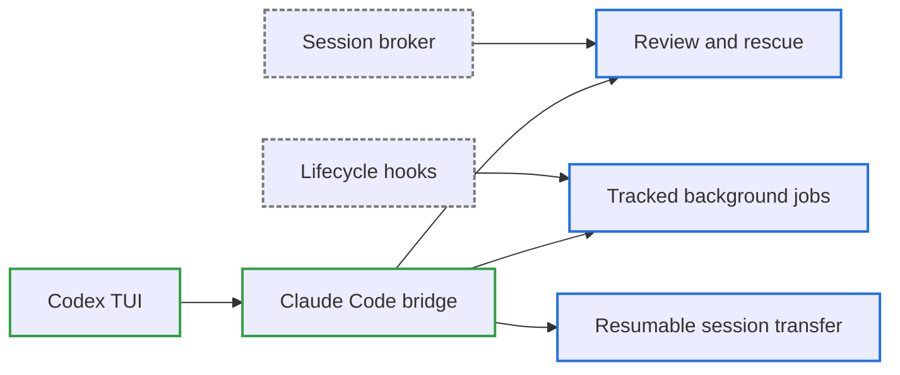

# v0.10.0

來源：v0.9.0

## 快速導覽

- [概覽](#概覽)
- [變更結構](#變更結構)
- [升級注意事項](#升級注意事項)
- [功能](#功能)
- [修正](#修正)
- [文件](#文件)
- [重構](#重構)
- [維護](#維護)

---

## 概覽

`v0.10.0` 完成 `claude-code-bridge`：讓 Codex 能把 review、對抗式 review、調查、修正與 session transfer 交給本機 Claude Code CLI，並以可查詢、可取消、可續接的背景工作管理長時間任務。

本版也補齊 broker lifecycle、session-scoped hooks、Stop review gate 與 Codex-to-Claude session transfer。反向移植的上游對照、宿主限制、TUI 實測結果與 deterministic tests 均已記錄，Codex plugin 的 root overlay 也納入同步與完整性驗證。

[回到頂端](#快速導覽)

---

## 變更結構

實線藍框代表使用者可直接操作的能力；虛線灰框代表負責 session 與工作生命週期的 runtime 支援。

[回到頂端](#快速導覽)

---

## 升級注意事項

- 使用 `aery-claude-code` 前，必須先安裝並登入本機 Claude Code CLI；`/claude-setup` 會檢查 installation、authentication 與可用模型。
- 更新 marketplace 後必須重新載入或更新 plugin，讓新增的 commands、hooks、scripts 與 prompts 從 plugin-root overlay 安裝到位。
- Slash commands 的 session identity 已在互動式 Codex TUI 驗證；`codex exec` 也會觸發 hooks，但它的 session identity 形態不同，不屬於本版已驗證的 bridge command 契約。
- 背景工作會寫入 `${PLUGIN_DATA}`，並以 workspace 與 session 分隔；取消工作前會驗證 PID 所屬 process，無法確認時不會送出終止訊號。

[回到頂端](#快速導覽)

---

## 功能

- 新增 Codex plugin-root overlay：skill 可在 [`codex-plugin/`](../skills/claude-code-bridge/codex-plugin/) 宣告 commands、hooks、scripts 與 prompts，同步流程會把它們提升到 plugin root，並移除不再存在的 stale entries（`feat: package Codex plugin-root files from a skill overlay directory`）。
- 新增 `claude-code-bridge` 與 `/claude-setup`，以 Claude Code stream-json session 作為 Codex 到 Claude Code 的反向橋接（`feat(claude-code-bridge): add a Codex plugin that delegates work to Claude Code`）。
- 新增 `/claude-review` 與 `/claude-adversarial-review`，支援 working tree、branch diff、結構化 findings 與明確的 review scope（`feat(claude-code-bridge): add review commands that delegate to Claude Code`）。
- Review 支援 `--background`，並新增 `/claude-status`、`/claude-result` 與 `/claude-cancel` 管理可追蹤工作（`feat(claude-code-bridge): run reviews in the background as trackable jobs`）。
- 新增 `/claude-rescue`，可委派調查與修正、以唯讀模式診斷，或續接先前完成的 Claude session（`feat(claude-code-bridge): delegate investigations and fixes to Claude Code`）。
- 完成 broker-backed session lifecycle、`SessionStart`／`Stop`／`SessionEnd` hooks、Stop review gate 與可續接的 Codex-to-Claude session transfer（`feat(claude-code-bridge): complete reverse plugin parity`）。

[回到頂端](#快速導覽)

---

## 修正

- 強化背景工作生命週期：state replacement 會重試 Windows file collision、finished job 不再誤報 worker 遺失、取消前會驗證 PID，review preferences 也不再與 job listing 混存（`fix(claude-code-bridge): harden the background job lifecycle against lost workers and wrong kills`）。

[回到頂端](#快速導覽)

---

## 文件

- 新增並完成 [`UPSTREAM-PARITY.md`](../skills/claude-code-bridge/UPSTREAM-PARITY.md) 與雙語設計文件，記錄每個上游檔案的 counterpart、host adaptation、已知 gap、測試證據與真實 TUI probe 結果。

[回到頂端](#快速導覽)

---

## 重構

- 本版沒有獨立的重構項目；runtime 結構調整皆直接服務新增的 bridge 行為與生命週期契約。

[回到頂端](#快速導覽)

---

## 維護

- 同步與驗證流程現在會檢查 plugin-root overlay ownership、完整複製與 stale entry 清理，並持續保證生成 package 與 source skill 一致。

[回到頂端](#快速導覽)
