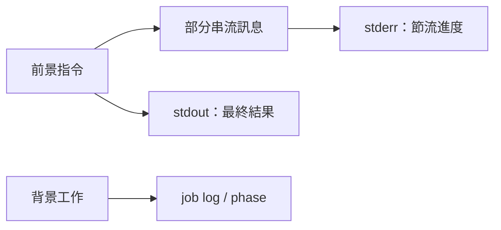

# v0.12.0

來源：v0.11.0

## Quick Navigation

- [概覽](#概覽)
- [功能](#功能)

---

## 概覽

本版改善 `claude-code-bridge` 的前景指令回報方式，讓長時間執行時能看到受控的即時進度，同時維持 stdout 只輸出最終結果，避免進度訊息干擾呼叫端。

[Back to top](#quick-navigation)

---

## 功能

- 讓前景 rescue/review 指令取得部分串流訊息，將節流後的 `[claude]` 進度寫入 stderr；stdout 仍只保留最終結果，背景工作則維持透過 job log 與 phase 回報（`feat(claude-code-bridge): stream live foreground progress to stderr and drop the default turn timeout`）。
- 移除 `ClaudeCliSession` 隱含的 15 分鐘總 turn timeout；需要時間限制的呼叫端必須明確傳入 `timeoutMs`，閒置與絕對時間監控則交由呼叫端負責。

[Back to top](#quick-navigation)
