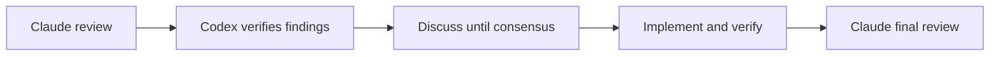

# v0.13.0

來源：v0.12.2

## 快速導覽

- [功能](#功能)
- [修正](#修正)
- [文件](#文件)
- [重構](#重構)
- [維護](#維護)

---

## 功能

- 強化 `claude-code` reviewer 協作流程：Codex 會逐項驗證 finding、與 Claude 在同一個 session 中討論到形成共識、完成修正與驗證，再要求最終複審。
- 保留獨立 slash command 的既有行為；直接呼叫 `/claude-adversarial-review` 時仍會原樣回傳 reviewer 結果。
- 在 adversarial review 的結構化輸出加入證據範圍說明，讓 consumer 能判斷 Claude 實際取得哪些 review context。

[回到頂端](#快速導覽)

---

## 修正

- 本版本沒有 production bug 修正。

[回到頂端](#快速導覽)

---

## 文件

- 更新 Claude Code reverse-port parity 紀錄，說明協作式 reviewer workflow、結構化證據資訊與取消測試的覆蓋邊界。

[回到頂端](#快速導覽)

---

## 重構

- 本版本沒有重構。

[回到頂端](#快速導覽)

---

## 維護

- 將 PID 等待與 process-termination 測試固定使用不支援 interrupt broker 的長時間執行 fixture，避免 broker 時序使測試走入不同的合法取消路徑。

[回到頂端](#快速導覽)
