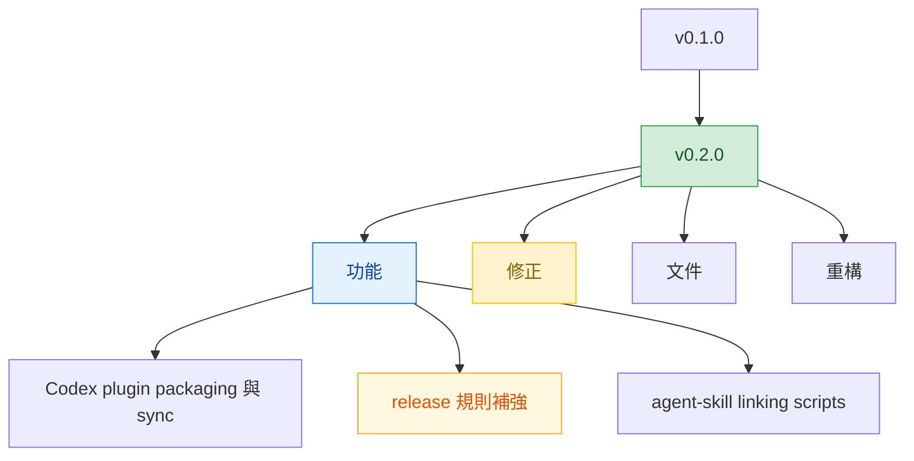

# v0.2.0

來源版本：`v0.1.0`

## Quick Navigation

- [概覽](#概覽)
- [變更結構](#變更結構)
- [功能](#功能)
- [修正](#修正)
- [文件](#文件)
- [重構](#重構)
- [維護](#維護)

---

## 概覽

`v0.2.0` 是 marketplace 向 Codex 與本機開發工具鏈擴張的起點，包含 plugin packaging、同步流程、release 規則與本地 linking scripts。

[Back to top](#quick-navigation)

---

## 變更結構

[Back to top](#quick-navigation)

---

## 功能

- 新增 Codex plugin packaging 支援，讓 marketplace 可輸出給 Codex 使用的 plugin 結構（`feat: add Codex plugin packaging support`）
- 新增 Codex package 自動同步流程，降低手動維護同步產物的成本（`feat: automate Codex package sync`）
- 新增 release 流程規則，要求 release note 固定使用繁體中文整理（`feat(release): require Traditional Chinese release notes`）
- 新增 release 成功後自動切回 `develop` 的流程要求，避免 release 完停留在 `main`（`feat(release): return to develop after successful release`）
- 新增本地 agent-skill linking scripts，補齊本機開發與驗證工具鏈（`feat: add local agent-skill linking scripts`）

[Back to top](#quick-navigation)

---

## 修正

- 移除 commit skill 對 co-author trailer 的強制要求，避免不必要的提交限制（`fix(commit): remove mandatory co-author trailer`）
- 補上 commit skill 對 line ending warnings 的處理要求，降低 Windows 環境提交風險（`fix(commit): require handling line ending warnings before commit`）
- 收斂 write-md skill 的修正文脈規則，避免接受一次性修正情境（`fix(write-md): reject one-off correction context in docs`）

[Back to top](#quick-navigation)

---

## 文件

- 補上雙語 [`AGENTS`](../AGENTS.md) 指引，明確 repo 協作與維護規則（`docs: add bilingual AGENTS instructions`）

[Back to top](#quick-navigation)

---

## 重構

- 將 `engineering-principles` skill 重新命名為 `arch-rules`，讓命名更貼近實際用途（`refactor: rename engineering-principles skill to arch-rules`）

[Back to top](#quick-navigation)

---

## 維護

- 無

[Back to top](#quick-navigation)
