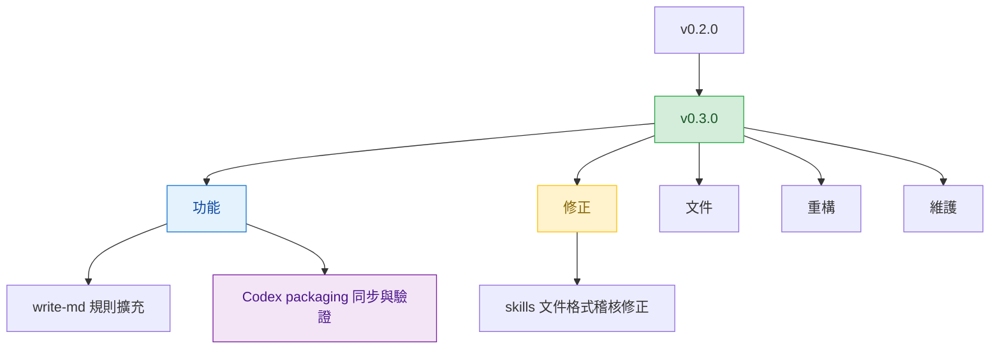

# v0.3.0

來源版本：[v0.2.0](v0.2.0.md)

## Quick Navigation

- [概覽](#概覽)
- [變更結構](#變更結構)
- [功能](#功能)
- [修正](#修正)
- [文件](#文件)
- [重構](#重構)
- [維護](#維護)

---

## 概覽

`v0.3.0` 是一個中型整理版，主軸包含 `write-md` 規則擴充、Codex plugin packaging 流程補強，以及既有 skills 文件格式的一致化。

[Back to top](#quick-navigation)

---

## 變更結構

[Back to top](#quick-navigation)

---

## 功能

- `write-md` skill 新增 AI agent 文件共通守則：禁止使用 Markdown table（改用條列清單），以及任何檔案或資源的指向一律使用 Markdown link，不允許裸路徑
- `write-md` skill 的 AI agent 文件受眾路由新增具體範例（`AGENTS.md`、`CLAUDE.md`、`SKILL.md` 等），讓 agent 判斷受眾時更明確
- Marketplace sync 腳本新增自動同步 Codex plugin package 版本號（`feat(marketplace): sync codex plugin package versions`）
- Marketplace verify 腳本新增驗證 Codex plugin package 內容與 source skills 完全一致（`feat(marketplace): verify codex plugin package contents`）

[Back to top](#quick-navigation)

---

## 修正

- 稽核並修正所有 skills（`arch-rules`、`go-mongo-rules`、`image-to-html`、`windows-script`）不符合 `write-md` SKILL 規範的問題，包含 Quick Navigation 章節、back-to-top 連結、Markdown table 轉換等

[Back to top](#quick-navigation)

---

## 文件

- 澄清 Plugin Bundle 的安裝、更新、移除生命週期指令說明（`docs: clarify plugin lifecycle commands`）

[Back to top](#quick-navigation)

---

## 重構

- `arch-rules` skill 開場白改為 agent persona 語氣，讓 AI agent 更能直接認同並套用守則
- `windows-script` skill 禁止 `.bat/.cmd` 的說明移除技術遺產背景介紹，只保留規則本身

[Back to top](#quick-navigation)

---

## 維護

- [`.gitignore`](../.gitignore) 新增 `bash.exe.stackdump` 與 `.worktree/` 排除規則

[Back to top](#quick-navigation)
