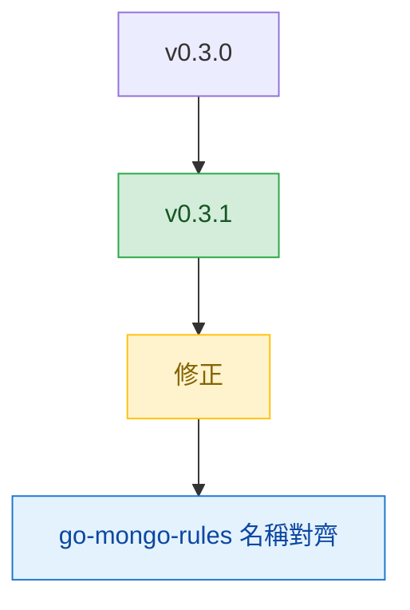

# v0.3.1

來源版本：[v0.3.0](v0.3.0.md)

## Quick Navigation

- [概覽](#概覽)
- [變更結構](#變更結構)
- [修正](#修正)

---

## 概覽

`v0.3.1` 是一個小版修正，重點在讓 `go-mongo-rules` 的 skill 識別名稱與資料夾名稱一致，避免 discovery 與引用時出現名稱分歧。

[Back to top](#quick-navigation)

---

## 變更結構

[Back to top](#quick-navigation)

---

## 修正

- 將 `go-mongo-rules` skill 的 `name` frontmatter 由 `mongo-guidelines` 修正為 `go-mongo-rules`，使 skill 識別名稱與資料夾名稱一致（`fix(go-mongo-rules): align skill name frontmatter with folder name`）

[Back to top](#quick-navigation)
