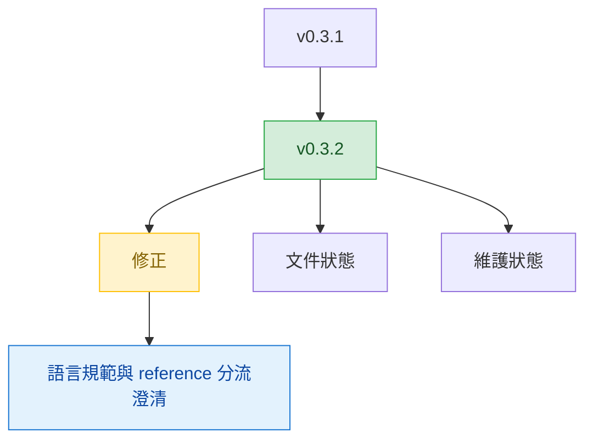

# v0.3.2

來源版本：[v0.3.1](v0.3.1.md)

## Quick Navigation

- [概覽](#概覽)
- [變更結構](#變更結構)
- [功能](#功能)
- [修正](#修正)
- [文件](#文件)
- [重構](#重構)
- [維護](#維護)

---

## 概覽

`v0.3.2` 主要是修正文意與規則邊界，讓 `write-md` 能更清楚區分英文與繁體中文文件，並明確拆開人類讀者文件與 AI agent 文件的維護語境。

[Back to top](#quick-navigation)

---

## 變更結構

[Back to top](#quick-navigation)

---

## 功能

- 無

[Back to top](#quick-navigation)

---

## 修正

- 澄清 `write-md` skill 的文件語言規範與 reference 分流規則，讓英文文件與繁體中文文件各自使用對應的強制語氣，並允許在同一任務中分別維護人類讀者文件與 AI agent 文件（`fix(write-md): clarify language-specific wording rules`）

[Back to top](#quick-navigation)

---

## 文件

- 無

[Back to top](#quick-navigation)

---

## 重構

- 無

[Back to top](#quick-navigation)

---

## 維護

- 無

[Back to top](#quick-navigation)
