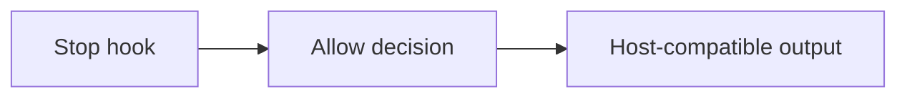

# v0.31.1

來源：v0.13.0

## 快速導覽

- [功能](#功能)
- [修正](#修正)
- [文件](#文件)
- [重構](#重構)
- [維護](#維護)

---

## 功能

- 本版本沒有新增功能。

[回到頂端](#快速導覽)

---

## 修正

- 修正 `claude-code` Stop hook 的允許停止輸出，移除 host 不使用的 `decision` 欄位，使輸出符合 host decision contract（`fix(claude-code): emit host-compatible allow stop decisions`）。

[回到頂端](#快速導覽)

---

## 文件

- 本版本沒有文件變更。

[回到頂端](#快速導覽)

---

## 重構

- 本版本沒有重構。

[回到頂端](#快速導覽)

---

## 維護

- 本版本沒有其他維護變更。

[回到頂端](#快速導覽)
