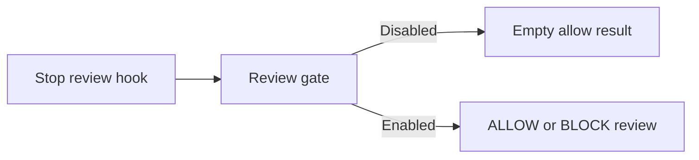

# v0.31.2

來源：v0.31.1

## 快速導覽

- [功能](#功能)
- [修正](#修正)
- [文件](#文件)
- [重構](#重構)
- [維護](#維護)

## 功能

- 本版本沒有新增功能。

[回到頂端](#快速導覽)

---

## 修正

- 修正 `claude-code` Stop Review Hook 在 review gate 關閉時仍收集 job context 並輸出狀態訊息的問題；現在會直接回傳空的 allow 結果，保持 host 靜默。
- 保留 review gate 啟用時的 `ALLOW`／`BLOCK` 協定，並讓 reviewer 無法建立 allow 決定時安全地阻止停止。（`fix(claude-code): keep disabled stop review hooks silent`）

[回到頂端](#快速導覽)

---

## 文件

- 更新 bridge runtime 與 upstream parity 文件，反映 Stop Review Hook 的靜默行為。
- 移除與現行 hook 實作重複且過時的 Stop Review Gate 設計文件。

[回到頂端](#快速導覽)

---

## 重構

- 本版本沒有重構變更。

[回到頂端](#快速導覽)

---

## 維護

- 本版本沒有其他維護變更。

[回到頂端](#快速導覽)
