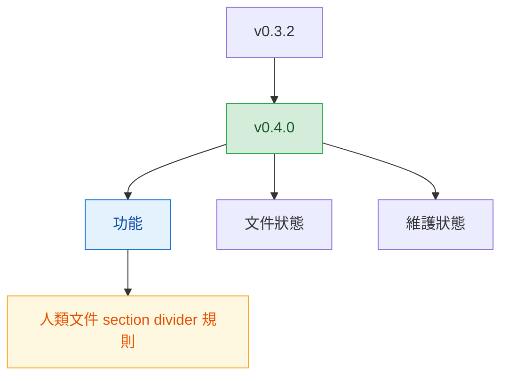

# v0.4.0

來源版本：[v0.3.2](v0.3.2.md)

## Quick Navigation

- [概覽](#概覽)
- [變更結構](#變更結構)
- [功能](#功能)
- [修正](#修正)
- [文件](#文件)
- [重構](#重構)
- [維護](#維護)

---

## 概覽

`v0.4.0` 聚焦在 `write-md` 的人類文件規則補強，目標是讓主要章節切分更清楚，降低長文件閱讀時的段落黏連感。

[Back to top](#quick-navigation)

---

## 變更結構

[Back to top](#quick-navigation)

---

## 功能

- 要求人類讀者文件的各主要章節之間使用獨立一行的 `---` 分隔線，讓章節切分與閱讀節奏更一致（`feat(write-md): require section dividers in human docs`）

[Back to top](#quick-navigation)

---

## 修正

- 無

[Back to top](#quick-navigation)

---

## 文件

- 無

[Back to top](#quick-navigation)

---

## 重構

- 無

[Back to top](#quick-navigation)

---

## 維護

- 無

[Back to top](#quick-navigation)
