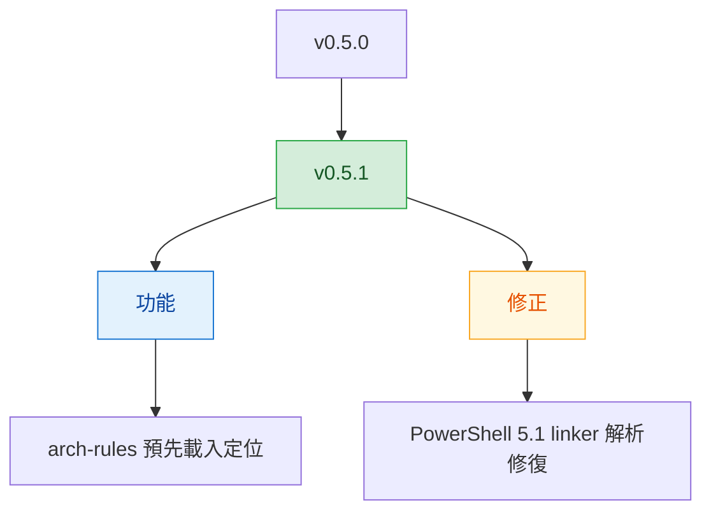

# v0.5.1

來源：v0.5.0

## Quick Navigation

- [概覽](#概覽)
- [變更結構](#變更結構)
- [功能](#功能)
- [修正](#修正)
- [文件](#文件)
- [重構](#重構)
- [維護](#維護)

---

## 概覽

`v0.5.1` 聚焦在兩件事：讓 `arch-rules` 從「守則速查」調整為實作與系統規劃前就必須先載入並遵守的執行原則，以及修復 `link-agent-skills.ps1` 在 PowerShell 5.1 下因編碼造成的解析失敗。

[Back to top](#quick-navigation)

---

## 變更結構

[Back to top](#quick-navigation)

---

## 功能

- **arch-rules**：將 skill 觸發語意調整為在撰寫、修改、重構、review 程式碼，以及 system design、API 設計、技術選型等規劃工作前就必須先載入，使它成為執行中的設計原則，而不是事後查閱的速查表（`feat(arch-rules): require preloading during coding and design`）

[Back to top](#quick-navigation)

---

## 修正

- 修復 `scripts/link-agent-skills.ps1` 在 `powershell.exe` 5.1 下因缺少 BOM 而導致的字串解析錯誤，恢復 skill linker 的可執行性（`fix: restore PowerShell 5.1 parsing for skill linker`）

[Back to top](#quick-navigation)

---

## 文件

- 無

[Back to top](#quick-navigation)

---

## 重構

- 無

[Back to top](#quick-navigation)

---

## 維護

- 同步更新 marketplace version 與 Codex plugin package version 至 `v0.5.1`

[Back to top](#quick-navigation)
