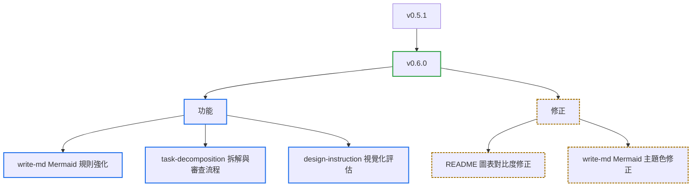

# v0.6.0

來源：v0.5.1

## Quick Navigation

- [概覽](#概覽)
- [變更結構](#變更結構)
- [功能](#功能)
- [修正](#修正)
- [文件](#文件)
- [維護](#維護)

---

## 概覽

`v0.6.0` 聚焦在強化 `write-md` skill 的 Mermaid 圖表規則（跳脫語法、識別碼命名、`classDef` 語法、渲染驗證），並延伸出新的 `task-decomposition` 拆解與同儕審查流程、`design-instruction` 的視覺化評估步驟，以及數個文件與維護性修正。

[Back to top](#quick-navigation)

---

## 變更結構

[Back to top](#quick-navigation)

---

## 功能

- **write-md**：新增 Mermaid 數字實體跳脫、PascalCase 識別碼加引號標籤、`classDef` 屬性語法，以及渲染前必須實際驗證輸出的規則，並同步更新 `diagram-examples`、`human-reader-docs` 的英文與繁體中文版本、Codex 同步副本，以及 README 架構圖（`feat(write-md): add Mermaid escaping, identifier, and render-verification rules`）
- **readme**：調整圖表樣式，改善 Plugin Bundle 架構圖的清晰度與一致性（`feat(readme): update styles for clarity and consistency in diagrams`）
- **design-instruction**：新增視覺化評估步驟，要求設計流程中確認呈現的清晰度（`feat(design-instruction): add visualization evaluation step for design clarity`）
- **task-decomposition**：新增設計與規劃拆解流程，並要求拆分策略需明確確認、plan 需經同儕審查（`feat(task-decomposition): add design and plan decomposition workflow`、`feat(task-decomposition): require peer-reviewed plan workflow`、`feat(task-decomposition): require explicit split strategy confirmation`）

[Back to top](#quick-navigation)

---

## 修正

- 修正 README 架構圖的對比度問題，並改以顏色以外的方式（形狀、線條樣式）編碼角色差異，避免色盲讀者或灰階顯示下無法辨識（`fix(docs): correct README diagram contrast and encode roles beyond color`）
- 修正 `write-md` 範例中 Mermaid 顏色未隨主題切換的問題，改為僅使用 `stroke` 相關屬性並通過對比度驗證（`fix(write-md): make Mermaid colors theme-safe and contrast-verified`）
- 修正 `task-decomposition` 檢查腳本路徑，改用可移植的解析方式（`fix(task-decomposition): require portable check script resolution`）

[Back to top](#quick-navigation)

---

## 文件

- 在 README 加入目前版本與 release note 的連結（`docs(release): link current version to release notes`）

[Back to top](#quick-navigation)

---

## 維護

- 在每個目錄忽略 `bash.exe.stackdump`（`chore: ignore bash.exe.stackdump in every directory`）
- 停用尚未完成的規劃類 skills（`chore: disable unfinished planning skills`）
- 同步更新 marketplace version 與 Codex plugin package version 至 `v0.6.0`

[Back to top](#quick-navigation)
