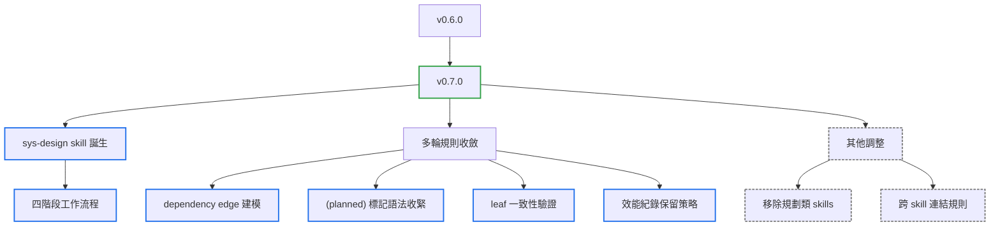

# v0.7.0

來源：v0.6.0

## Quick Navigation

- [概覽](#概覽)
- [變更結構](#變更結構)
- [功能](#功能)
- [修正](#修正)
- [文件](#文件)
- [重構](#重構)
- [維護](#維護)

---

## 概覽

`v0.7.0` 新增 `sys-design` skill：一套從設計文件出發、以 Specification by Example 與 TDD 驅動實作的四階段開發流程（設計 → SBE → 實作 → 效能驗證）。這是本次 release 的主體，其餘 commit 幾乎都是它從初版到穩定所經歷的多輪修正與收斂，包含依賴邊建模、`(planned)` 標記語法的嚴格化、leaf 一致性驗證，以及效能紀錄的保留策略調整。另外移除了尚未完成的規劃類 skills，並補上一條跨 skill 連結的撰寫規則。

[Back to top](#quick-navigation)

---

## 變更結構

[Back to top](#quick-navigation)

---

## 功能

- **sys-design**：新增從設計文件出發的四階段開發流程——Phase 1 模組化設計、Phase 2 SBE 落成失敗測試、Phase 3 TDD 實作、Phase 4 效能驗證（`feat(sys-design): add four-phase workflow from design document to TDD`）
- **sys-design**：導入 `(planned)` 標記慣例，標示尚未存在的連結，並提供 `list_planned.py` 掃描工具（`feat(sys-design): mark unresolved planned links and add a scanner for them`）
- **sys-design**：Phase 4 改用獨立的 `sd-<feature-name>-perf.md` 效能紀錄文件，不受設計文件行數上限與結構圖規則約束（`feat(sys-design): record Phase 4 measurements in a dedicated perf document`）
- **sys-design**：要求 assembly、leaf、overview、perf-record 四種文件各自遵循固定章節順序（`feat(sys-design): require a fixed section order per document type`）
- **sys-design**：導入 dependency edge，與 composition edge 區分——模組依賴另一模組不等於組成關係（`feat(sys-design): distinguish dependency edges from composition edges`）
- **sys-design**：Phase 1 的 Location Decision 新增依賴邊規劃、循環偵測，並允許依賴邊跨 submodule 邊界（`feat(sys-design): plan dependency edges with cycle detection`）
- **sys-design**：使用者刪除或修正 Phase 2 測試後，必須重跑收斂檢查才能取得確認（`feat(sys-design): re-verify Phase 2 tests after the user drops or corrects one`）
- **sys-design**：Phase 4 效能量測紀錄新增程式碼版本欄位，後改以 commit 取代日期作為量測身分，並只保留最近三筆（`feat(sys-design): record the code revision with each Phase 4 measurement`、`feat(sys-design): keep only the three most recent perf measurements, pinned to commit`）

[Back to top](#quick-navigation)

---

## 修正

- 修正 `sys-design` 初版中圖建構、edge 種類與行數計算之間不一致之處（`fix(sys-design): keep graph building, edge kinds, and counting consistent`）
- 要求 `(planned)` 標記使用單一行內連結的標準形式，之後再進一步收緊為嚴格且無歧義的形狀，避免掃描工具漏判（`fix(sys-design): require the canonical single-line form for planned links`、`fix(sys-design): tighten the planned-link shape to a strict, unambiguous form`）
- 要求同一組 Phase 2 測試檔必須指名相同的 leaf，且 `sys-design-leaf` 檔頭驗證失敗時改為退回 Phase 2，而非詢問使用者（`fix(sys-design): require every test in a Phase 2 set to agree on its leaf`、`fix(sys-design): validate the sys-design-leaf header strictly and return to Phase 2`）
- Phase 3 禁止在依賴者契約已損壞時靜默改寫該文件，必須恢復相容性或交由使用者決定（`fix(sys-design): stop Phase 3 from silently rewriting a dependent whose contract broke`）

[Back to top](#quick-navigation)

---

## 文件

- 為 `sys-design` 新增人類可讀的 README 概覽，並在後續變更中同步更新（`docs(sys-design): add a human-reader overview README`、`docs(sys-design): sync README with dependency edges, planned-link, and perf-record changes`）
- 在 `AGENTS.md` 補上規則：skill 內部嚴禁使用相對連結指向其他 skill，必須以 inline code 命名（`docs(agents): forbid relative Markdown links between skills`）

[Back to top](#quick-navigation)

---

## 重構

- 簡化 Phase 2 SBE gate，拿掉逐項候選清單確認的流程（`refactor(sys-design): streamline Phase 2 SBE gate to skip candidate-list ceremony`）
- 要求測試檔必須帶 `sys-design-leaf` 檔頭，拿掉以相鄰位置推斷擁有者的舊邏輯（`refactor(sys-design): require the sys-design-leaf header, drop adjacency inference`）
- 釐清 Phase 3 上層同步與行為一般化規則的措辭（`refactor(sys-design): clarify Phase 3 parent-sync and generalization rules`）
- 新增 Phase 1 路由 fallback，並釐清 Phase 2 重跑迴圈的措辭（`refactor(sys-design): add an explicit Phase 1 routing fallback and clarify Phase 2's repeat loop`）

[Back to top](#quick-navigation)

---

## 維護

- 移除尚未完成的規劃類 skills（`chore: remove superseded planning skills`）
- 同步更新 marketplace version 與 Codex plugin package version 至 `v0.7.0`

[Back to top](#quick-navigation)
