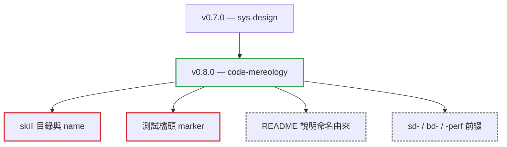

# v0.8.0

來源：v0.7.0

## Quick Navigation

- [概覽](#概覽)
- [變更結構](#變更結構)
- [升級注意事項](#升級注意事項)
- [重構](#重構)
- [文件](#文件)
- [維護](#維護)

---

## 概覽

`v0.8.0` 只做一件事：把 `v0.7.0` 推出的 `sys-design` skill 重新命名為 `code-mereology`。舊名只描述了四個階段中的第一個，其餘三個階段——把行為釘成失敗測試、對著測試實作、量測效能——都不屬於設計；而「system design」在業界另有「大規模分散式架構」的既定語意，也與 `arch-rules` 難以區分。新名取自 mereology（部分整體論），研究的正是「部分與整體的關係」，而那就是此 skill 文件模型所編碼的東西。

這是一次 breaking 變更：skill 的安裝路徑與測試檔頭註解都改了。

[Back to top](#quick-navigation)

---

## 變更結構

實線紅框是會影響既有使用者的兩處；虛線灰框不受影響。

[Back to top](#quick-navigation)

---

## 升級注意事項

- **已安裝的使用者必須重新安裝**：skill 目錄與 frontmatter 的 `name` 都從 `sys-design` 改為 `code-mereology`，安裝路徑因此改變。
- **既有測試檔的檔頭註解必須更新**：標示所屬設計文件的 marker 從 `sys-design-leaf:` 改為 `code-mereology-leaf:`。Phase 3 會驗證這個註解，未更新者無法通過冷載入檢查。
- **`sd-`、`bd-`、`-perf` 三種檔名前綴不受影響**：它們代表的是文件類型，與 skill 名稱無關，既有的設計文件不需要改名。

[Back to top](#quick-navigation)

---

## 重構

- 將 `sys-design` 重新命名為 `code-mereology`，測試檔頭 marker 同步改為 `code-mereology-leaf:`（`refactor(code-mereology): rename from sys-design`）

[Back to top](#quick-navigation)

---

## 文件

- 在 skill 的 `README.md` 開頭說明命名的概念由來：`bd-*.md` 說明組裝起來的整體交付什麼，`sd-*.md` 說明其中一個部分做什麼，而圖上的組成邊與依賴邊，區分的正是「是某物的一部分」與「只是依賴某物」（`docs(code-mereology): explain where the name comes from`）

[Back to top](#quick-navigation)

---

## 維護

- 同步更新 marketplace version 與 Codex plugin package version 至 `v0.8.0`

[Back to top](#quick-navigation)
