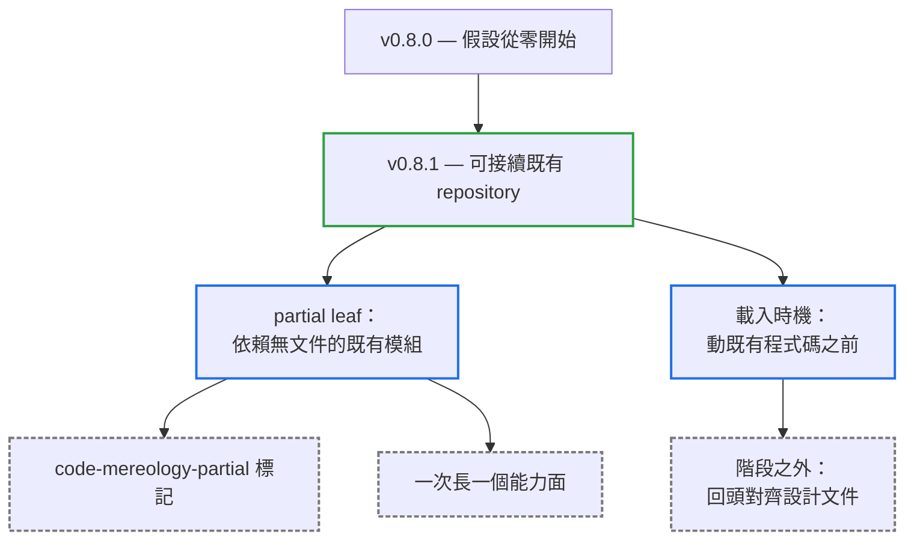

# v0.8.1

來源：v0.8.0

## Quick Navigation

- [概覽](#概覽)
- [變更結構](#變更結構)
- [升級注意事項](#升級注意事項)
- [功能](#功能)

---

## 概覽

`v0.8.1` 讓 `code-mereology` 能接續一個已經在開發中的 repository。在此之前，這套流程隱含假設專案是從零開始的：每一份設計文件都由它自己走完 Phase 1 產生。落在真實專案上，新功能一旦依賴到某個「已經實作、但沒有設計文件」的既有模組，流程就要求先把那整個模組的設計文件寫完——一份沒有邊界的工作，橫在功能與它的第一行程式碼之間。

本版從兩個方向解決它。其一，新增 partial leaf：一份只涵蓋「正被依賴的那個能力面」的設計文件，讓依賴當下就有真實檔案可以連結，模組其餘部分按需成長。其二，把 skill 的載入時機從「設計出發的開發」擴大到「動任何既有程式碼之前」，並補上一條階段之外的守則，要求改完程式碼回頭對齊被影響到的設計文件。

兩項都是純新增，既有的文件、測試與檔名前綴都不受影響。

[Back to top](#quick-navigation)

---

## 變更結構

藍框是本版新增的兩個入口，虛線灰框是它們各自帶來的規則。

[Back to top](#quick-navigation)

---

## 升級注意事項

- **既有文件與測試都不需要改動**：本版只新增規則，沒有改變任何既有規則的語意。`sd-`、`bd-`、`-perf` 三種檔名前綴與 `code-mereology-leaf:` 檔頭註解都維持原樣。
- **skill 會在更多情境下被載入**：description 的觸發範圍已擴大到「在已經開發中的 repository 動任何既有程式碼之前」。若專案中的既有程式碼旁邊有 `sd-*.md`，修改之後會被要求回頭檢查文件是否已與程式碼脫節。
- **partial leaf 不會自動出現**：它只在「新功能依賴到一個沒有設計文件的既有模組」時才進場，且與依賴它的那份 leaf 在同一輪中一起交付使用者確認。

[Back to top](#quick-navigation)

---

## 功能

- 新增 partial leaf，讓新功能可以依賴沒有設計文件的既有程式碼：只描述正被依賴的那個能力面，帶上 `code-mereology-partial` 標記，內容必須從程式碼讀出而非依呼叫方的期待推測。它嚴禁畫自己的依賴邊，因此不會把整張 legacy 圖拖進單一功能的 Phase 1；同一模組的後續依賴在同一份文件上擴充，一次長一個能力面。Phase 2 只在「即將規格化的行為落在標記仍排除的範圍」時才擋下，因此每一輪只為它動到的那個能力面付出代價。Phase 3 另行規定：對著 partial leaf 實作時若發現它與程式碼不符，屬事實記載錯誤，直接依程式碼修正，但必須接著檢查該修正是否推翻了已確認的設計或凍結測試（`feat(code-mereology): let a new feature depend on undocumented existing code`）
- 把載入時機擴大到「動任何既有程式碼之前」，並新增「階段之外的程式碼修改」守則：改動既有程式碼前先找它所在資料夾的 `sd-*.md`，改動後逐一對照並修正已不成立的敘述；若這次修改移動了模組邊界或改變了呼叫方能觀察到的行為，只改文字不夠，必須退回 Phase 1（`feat(code-mereology): load before editing existing code and reconcile its docs`）

[Back to top](#quick-navigation)
