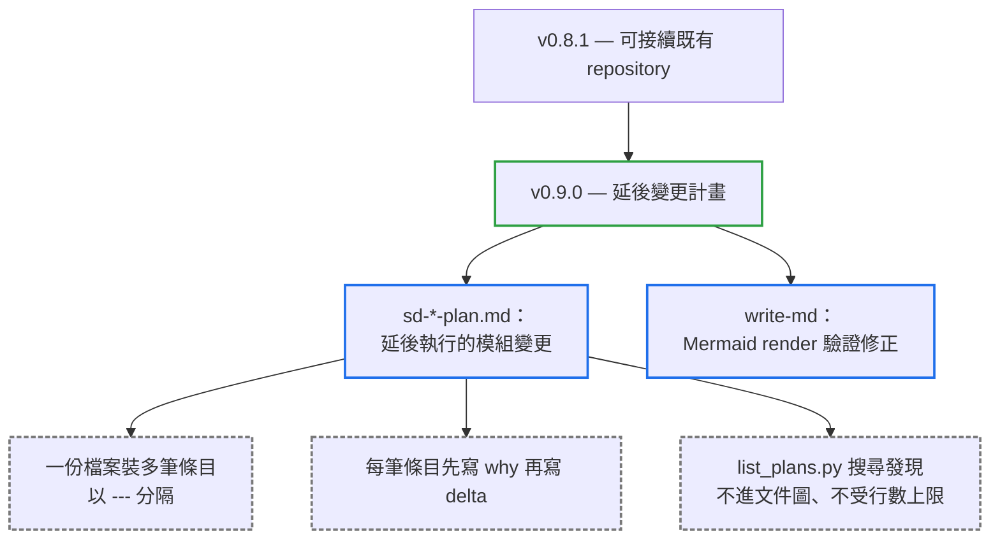

# v0.9.0

來源：v0.8.1

## Quick Navigation

- [概覽](#概覽)
- [變更結構](#變更結構)
- [升級注意事項](#升級注意事項)
- [功能](#功能)
- [修正](#修正)
- [維護](#維護)

---

## 概覽

`v0.9.0` 為 `code-mereology` 補上「延後變更計畫」機制：`sd-<feature-name>-plan.md`。用途是讓一份已交付的設計文件，在日後陸續收到新的變更需求時，可以先把工作意圖記下來，而不必立刻中斷手上的工作去執行它——真正執行時仍然要走回 Phase 1/2/3 的設計與測試確認關卡，plan 本身從不是規格來源。

本版分兩步完成：先建立單一延後計畫的骨架（檔名規則、與設計文件的配對、發現機制、執行與刪除語意），再擴充成支援同一份檔案裝下多筆條目——因為現實中一份模組往往不是只被要求改一次，而是隨時間陸續累積多個尚未輪到的變更請求。每筆條目都必須先寫下「為什麼需要這個變更」的原因，才能讓之後回頭執行或刪除它的人判斷這筆計畫是否還站得住腳。

此外也修正了 `write-md` 裡 Mermaid 驗證的兩個漏洞：允許用「找不到本機 Mermaid CLI」當作跳過必要 render 驗證的理由，以及序列圖文字中出現裸露分號會被 Mermaid 解析成新指令，卻沒有規則攔住它。

[Back to top](#quick-navigation)

---

## 變更結構

藍框是本版新增的兩條主線，虛線灰框是它們各自帶來的規則細節。

[Back to top](#quick-navigation)

---

## 升級注意事項

- **既有文件與測試都不需要改動**：本版只新增規則，沒有改變任何既有規則的語意。`sd-`、`bd-`、`-perf` 三種檔名前綴與 `code-mereology-leaf:` 檔頭註解都維持原樣，`-plan` 是全新前綴，不會與既有命名衝突。
- **`-plan` 檔案不計入文件圖、不受行數上限**：Phase 3 的反向走訪不會碰到它，`count_lines.py` 的 300 行上限規則也把它與 `-perf` 一起排除。
- **plan 只在使用者要求時才建立**：不會在既有專案中自動生成，發現機制靠 `list_plans.py` 搜尋而非文件連結。
- **`write-md` 的 render 驗證規則變嚴格**：找不到本機 Mermaid CLI 不再是跳過驗證的合理理由，必須改用其他可用的相容 renderer；序列圖訊息與 `Note` 文字中也不可再出現裸露分號。

[Back to top](#quick-navigation)

---

## 功能

- 新增「延後變更計畫」機制：`sd-<feature-name>-plan.md` 讓模組變更可以先記錄意圖、日後再執行，執行時仍必須通過 Phase 1/2/3 的確認關卡，plan 從不是規格來源（`feat(code-mereology): support deferred work with disposable plans`）
- 支援同一份 plan 檔案裝下多筆延後條目：以空白行、`---`、空白行分隔，每筆條目必須先寫下促成它的原因才能寫 delta，交付後逐筆刪除，檔案裡不再留下任何條目時才整份移除（`feat(code-mereology): support multi-entry deferred-change plans`）

[Back to top](#quick-navigation)

---

## 修正

- 修正 `write-md` 的 Mermaid 驗證漏洞：禁止序列圖訊息或 `Note` 文字中出現裸露分號（會被解析成新指令），並禁止把「找不到本機 Mermaid CLI」當作跳過 render 驗證的理由（`fix(write-md): enforce parser-safe Mermaid validation`）

[Back to top](#quick-navigation)

---

## 維護

- 忽略 IntelliJ 專案中繼資料，避免其進入版本控制（`chore: ignore IntelliJ project metadata`）

[Back to top](#quick-navigation)
