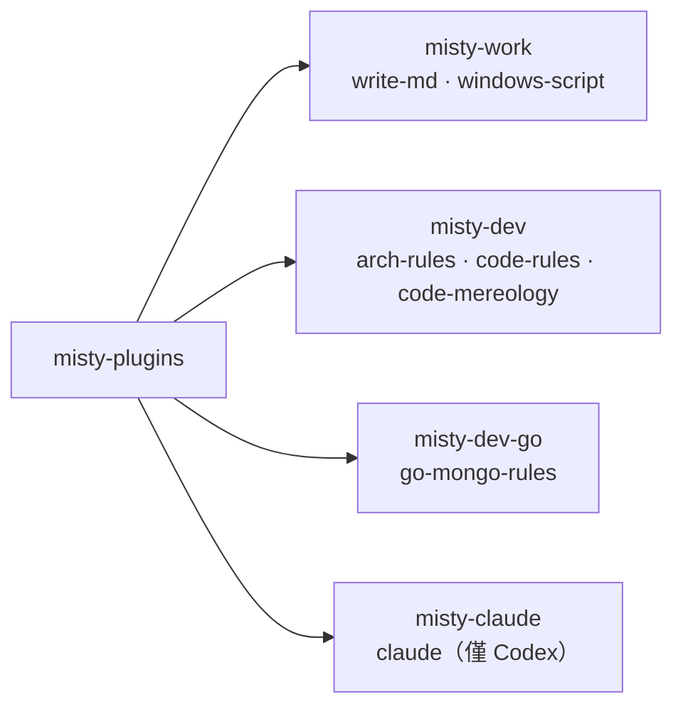

# v1.0.0

來源：v0.31.2

## 快速導覽

- [升級須知](#升級須知)
- [功能](#功能)
- [修正](#修正)
- [文件](#文件)
- [重構](#重構)
- [維護](#維護)

## 升級須知

本版本包含三項破壞性變更，舊名稱全部停用，需要重新註冊 marketplace 並重新安裝 plugin。

1. 倉庫改名為 `misty-marketplace`，GitHub 位置變為 `Aery9527/misty-marketplace`。
2. Claude Code 與 Copilot CLI 的 marketplace `aery-plugins`，以及 Codex 的 marketplace `aery-codex-plugins`，統一改名為 `misty-plugins`。
3. Plugin bundle 重新分組：`aery-design`、`aery-go-dev`、`aery-claude-code` 停用，改為 `misty-work`、`misty-dev`、`misty-dev-go`、`misty-claude`。`image-to-html` skill 已移除。

升級步驟：先移除舊 marketplace（會一併移除從它安裝的 plugin），再依 [README](../README.md) 的安裝表格加入 `misty-plugins` 並安裝需要的 bundle。

[回到頂端](#快速導覽)

---

## 功能

- 倉庫與兩個宿主的 marketplace 統一改名為 misty 系列，plugin manifest 的 repository 指向新倉庫。（`feat(marketplace)!: rename repository and marketplaces to misty`）
- Plugin bundle 依情境重新分組：`misty-work` 收納 `write-md` 與 `windows-script`，`misty-dev` 收納 `arch-rules`、`code-rules` 與 `code-mereology`，`misty-dev-go` 收納 `go-mongo-rules`；`image-to-html` 退役。（`feat(marketplace)!: regroup skills into misty-work, misty-dev, and misty-dev-go bundles`）
- Codex 專用的橋接 skill 由 `claude-code` 改名為 `claude`，其 bundle 由 `aery-claude-code` 改名為 `misty-claude`。（`feat(claude)!: rename skill to claude and its Codex bundle to misty-claude`）
- `code-rules` 改寫為具體實作規則：只保留帶有門檻、判斷分支或範例的規則，涵蓋變更邊界、參數數量、分支分派、錯誤處理、註解、log 與工具使用；與 `arch-rules` 重複的通則移除。（`feat(code-rules): replace generic guidance with concrete implementation rules`、`feat(code-rules): add concrete implementation guidance`）
- `arch-rules` 改為精簡的工程關鍵字提示表，並在開頭指向 `code-rules` 處理實作層規則。（`feat(arch-rules): guide design with concise engineering cues`、`feat(arch-rules): point implementation work to code-rules`）

[回到頂端](#快速導覽)

---

## 修正

- 本版本沒有修正變更。

[回到頂端](#快速導覽)

---

## 文件

- 共用的 agent 指引集中到 LORE 檔案，各 skill 不再重複。（`docs: centralize shared agent guidance in lore files`）
- marketplace 描述改為直接說明內含的規則類型。（`docs(marketplace): describe the marketplace by what it offers`）

[回到頂端](#快速導覽)

---

## 重構

- 所有 skill 的 description 精簡為觸發條件與用途。（`refactor: trim skill descriptions to trigger conditions and purpose`）
- `go-mongo-rules` 改寫為精簡規則清單，並修正技術描述。（`refactor(go-mongo-rules): rewrite as concise rule list and fix technical claims`）
- `code-mereology` 的目錄總覽檔依文件命名規則改為 `CODE-MEREOLOGY.md`。（`refactor(code-mereology): rename README.md to CODE-MEREOLOGY.md per doc naming rule`）

[回到頂端](#快速導覽)

---

## 維護

- 本版本沒有其他維護變更。

[回到頂端](#快速導覽)
