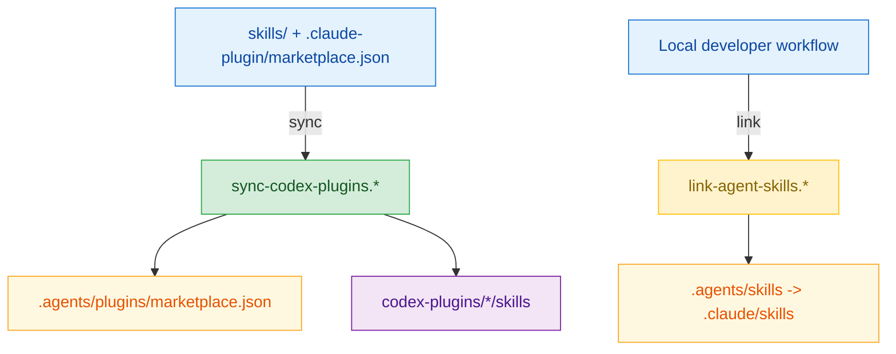

# Scripts

這個目錄放的是 repo 維護腳本。

## Quick Navigation

- [概覽](#概覽)
- [腳本關係圖](#腳本關係圖)
- [腳本清單](#腳本清單)
- [sync-codex-plugins](#sync-codex-plugins)
- [link-agent-skills](#link-agent-skills)
- [平台說明](#平台說明)
- [維護規則](#維護規則)

## 概覽

這個目錄裡的腳本主要分成兩類：

- `sync-codex-plugins.*`：把 Claude marketplace 定義同步成 Codex 會讀的
  marketplace 與 plugin package 產物。
- `link-agent-skills.*`：在本機開發環境建立 `.claude/skills` 與
  `.agents/skills` 之間的 link，讓不同 agent 入口共用同一份 skills。

最重要的邊界是：只有 `sync-codex-plugins.*` 屬於正式的封裝與同步流程；
`link-agent-skills.*` 只是本機開發輔助工具，不該被當成 release automation
的一部分。

[Back to top](#quick-navigation)

## 腳本關係圖



## 腳本清單

| Script | 用途 | 何時使用 |
| ------ | ---- | -------- |
| `sync-codex-plugins.ps1` | 同步 `.claude-plugin/marketplace.json` 到 `.agents/plugins/marketplace.json` 與 `codex-plugins/*/skills` | 任何 skill、plugin 分組或 Codex plugin package 結構有變動時 |
| `sync-codex-plugins.sh` | `sync-codex-plugins.ps1` 的 shell wrapper | 在 macOS、Linux 或 Git Bash 上觸發同步時 |
| `link-agent-skills.ps1` | 互動式管理 `.agents/skills` 的 Windows junction | 本機 Windows 開發環境需要讓 `.agents/skills` 指向 `.claude/skills` 時 |
| `link-agent-skills.sh` | 互動式管理 `.agents/skills` 的 Unix symlink | 本機 Unix-like 開發環境需要讓 `.agents/skills` 指向 `.claude/skills` 時 |

[Back to top](#quick-navigation)

## sync-codex-plugins

`sync-codex-plugins.ps1` 是面向 Codex 產物的正式同步腳本。

### 會更新什麼

- `.agents/plugins/marketplace.json`
- `codex-plugins/*/.codex-plugin/plugin.json` 的 `version`
- `codex-plugins/*/skills`

### 會讀取什麼

- `.claude-plugin/marketplace.json`
- 既有的 `.agents/plugins/marketplace.json`
- 每個 plugin 宣告所指向的 skill source 目錄
- `codex-plugins/*/.codex-plugin/plugin.json`

### 會做什麼

1. 以 `.claude-plugin/marketplace.json` 作為 plugin bundle 的 source of
   truth。
2. 驗證 plugin 名稱、skill 路徑、source 目錄，以及 Codex plugin package
   目錄是否存在。
3. 把宣告的 skill 目錄複製到各自的 `codex-plugins/<plugin>/skills`。
4. 用 `.claude-plugin/marketplace.json` 的 `metadata.version` 回寫每個
   `codex-plugins/<plugin>/.codex-plugin/plugin.json` 的 `version`。
5. 從同步後的 package tree 中刪除所有 `*_zhTW.md`，讓 Codex package 只保
   留英文主檔。
6. 重寫 `.agents/plugins/marketplace.json`，使其指向
   `./codex-plugins/<plugin>`。

### 前置條件

- `.claude-plugin/marketplace.json` 內的 plugin 名稱必須唯一。
- 每個宣告的 plugin `source` 目錄都必須存在。
- 每個宣告的 skill 目錄都必須存在。
- 每個目標 `codex-plugins/<plugin>` 目錄都必須事先建立。
- 每個目標 `codex-plugins/<plugin>/.codex-plugin/plugin.json` 都必須已存在。
- 若透過 `.sh` wrapper 執行，環境中必須有 `pwsh`。

### 用法

```powershell
.\scripts\sync-codex-plugins.ps1
```

```sh
./scripts/sync-codex-plugins.sh
```

### 失敗行為

這個腳本採用 fail fast，而不是靜默跳過錯誤。這個取捨是合理的，因為它維
護的是封裝產物；若腳本默默容錯，只會把壞掉的 plugin 定義包進產物裡。

[Back to top](#quick-navigation)

## link-agent-skills

`link-agent-skills.*` 是本機開發輔助工具。它不會更新封裝產物，也不能取代
`sync-codex-plugins.*`。

### 互動模式

1. 把整個 `.agents/skills` 連到 `.claude/skills`
2. 逐個 skill 目錄建立 link
3. 移除既有 link

PowerShell 版本建立的是 Windows junction，shell 版本建立的是 Unix
symlink。

### 副作用

- 這組腳本會修改 `.agents/skills`。
- 這組腳本也會同步新增或移除 `.gitignore` 裡對應的條目。
- 如果 `.agents/skills` 已存在，腳本可能會先移除既有路徑，再建立要求的
  link 結構。

### 限制

- 這組腳本是互動式，不適合 CI。
- 它不會更新 `.agents/plugins/marketplace.json`。
- 它不會重建 `codex-plugins/*/skills`。
- 若逐 skill 模式的目標路徑已存在且不是 link，腳本會直接略過，不會幫你
  merge 內容。

[Back to top](#quick-navigation)

## 平台說明

- Windows：優先使用 `sync-codex-plugins.ps1` 與 `link-agent-skills.ps1`
- macOS / Linux：使用對應的 `.sh` wrapper
- `sync-codex-plugins.sh` 只是 wrapper，實際仍依賴 `pwsh`

[Back to top](#quick-navigation)

## 維護規則

如果未來往這個目錄新增腳本，這份 README 至少要同步補上：

- 腳本用途
- 前置條件與依賴
- 腳本會讀哪些檔案或目錄
- 腳本會寫哪些檔案或目錄
- 是否適合 CI 或 release workflow
- 失敗行為與安全邊界

[Back to top](#quick-navigation)
