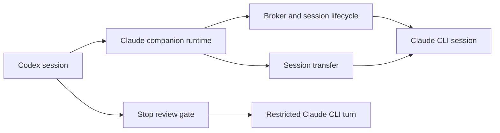

# Claude Code Bridge Runtime

## 快速導覽

- [此組裝提供的成果](#此組裝提供的成果)
- [關係與資料流](#關係與資料流)
- [Runtime 模組](#runtime-模組)

---

## 此組裝提供的成果

Bridge runtime 讓 Codex session 能把工作委派給長期運行的 Claude Code CLI
session、安全地觀察與停止委派工作、選擇性要求停止前審查，並把產生的脈絡交給可續接的
Claude session。它保留 packaged `claude-code-bridge` skill 上游 parity 契約所記錄的
host 限制，不會宣稱 Codex 能重現其實無法提供的 Claude Code 原生機制。

[返回頂端](#快速導覽)

---

## 關係與資料流

Companion 維持所有使用者呼叫 bridge commands 的單一邊界。Codex hooks 是獨立的 host
entry points：stop hook 直接呼叫自己的受限 Claude turn，session hook 則協調 teardown。
Broker 負責 live session 協調，而 transfer 建立另一個可續接的 bridge-owned Claude session。

[返回頂端](#快速導覽)

---

## Runtime 模組

- [Broker 與 session lifecycle](../sd-broker-session-lifecycle_zhTW.md) — 協調 live bridge session、graceful interruption 與 session cleanup，且不讓 broker state 取代 job record 的權威地位。
- [Stop review gate](../sd-stop-review-gate_zhTW.md) — 將已儲存的 review-gate 偏好套用到 Codex stop event；審查無法得出 allow 決定時採取安全失敗。
- [Session transfer](../sd-session-transfer_zhTW.md) — 將 Codex context 轉換成 bridge-owned Claude session，並回傳可續接命令，而不直接寫入 Claude 的私有 project-session 格式。

[返回頂端](#快速導覽)
