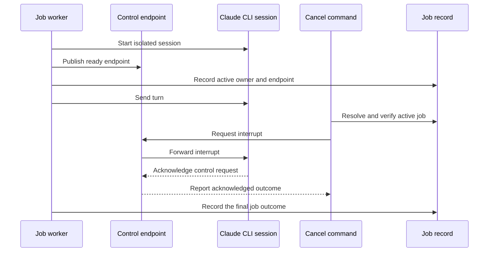

# Broker 與 Session Lifecycle

## 快速導覽

- [責任與邊界](#責任與邊界)
- [Runtime 流程](#runtime-流程)
- [介面與資料視圖](#介面與資料視圖)
- [注意事項](#注意事項)

---

## 責任與邊界

此模組讓另一個 bridge process 能透過受限的 control channel，聯絡擁有 active
Claude CLI session 的 process。它負責 endpoint 建立、control message 驗證、
graceful interrupt 與 shutdown request、endpoint liveness，以及 job 或其 Codex
session 結束時的 cleanup。

每個 active job 必須擁有自己的 control endpoint。Broker 嚴禁成為 workspace-wide
Claude session：model、tool、schema、permission 與 resume option 都在 Claude CLI
啟動時固定；跨 command 共用一個 process 會混合不相容的安全與輸出契約。Broker
也嚴禁成為第二套 job store；既有 job record 仍是 request、progress 與 outcome
的唯一真相來源。

[返回頂端](#快速導覽)

---

## Runtime 流程

Endpoint 必須 ready 後，job 才能宣告具備 brokered control。Cancellation 會先鎖定
已驗證的 control channel；若 endpoint 不存在、無法連線，或無法確認 interrupt，
則沿用既有、已驗證的 process termination fallback，並回報其較窄的保證。

[返回頂端](#快速導覽)

---

## 介面與資料視圖

- [Broker server](scripts/claude-broker.mjs) — 接收單一 active session owner 的受限 control request，並回報 Claude 是否 acknowledge。
- [Endpoint codec](scripts/lib/broker-endpoint.mjs) — 建立各平台的 local endpoint，並拒絕不支援或格式錯誤的 endpoint value。
- [Broker lifecycle](scripts/lib/broker-lifecycle.mjs) — publish、probe、shutdown 並移除每個 job 的 control endpoint。
- [Session lifecycle hook](scripts/session-lifecycle-hook.mjs) — 接收 Codex session event，只清理可歸屬於該結束 session 的 job。
- [Claude CLI session](scripts/lib/claude-cli.mjs) — 擁有 stdin control channel，並定義 interrupt acknowledgement。
- [Companion command boundary](scripts/claude-companion.mjs) — 啟動 tracked work、解析 cancellation，並回報實際採用的 fallback。
- [Job records](scripts/lib/state.mjs) — 對 active owner、control endpoint 與 terminal outcome 保持權威。

[返回頂端](#快速導覽)

---

## 注意事項

- Idempotency — shutdown 與 cleanup 必須容許 endpoint、process 或 artifact 已不存在。重複 cleanup 嚴禁改動其他 job。
- Concurrency — 一個 endpoint 代表一個 active session owner，且只接受 control request；它嚴禁 multiplex 獨立的 Claude turn，也嚴禁在已記錄的 owner 仍 active 時接受新 owner。
- Ordering — endpoint readiness 必須早於將它 publish 到 job record。Publish 與清除 endpoint 都必須使用 guarded write，並在觀察到 terminal job 時拒絕更新。
- Failure behavior — control endpoint 建立失敗時可以 fallback 到 direct runtime，但必須可觀察，且嚴禁回報成支援 graceful interruption。失敗或未回覆的 interrupt 可以 fallback 到 verified process termination。
- Session scope — session-end event 必須從 listing 與 authoritative job files 共同找出 jobs，再只清理帶有該 Codex session identifier 的項目。Codex 未提供 durable identifier 時，hook 嚴禁猜測 identifier 或移除 workspace 的所有 job。
- Cleanup safety — acknowledged broker shutdown 或 verified fallback termination 後，除非已觀察到 worker exit，否則 active job files 必須保留。殘留 record 只增加人工 cleanup；終止無關 process 或刪除唯一 evidence 都不是可接受的 fallback。
- Host delivery — 直接呼叫 hook 驗證 parsing 與 cleanup；互動式 Codex TUI probe 已確認 `SessionStart` 與 `SessionEnd` 會連同 workspace 與已安裝 plugin environment 一起送達。Hook process 不會收到 `CODEX_THREAD_ID`；其 payload identifier 會等於 transcript 的 `session_meta.id`，而 command 端的 `CODEX_THREAD_ID` 識別的正是該值。
- Limits — acknowledged interrupt 只證明 Claude 接受 control request，不代表所有 child process 已退出，也不代表 job 已進入 terminal state。
- Guard limit — endpoint guard 只縮小 final read 與 atomic rename 之間的區間，無法關閉它。Terminal write 若落在該區間仍可能被覆寫；要關閉它需要此 runtime 並未提供的真正 cross-process lock 或 compare-and-swap primitive。

[返回頂端](#快速導覽)
