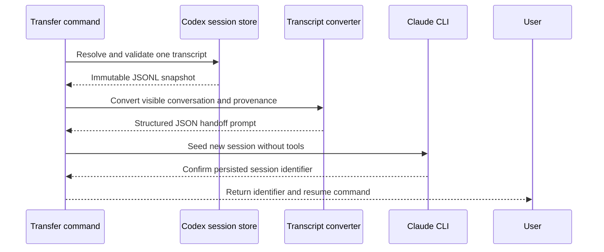

# Session Transfer

## 快速導覽

- [責任與邊界](#責任與邊界)
- [Transfer 流程](#transfer-流程)
- [介面與資料視圖](#介面與資料視圖)
- [注意事項](#注意事項)

---

## 責任與邊界

此模組將 Codex transcript snapshot 轉成一個全新、bridge-owned Claude session 的
第一個 turn，並回傳該 session 的 identifier 與 `claude --resume` command。Handoff
依時間順序攜帶 source provenance 及可見的 user/assistant conversation；不支援的可見
內容會以明確 omission marker 表示，不會無聲消失。

結果是可續接的 Claude conversation，不是具有獨立歷史 turn 的原生匯入。Bridge 必須只
透過受支援的 Claude CLI 建立並保存 target。它嚴禁在 Claude 私有 session store 內合成或
編輯檔案、改動 Codex source、納入 hidden reasoning 或 host control record，也嚴禁宣稱已
移轉被省略的內容。

[返回頂端](#快速導覽)

---

## Transfer 流程

Command 預設依 `CODEX_THREAD_ID` 找到目前 transcript；明確提供 source 時可選擇另一份
Codex JSONL transcript。兩種情況的 canonical source 都必須是 Codex session store
底下既存的檔案，且 metadata 必須識別單一 session。必須依序完成解析、讀取完整 snapshot、
轉換及成功初始化 Claude，才能回報 resume command。

[返回頂端](#快速導覽)

---

## 介面與資料視圖

- [Transfer command](commands/claude-transfer.md) — 呼叫一次 transfer，呈現 Claude session identifier 與 resume command，且不誇稱為原生 history import。
- [Codex transcript boundary](scripts/lib/codex-session-transfer.mjs) — 解析安全 source、驗證 session identity，並把支援的 conversation content 轉成帶 provenance 的 handoff。
- [Companion command boundary](scripts/claude-companion.mjs) — 協調 validation、conversion、Claude initialization 及 human 或 JSON output。
- [Claude runtime](scripts/lib/claude.mjs) — 驗證 availability 並執行隔離的 seed turn。
- [Claude CLI session](scripts/lib/claude-cli.mjs) — 透過受支援的 CLI flag 建立具名 session，並回報從 Claude 觀察到的 session identifier。
- [Session transfer core](scripts/lib/codex-session-transfer.mjs) — 在信任 source 前解析並 canonicalize transcript path。

[返回頂端](#快速導覽)

---

## 注意事項

- Idempotency — transfer 刻意不是 idempotent：每次成功呼叫都建立不同的 Claude session；它不改動 Codex source，且嚴禁覆寫較早的 target。
- Concurrency — concurrent transfer 必須使用不同的 target identifier 與彼此獨立的 immutable source snapshot；任一 transfer 嚴禁重用另一個 in-flight session。
- Ordering — Claude 啟動前必須讀完 source snapshot；只有 Claude 回報已保存的 target identifier 後，才能輸出 resume command。
- Source compatibility — conversation 只攜帶可見的 user/assistant text；non-conversation record 會略過，不支援的可見內容會標記。Malformed JSONL、identity 衝突或沒有可移轉 conversation 的 source 必須明確失敗。
- Prompt boundary — provenance 與可見 messages 必須序列化為單一 JSON value。Conversation strings 嚴禁直接插值成 prompt markup 或 delimiter。
- Seed isolation — 初始 handoff turn 必須停用 built-in 與 MCP tool，讓 transfer 本身不能改動 workspace；續接已完成的 session 是另一個使用其 invocation permission 的使用者動作。
- Failure behavior — path validation、conversion、availability、initialization 或 protocol failure 都嚴禁回報成功。Claude 若在後續失敗前已公開 identifier，diagnostic 必須回報該可能不完整的 session，不能假裝已 rollback。
- Capacity — transcript 嚴禁為了符合 model context 而無聲截斷。Claude 若因完整 handoff 過大而拒絕，transfer 失敗且 source 維持不變。
- Host compatibility — Codex 未記錄穩定的 transcript-reading API，也沒有原生 Claude importer。隔離的 parser 必須拒絕不相容的必要 record，嚴禁把目前觀察到的私有 JSONL shape 視為永久穩定。
- Acceptance — test 可驗證 conversion 與 CLI orchestration；resumability 仍需第二個 process probe，確認 provenance 在 resume 後仍存在，且 bridge 本身未寫入 Claude session file。

[返回頂端](#快速導覽)
