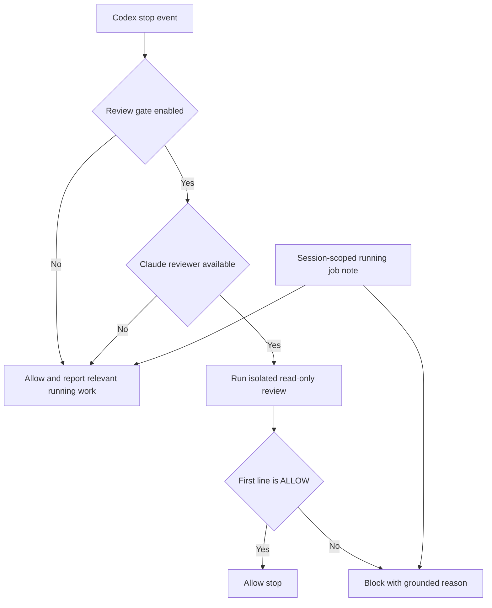

# Stop Review Gate

## 快速導覽

- [責任與邊界](#責任與邊界)
- [決策流程](#決策流程)
- [介面與資料視圖](#介面與資料視圖)
- [注意事項](#注意事項)

---

## 責任與邊界

此模組在 Codex 詢問目前 turn 能否停止時，套用 workspace 已儲存的 review-gate
偏好。功能啟用且 Claude 可用時，它會把最後一則 Codex response 與目前 repository
state 交給隔離、唯讀的 Claude reviewer。Reviewer 必須根據可觀察工作回傳一個明確的
`ALLOW` 或 `BLOCK` 決定。

Gate 嚴禁宣稱提供的 response 能證明上一個 turn 改了哪些檔案。Reviewer 無法確認有可
審查的 code change 時，必須允許停止。仍在運行的 companion job 是提供給使用者的脈絡，
不能獨立構成阻擋理由。Gate 只負責 stop decision；嚴禁變更 job outcome、終止工作或寫入
repository 內容。

[返回頂端](#快速導覽)

---

## 決策流程

Review 未啟用或 Claude 不可用時採 fail-open，避免 hook 困住使用者，同時輸出可採取行動
的診斷。一旦已啟用的 review 開始執行，`BLOCK`、timeout、非零 exit、空白或無效輸出，
以及第一行不是 `ALLOW` 的結果都採 fail-closed。Block reason 會附上相關 running job
note，但不把該 note 當成 review evidence。

[返回頂端](#快速導覽)

---

## 介面與資料視圖

- [Hook manifest](hooks.json) — 以有限 timeout 註冊 session 與 stop hook。
- [Stop hook](scripts/stop-review-gate-hook.mjs) — 解析 host event、判定 scope、呼叫 review，並輸出 host decision。
- [Review prompt](prompts/stop-review-gate.md) — 將 reviewer 約束在前一則 response、可觀察 repository evidence 與精確 decision protocol 內。
- [Workspace configuration](scripts/lib/state.mjs) — 提供已儲存的 `stopReviewGate` 偏好與 session identifier 慣例。
- [Tracked jobs](scripts/lib/job-control.mjs) — event 帶有 identifier 時，提供已按該 session 篩選的 running-job context。
- [Claude runtime](scripts/lib/claude.mjs) — 提供 installation 與 authentication readiness 檢查，以及受限 review invocation boundary。

[返回頂端](#快速導覽)

---

## 注意事項

- Idempotency — 重複 stop event 必須依目前輸入產生新決定，嚴禁保存 latch 或改動 repository state。
- Concurrency — event 帶有 session identifier 時，running-job context 必須限於該 session；缺少 identifier 時嚴禁猜測。
- Ordering — 必須先檢查 configuration 與 reviewer availability，再執行 review；final diagnostic 或 block reason 輸出前必須先收集 job context。
- Reviewer isolation — review 必須只開放檢查 response 與 repository 所需的 read operation；嚴禁授予 shell、edit、write 或具寫入能力的 MCP tool。
- Prompt boundary — 前一則 response 必須以 escaped JSON string 進入 prompt，使 response text 無法關閉外層 prompt markup 或取代 decision protocol。
- Failure behavior — review 未啟用與 setup 不可用時，以 diagnostic fail-open；review 啟用且開始後，execution 或 protocol failure 採 fail-closed。
- Decision protocol — 第一行必須恰為 `ALLOW` 或 `BLOCK`。`BLOCK` 必須附上與可觀察 code 相連的具體理由；無法確定 turn provenance 時必須判定 `ALLOW`。
- Host delivery — 直接呼叫與 test 驗證 parsing 和 decision；互動式 Codex TUI probe 已確認 `Stop` 會連同 workspace 與已安裝 plugin environment 一起送達。宿主契約改變時，必須重跑 probe。
- Limits — repository inspection 可找出可觀察工作中的 defect，但不能證明 authorship、workspace 外的完整性，或已發生 effect 的安全性。

[返回頂端](#快速導覽)
