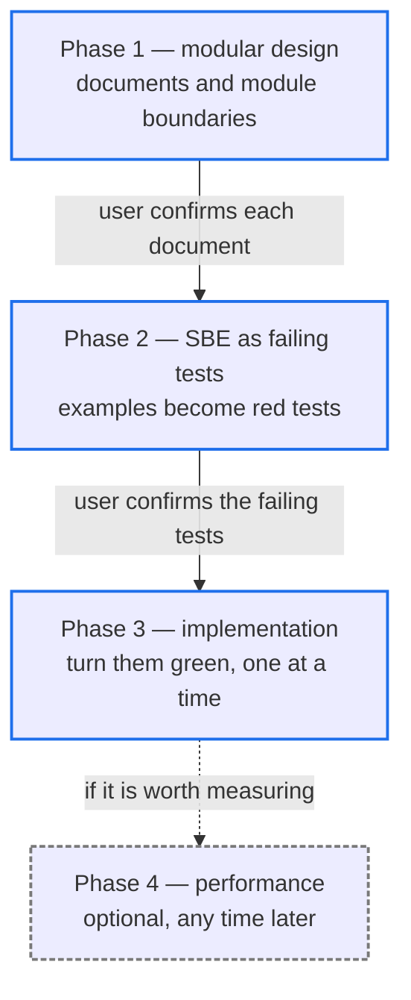
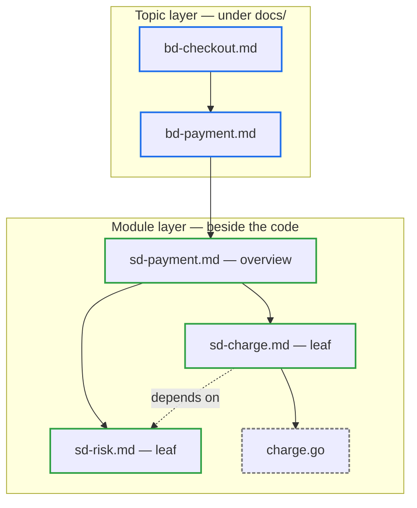

# code-mereology

一套開發流程，它唯一的規格文件是設計文件；其餘產出都是測試、實作程式碼，以及選配的效能紀錄。

## 快速導覽

- [它解決什麼問題](#它解決什麼問題)
- [四個階段](#四個階段)
- [文件模型](#文件模型)
- [檔名規則](#檔名規則)
- [值得知道的決策](#值得知道的決策)
- [規則放在哪裡](#規則放在哪裡)

---

## 它解決什麼問題

設計文件會腐爛。它描述某個東西怎麼運作，程式碼往前走了，一年後沒有人信任那份文件到願意打開它。

這個 skill 的解法是：讓文件可能寫錯的東西變少。設計文件說明一個模組做什麼、擁有什麼職責、有哪些要注意的地方——但從不說明它怎麼做到。介面是指向真實程式碼的 Markdown link，而不是它的複本。行為由測試釘住，而不是由散文描述。留在文件裡的，是變動最慢的那一部分。

這裡沒有實作計畫文件，也沒有存放範例的文件。範例活在失敗的測試裡——測試無法在不變紅的情況下與程式碼脫節。

[返回開頭](#快速導覽)

---

## 四個階段

每個階段各自獨立載入。每個階段都寫明動手之前需要什麼、自己會產出什麼，因此任一階段都能在沒有前置脈絡的情況下接手。

兩條實線箭頭是使用者的 gate。agent 嚴禁靠自己的判斷跨過它們：使用者必須確認每一份文件，才能往下打開它的模組；必須確認那組失敗的測試，才能寫下第一行實作。

Phase 2 與 Phase 3 是每個 leaf 模組各跑一輪，而不是整棵樹跑一輪。

[返回開頭](#快速導覽)

---

## 文件模型

文件分兩層下降。主題層說明「組裝起來的整體交付什麼」，模組層說明「單一組件做什麼、邊界在哪」。讀者從主題進入，再往下走到組件。

實線箭頭是組成——一個節點由什麼構成。虛線箭頭是依賴——一個模組需要別處提供什麼能力。依賴不等於組成，因此 `sd-charge.md` 即使連了出去，它仍然是 leaf。

Phase 3 會從它剛實作完的 leaf 沿這張圖反向回溯，所以每一條邊都必須是真實的連結，而不是靠語意暗示的關係。

[返回開頭](#快速導覽)

---

## 檔名規則

| 檔名 | 位置 | 主題 |
|------|------|------|
| `bd-<主題>.md` | scope 根目錄下的 `docs/` | 組裝起來的整體交付什麼——一項業務需求、一段架構說明、一條端到端的 data flow |
| `sd-<功能>.md` | 與它所描述的程式碼放在一起 | 單一模組：它的職責、邊界與注意事項 |
| `sd-<功能>-perf.md` | 與它所量測的程式碼放在一起 | 最近三次的效能量測結果，每筆釘在一個 commit 上 |

monorepo 採用同一模型的巢狀結構：repository 根目錄一個 `docs/` 說明各 submodule 如何組裝，每個 submodule 根目錄再各有一個說明自己內部。

[返回開頭](#快速導覽)

---

## 值得知道的決策

以下是第一次讀規則時最可能感到意外的幾個選擇。

**範例嚴禁寫進文件。** 它們直接進入失敗的測試。一份重述測試已表達內容的文件，等於第二個真相來源，遲早會與第一個牴觸。

**設計文件上限 300 行，圖不計入。** 超過就代表這個模組承載太多，唯一容許的反應是把它切開——為了塞進上限而壓縮敘述是明文禁止的。

**由使用者刪減測試，而不是勾選清單。** 判斷具體的 input 與 output 比判斷對它們的抽象描述更容易，因此拿來檢視的是測試本身，而不是一份逐項打勾的案例清單。

**每個測試檔都在檔頭註解寫出自己所屬的設計文件。** 靠「文件就放在程式碼旁邊」來推斷擁有者，一路可行到某個資料夾多出第二份設計文件為止，然後它就無聲失效。

[返回開頭](#快速導覽)

---

## 規則放在哪裡

本檔案是概覽。agent 實際遵循的規則在 [SKILL_zhTW.md](SKILL_zhTW.md) 以及它路由過去的各階段 reference：

- [Phase 1 — 模組化設計](references/phase1-design_zhTW.md)
- [Phase 2 — SBE 落成失敗測試](references/phase2-sbe_zhTW.md)
- [Phase 3 — 實作](references/phase3-tdd_zhTW.md)
- [Phase 4 — 效能驗證](references/phase4-benchmark_zhTW.md)

另有兩支腳本支援這些階段：[count_lines.py](scripts/count_lines.py) 負責行數上限，[list_planned.py](scripts/list_planned.py) 負責列出目標尚未存在的連結。

[返回開頭](#快速導覽)
