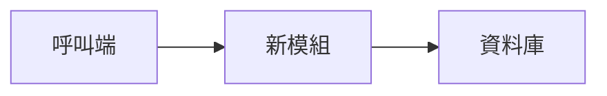

# [功能名稱]

> 填寫說明：本文件為 SA 層級設計文件，供人類讀者（開發者、架構師、新成員）閱讀。
> 說明「為什麼」，不說明技術細節的「如何做」。完成後刪除此提示。

## 背景與問題陳述

[說明現狀、問題根因，以及為什麼現在需要解決它。
具體描述痛點或機會，避免抽象的「需要改進」。]

## 範疇

**本次包含**
- …

**本次不包含**
- …（明確排除，避免讀者誤解範圍）

## 解決方案概覽

[高層次說明解法。搭配 Mermaid 圖表協助理解流程或系統邊界。

範例 Mermaid：

]

## 關鍵設計決策

[記錄每個非顯而易見的選擇與其理由。讓未來讀者理解為何不走另一條路。]

| 決策 | 選擇 | 理由 |
| --- | --- | --- |
| … | … | … |

## 風險與注意事項

1. …
2. …
