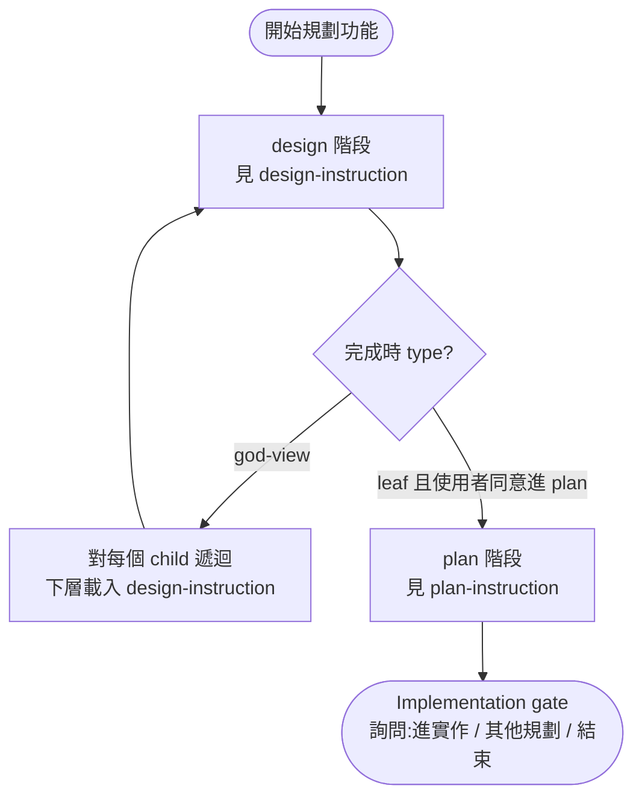

# task-decomposition

進行任何 **規劃** / **設計** / **計畫** 任務時，**必須** 嚴格遵守 [文件路徑與檔名規範](references/name-rules_zhTW.md) 裡的規範，
此規範中提及路徑與檔名同時也是 scope 拆分準則與功能結構，必須在動筆前就用此 skill 的規範判斷功能該如何切，而非寫完才套規則。
這套規範透過一致的功能結構與拆分準則，可以直接從 *目錄結構* 與 *檔案清單* 快速勾勒 repo 功能概況，可用最少的資源建立系統概觀，而非全部載入內容後再篩選資訊。

## 核心概念

- 以下提到的 `DIRS`, `DC`, `SUBNAME`, `SEQUENCE`, `draft`, `review`， 涵義見 [name-rules_zhTW.md](references/name-rules_zhTW.md)，需要理解及使用時再載入即可
- 所有文件皆放在 `docs/sys/` 底下，目錄名稱即是功能的意思，內容是該功能的細節。內容可能又是一個目錄(再細分有足夠獨立或 scope 過大的子功能)，也可能是實際的
  `design.md`、`plan.md` 與其對應的 `plan*-review*.md` peer-review 文件。
- `design.md` 文件，檔名命名格式 `<DIRS>[-DC.SUBNAME]-design[-draft].md`
    - 此文件受眾是人類，屬 SA 文件，內容為抽象的功能描述，主體為 `user story`，內容也會包含系統面需求（如冪等性、並行控制、排程、注意等）。
    - 內容無關任何程式語言與系統細節，僅描述功能的「是什麼」與「為什麼」，不涉及「怎麼做」。
    - 一個 `design.md` 內容不超過 300 行，超過則表示功能範圍過大，**必定** 可以再細分不同 scope，因此 **必須** 使用以下兩種方式拆分:
        - 使用 `DC` 拆分 `design.md`，在同個目錄拆分多份 `-DC.SUBNAME-design.md` 表示此目錄名稱的功能涵義由這些 `-DC.SUBNAME-design.md` 組裝而成。
        - 使用一個或多個子目錄將功能再向下細分，以較高的抽象層收斂設計/實作細節。
    - 此文件會有兩種層級的涵義:
        - `god-view`(上帝視角型):用於敘述整體故事或匯整多個子功能的高抽象層描述，內容會 link 子目錄(功能)或其他 `design.md`
          來組裝描述當前目錄的功能， **嚴禁** 有對應的 `plan.md`。
        - `leaf`(實作型):明確敘述夠小可實作的功能，**必須** 有一到多個對應的 `plan.md`。
- `plan.md` 文件，檔名命名格式 `<DIRS>[-DC.SUBNAME]-plan[-SUBNAME[.SEQUENCE]][-draft].md`
    - 受眾是 AI agent，屬 SD 文件，內容為具體實作計畫，**必須** 以 `SBE` 呈現規格；每組 input/output 範例同時作為實作目標與驗收標準。
    - 內容為具體的程式實作細節，涵蓋程式語言、模組劃分、函式介面與資料結構等系統細節，描述功能的「怎麼做」；不重複論述 `design.md` 的內容。
    - 一個 `plan.md` 內容不超過 500 行，超過則表示實作負擔過大，**必須** 使用 `SUBNAME` 區分主題拆分多個檔規劃所有實作內容，同個
      `SUBNAME` 下若有大量 SBE test case 再以 `.01`、`.02` 等純序列號編號。
    - 每份 `plan.md` 在 plan 六階段流程中 **必須** 有對應的 `<plan-base>-review.md`（peer-review 文件）；review 由獨立 fork agent 撰寫、主 agent 親自審查並寫下決議、再由獨立 apply fork agent 機械化套用。詳見 [plan-instruction_zhTW.md](references/plan-instruction_zhTW.md)。
- `plan*-review*.md` 文件，檔名命名格式 `<DIRS>[-DC.SUBNAME]-plan[-SUBNAME[.SEQUENCE]]-review[-draft].md`
    - 受眾是 AI agent，屬 plan 的 peer-review 產物，**只能** 附在 `plan` 系列檔名之上；本身 **嚴禁** 再帶 SUBNAME / SEQUENCE。
    - 用途為記錄對單一 `plan.md` 的審查發現、建議與主 agent 決議；行數沿用 plan 的 500 行 WARN 限制。
- `draft` 有這個後綴命名的檔案，表示為待規劃/實作的項目。主要用意是可用來記錄有那些東西已規劃但尚未開始，可避免維護額外的 list 紀錄。`-draft` 可與 `-review` 組合：`<plan-base>-review-draft.md` 表示 review 已開啟但內容尚未寫完。
- `docs/sys/list.md` 註冊表，當專案內部已劃分多個獨立 scope 的子模組時（例如 monorepo 的 submodule、microservice、subsystem、subproject 等），在此註冊各子模組的
  `docs/sys/` 路徑，就可以以專案結構層級直接分散文件至各子模組內，達成良好的解偶性與模組化，同時又能從 root 的 `list.md` 一眼看出整體功能結構。

## 使用者偏好與規則衝突調和

當使用者明確指示違反本 skill 規則時（例如「放進 X 容器」但容器目前只有一個 sub-module、字面上不滿足 god-view 條件，或「都屬同一 scope」但規則上 sub-feature 似乎應拆子目錄），按以下步驟處理：

1. **確認偏好類別**：
    - 命名 / 路徑偏好（不影響結構合規性，直接執行）
    - 結構偏好（影響 god-view / leaf / 子目錄 / 同層拆分判斷）
    - 規則邊界偏好（看似違反，實則暴露 skill 規則本身的盲點）
2. **判斷是否為 skill 盲點**：若偏好觸到本 skill 規則的不足（例如「業務領域容器」「整層共通規範」這類條件），**優先放寬規則解讀** 而非勸阻使用者；同時記錄該盲點供日後修 skill。
3. **若衝突無法調和**：明確列出規則限制與替代方案，請使用者裁定；**禁止** 自行決定。

CLAUDE.md / AGENTS.md / 使用者直接指示永遠優先於本 skill 規則；本節只是補上 skill 內部缺乏的衝突處理 flow。

## 腳本執行慣例

- 所有 reference 文件中提到的 `<SKILL_ROOT>/scripts/check.py` 都是相對於 **此 skill 的安裝路徑**，也就是 `SKILL_zhTW.md` 所在的同一個目錄。
- AI agent 執行時 **必須** 動態解析 `<SKILL_ROOT>` 為實際安裝位置，**禁止** 寫死任何特定專案的路徑（例如 `.claude/skills/task-decomposition/...`）— 此 skill 為通用型，可被放置於任何位置。
- 推導方式：`<SKILL_ROOT>` = 本 SKILL 文件所在的絕對目錄；腳本實際路徑 = `<SKILL_ROOT>/scripts/check.py`。

## 流程關係概觀

兩階段銜接方式：`design` 是面向人類的 SA 階段（拆 scope）；`plan` 是面向 AI agent 的 SD 階段（把每份 `leaf` design 轉成可執行的 SBE，再經 peer-review 與決議套用）。動筆前 **必須** 載入對應的 instruction 文件。

## 當前任務延伸閱讀指引

- 任何 **新增 / 修改 / 擴充** `design.md` 的任務，載入 [design-instruction_zhTW.md](references/design-instruction_zhTW.md)
- 任何 **新增 / 修改 / 擴充** `plan.md`（或其 peer-review 產物 `plan*-review*.md`）的任務，載入 [plan-instruction_zhTW.md](references/plan-instruction_zhTW.md)
- 想看「目錄 + 檔名 + 內容」端到端示範，載入 [example_zhTW.md](references/example_zhTW.md)（以訂單系統 `order` 為情境，涵蓋 god-view、leaf、`-draft`、`DC.SUBNAME` 同層拆分、`.metadata.md` / `list.md` 與 check.py 輸出）
