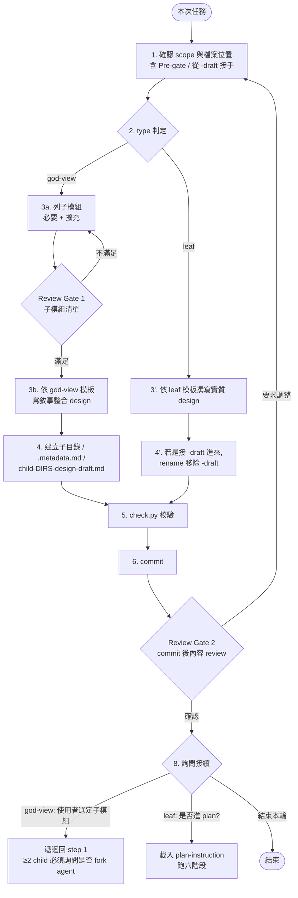
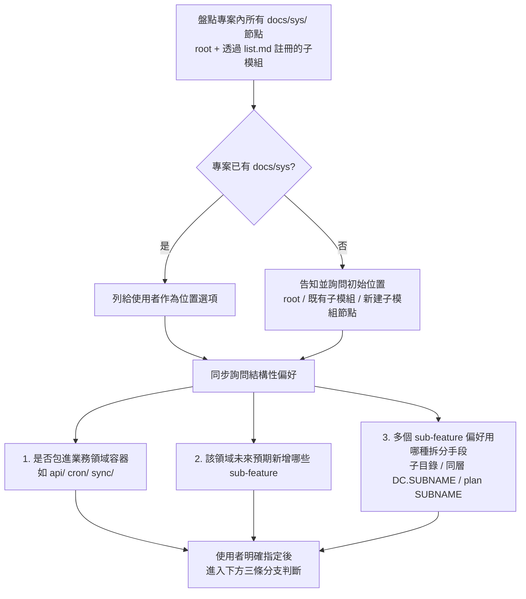
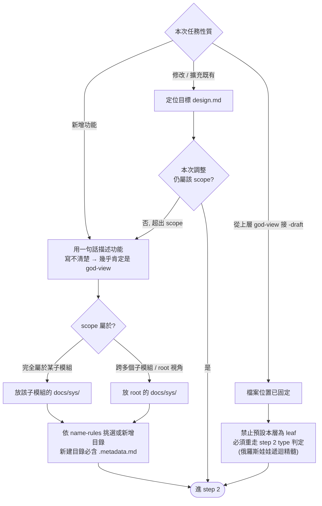
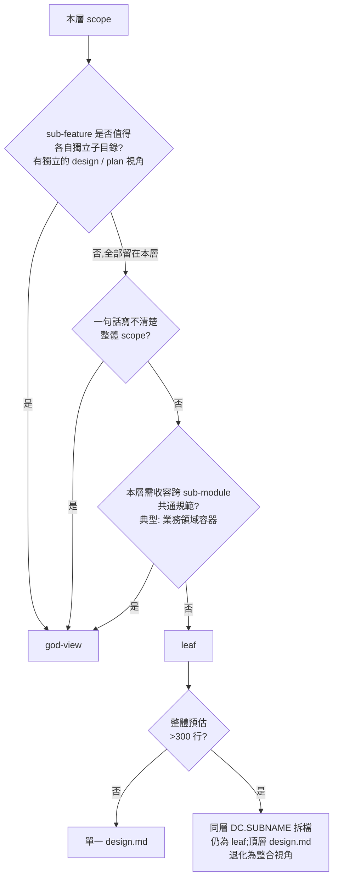
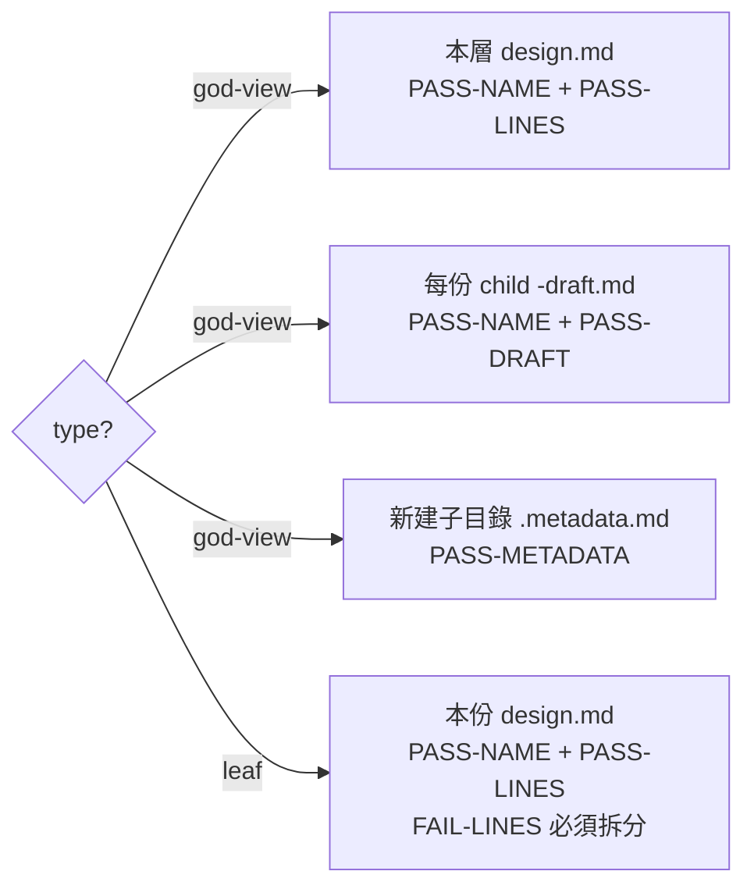
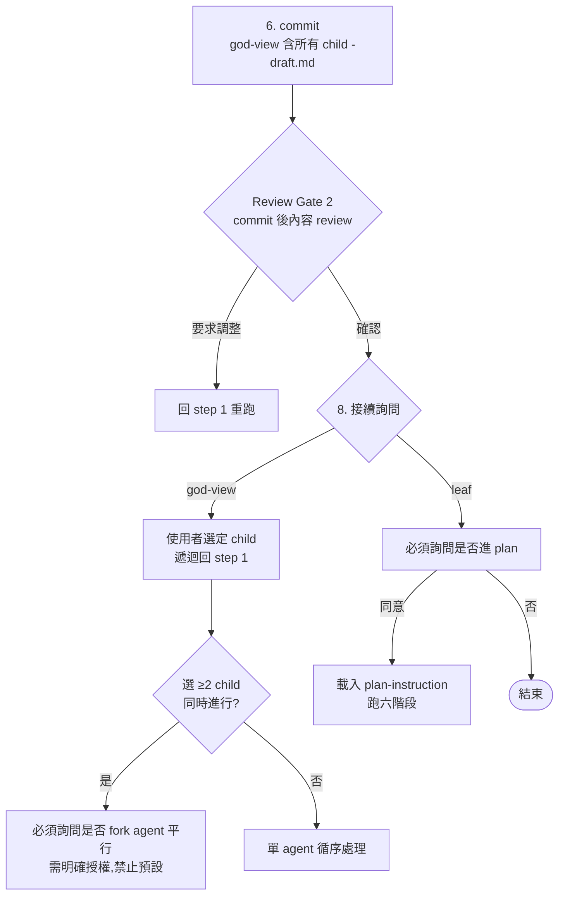

# design.md 撰寫指引

> 想先看完整端到端範例（god-view / leaf / draft / DC.SUBNAME 同層拆分），參考 [example_zhTW.md](example_zhTW.md)。

> 進入此文件代表：你準備 **新增 / 修改 / 擴充** 任一份 `design.md`。
> design 依 scope 大小分為兩種類型，互相銜接形成「俄羅斯娃娃」式的遞迴拆分：
> 1. `god-view`（上帝視角型）：scope 仍含多個獨立子模組；本層 design 描述輪廓 + 列出子模組（必要 + 擴充），為每個子模組建立 `<child-DIRS>-design-draft.md` 暫存檔；本層 design **嚴禁** 對應 plan。
> 2. `leaf`（實作型）：scope 不再需要向下拆分子目錄，本層即可撰寫實作型 design 並對應 plan（同層仍可用 `DC.SUBNAME` 拆分為多份 design / plan，此時頂層 `<DIRS>-design.md` 視具體角色決定是否對應 plan）；完成後進入 [plan-instruction_zhTW.md](plan-instruction_zhTW.md) 的六階段流程。
>
> 任何 `-draft.md` 都是下一輪的起點，遞迴往下直到所有 `leaf` 完成。每完成一層 → commit → 暫停等使用者 review → 取得同意才能進入下一層或下一階段。

## 撰寫流程總覽



每份 design 都跑這套流程；step 3 / 4 / 8 依 `god-view` / `leaf` 類型分支（圖中 G3a / G3b / G4 與 L3 / L4）。`god-view` 經過 2 次 review gate（step 3 子彈 + step 7），`leaf` 僅 1 次（step 7）。

## Step 1: 確認 scope 與檔案位置

### Pre-gate（舊專案首次引入或新增 scope 時 必跑）

若使用者未明確指定本次設計要放在哪個 `docs/sys/`，**必須** 先主動盤點並詢問，**禁止** 自行假設位置或自行建立 `docs/sys/`。



### 三條分支判斷



關鍵規範：

- **邊界判斷**：若功能主要屬於某子模組（粗估 ≥ 80% 的 user story / 系統面需求屬於該模組），即使有少量跨模組互動，仍放在該子模組的 `docs/sys/`；跨模組依賴在 design 的「前提與限制」章節說明即可。
- **業務領域容器**：當 scope 屬於某子模組，但該子模組內部已有或預期將有多個語意分明的業務領域（如「對外 API」「定時任務」「資料同步」等），**應** 建立領域分類目錄作為容器（例：`api/`、`cron/`、`sync/`），把該領域下的 sub-feature 放進去。容器目錄即使目前只承載一個 sub-feature 也 **應** 建立；該層 design 依下方 god-view 條件 (c) 成立，收容跨 sub-module 共通規範。是否使用容器在 Pre-gate 詢問階段就決定，**禁止** 事後才加層或拆層。
- 若新使用某個子模組的 `docs/sys/`，**必須** 在該子模組的 `docs/sys/` 下建立空 `list.md`（即使無下游節點），並在 root 或上層的 `list.md` 註冊該節點（規則見 [name-rules_zhTW.md](name-rules_zhTW.md)）。

## Step 2: 判斷 design 類型



**行數只決定「`leaf` 內部要單檔還是 DC.SUBNAME 拆檔」,不決定「god-view 還是 leaf」**。一份 leaf 內容超過 300 行時仍是 leaf,改用同層 `DC.SUBNAME` 拆檔即可,**不會** 因此自動變成 god-view。god-view 只保留給「sub-feature 真的值得各自獨立子目錄(各自 `docs/sys/<sub>/` 視角 + 各自 design + plan)」的情境。

- `god-view`：本層 scope 仍需向下拆分為獨立子目錄（每個子模組各自擁有自己的 `docs/sys/<sub>/` 視角，含各自 design / plan）。`god-view` 目錄內 **嚴禁** 出現任何 `plan.md` 與對應的 `plan*-review*.md`，本層僅做敘事整合。
- `leaf`：本層 scope 不需要再向下拆分子目錄，可直接於本層撰寫實作型 design 並對應 plan；若本層內容過多需要同層 `DC.SUBNAME` 拆分時，本層 `<DIRS>-design.md` 退化為 god-view 整合（**不再對應 plan**），plan 全由各 DC 拆檔（`<DIRS>-NNNN.SUBNAME-plan*.md`）各自承接，此種同層拆分不視為向下拆分。

## Step 3-4: 撰寫內容 + 處理子檔 / rename

### god-view 流程

1. 列出本層子模組，每個分入「必要」或「擴充」：
    - 必要：缺一不可、使本系統 / 模組無法成立的子模組。
    - 擴充：可選的、後續可加入、不影響核心運作的子模組。
2. **Review Gate 1（清單 review，無 artifact）**：暫停展示子模組清單給使用者檢視（**此時尚未建立任何檔案**），確認清單完整、必要 / 擴充劃分正確。不滿足回此步驟修正；滿足後進下一動作。
3. 依下方「`god-view` 模板」寫入本層 `design.md`：本層為敘事整合，**禁止** 涉及實作細節；「子模組」一節列必要 + 擴充，每項附 link 至各 `<child-DIRS>-design-draft.md`。
4. 為每個子模組建立目錄、`.metadata.md`（即使無內容，空檔也要存在）與 `<child-DIRS>-design-draft.md` 暫存檔（檔案實體建立即可，內容空白或僅含 placeholder 標題）。
    - `<child-DIRS>` **必須** 是「本層 `DIRS` + 子目錄名」以 `-` 串接的完整結果（例：本層為 `docs/sys/ecommerce/`，子目錄 `catalog/` 的 child-DIRS = `ecommerce-catalog`，檔名為 `ecommerce-catalog-design-draft.md`，**禁止** 寫成 `catalog-design-draft.md`）。
    - 若本層需要在同目錄使用 `DC` 拆分而非向下拆子目錄，每份 DC 拆檔 **必須** 同時帶 `SUBNAME`（例：`ecommerce-1000.checkout-design.md`、`ecommerce-2000.fulfillment-design.md`）；命名規則見 [name-rules_zhTW.md](name-rules_zhTW.md)，由 `check.py` 校驗。

### leaf 流程

- 依下方「`leaf` 模板」直接撰寫實質 design 內容，以 user story 為主體，描述「是什麼」與「為什麼」，**完全不涉及程式實作**。
- 若本份是從上層 `-draft.md` 接過來的，rename 移除 `-draft` 後綴。

## Step 5: 規範校驗



- 命令：`python <SKILL_ROOT>/scripts/check.py <檔案路徑>`（`<SKILL_ROOT>` 解析方式見 SKILL「腳本執行慣例」）。
- **嚴禁** 自行比對檔名 / 路徑 / 行數，合法性一律以腳本回報為準。
- 若涉及 `list.md` 或新增 `docs/sys/` 節點，**必須** 額外對相關 `docs/sys/` 目錄執行 `check.py`（`PASS-REGISTRY` / `FAIL-REGISTRY` / `FAIL-CYCLE`）。

## Step 6-8: commit / Review Gate 2 / 接續詢問



鐵則：

- Review Gate 2 **必須** 暫停作業，等使用者確認 commit 內容；**禁止** 未經同意自行進入子模組或 plan。
- god-view 共經過 2 次 review gate（step 3 子彈 + step 7），leaf 僅 1 次。
- `leaf` design **必有** 對應 `plan.md`，缺失即代表功能未實現；`god-view` design **不對應** plan 與 review（詳見 SKILL 強相依關係）。

## 拆分手段決策

`design` / `plan` 共有三層拆分手段，常被混用。判斷的關鍵問題：**「同一份 design 是否能完整描述所有 sub-feature 的 user story 與驗收條件？」**

| 情境 | 拆分手段 | 結果結構 |
|---|---|---|
| 各 sub-feature 有獨立 user story / 系統面需求，需單獨開 design 描述 | 子目錄 | 各自一個目錄 + 自己的 `design.md` + 自己的 `plan.md` |
| 同一 scope，但 design 內容過大、無法在 300 行內講完 | 同層 `DC.SUBNAME` design | 同目錄多份 `design.md`；原本的 `<DIRS>-design.md` 退化為 god-view 整合 |
| 同一 design scope（共用 user story 與驗收條件），僅實作時機或實作面向不同 | `plan` `SUBNAME` | 所有 sub-feature 共用一份 `design.md`；多份 `<DIRS>-plan-SUBNAME.md`（未完成的面向以 `-draft` 暫存） |

簡述邏輯：

- 「user story 切得開、值得各自 design」→ 切子目錄。
- 「story 切不開，但 design 超過 300 行」→ 同層 `DC.SUBNAME` design。
- 「story 切不開、design 裝得下，sub-feature 只差在實作時機或面向」→ `plan` `SUBNAME`。

## 常見使用者意圖映射

當使用者給結構性偏好指令時，**必須** 翻譯成下表的結構行為（不要照字面執行卻忽略結構意涵）：

| 使用者用語 | 結構落實 |
|---|---|
| 「放進 X 底下」「屬於 X 領域」 | 建立業務領域容器 `X/`；該層至少寫一份 `god-view` design 收容跨 sub-module 共通規範（god-view 條件 (c)）。 |
| 「都是同一個 scope，不要切太多目錄」 | 用 `plan` `SUBNAME` 拆，**不切** 子目錄；同一份 `design.md` 涵蓋全部 sub-feature。 |
| 「先實作 A，未來再做 B / C」 | 同一份 `design.md` 涵蓋 A / B / C；用 `plan` `SUBNAME` 分多份；B / C 以 `-draft` 暫存。 |
| 「結構簡潔、不要過度設計」 | 不建容器；scope 扁平放在子模組 `docs/sys/` 下。 |
| 「未來會加入很多 X」 | 即使目前只規劃一個，仍建容器目錄；在 god-view 的 Optional 區先列出預期 sub-feature 名稱。 |
| 「把 sub-feature 升級到新容器」「事後包進容器」 | 將既有檔案搬進新容器目錄、依新 DIRS 改檔名、重跑 `check.py`；**禁止** 留下半空殼的舊位置。 |

當使用者用語不在表中但聽起來像結構性偏好時，視為結構性偏好處理，**回到 Pre-gate 重問** 後才動筆。

## 必含要素

依類型不同，必含要素分為兩組：

### `god-view` design

- 功能目的：本層 scope 的整體目的（why）。
- User Story：本層 scope 整體層級的使用情境（可較抽象，因細節由子模組各自承接）。
- 系統面需求：本層 scope 整體層級的系統需求（如冪等、並行、排程等跨模組要求）。
- 子模組：列必要 + 擴充模組，每項一句話說明職責，並附 link 至各 `<child-DIRS>-design-draft.md`。

### `leaf` design

- 功能目的：用一段話闡述為何要做這個功能（why）。
- User Story：以「身為 X，我希望 Y，以便 Z」格式條列使用情境（user-facing what）。
- 系統面需求：條列系統層級必須保證的行為（排程、冪等性、並行控制、一致性、失敗復原、效能、稽核、權限等）。描述「需要什麼」，不描述「怎麼做」。若無相關需求寫「無」。
- 驗收條件：人類可讀的「達成何種狀態即視為完成」（done definition）。
- 前提與限制：明確列出設計的依賴條件與邊界假設。

## 文件模板

依類型挑對應模板填寫，章節標題與順序 **嚴禁** 變更，以保持所有 design 文件格式一致。

### `god-view` design 模板

````markdown
# <DIRS>[-DC.SUBNAME] design (god-view)

## 功能目的

<本層 scope 的整體目的，一段話。>

## User Story

- 身為 <角色>，我希望 <整體目標>，以便 <整體效益>。
- 身為 <角色>，我希望 <整體目標>，以便 <整體效益>。

## 系統面需求

- <類別>：<本層整體要求>
- <類別>：<本層整體要求>

## 子模組

### 必要

- [<子模組名>](<相對路徑/<child-DIRS>-design-draft.md>) — <一句話說明該模組職責>
- [<子模組名>](<相對路徑/<child-DIRS>-design-draft.md>) — <一句話說明該模組職責>

### 擴充

- [<子模組名>](<相對路徑/<child-DIRS>-design-draft.md>) — <一句話說明該模組職責>
- [<子模組名>](<相對路徑/<child-DIRS>-design-draft.md>) — <一句話說明該模組職責>
````

### `leaf` design 模板

````markdown
# <DIRS>[-DC.SUBNAME] design

## 功能目的

<一段話說明此功能解決什麼問題、為何要做。>

## User Story

- 身為 <角色>，我希望 <行為>，以便 <效益>。
- 身為 <角色>，我希望 <行為>，以便 <效益>。

## 系統面需求

- <類別>：<具體要求>
- <類別>：<具體要求>

## 驗收條件

- <可被人類驗證的完成狀態 1>
- <可被人類驗證的完成狀態 2>

## 前提與限制

- <依賴條件、邊界假設或不在 scope 內的事項>
````

## 禁止內容（屬 `plan.md` 範疇）

- 程式語言、framework、套件、函式、介面名稱。
- 資料結構、API 路徑、資料庫 query 語法。
- 具體 input / output 範例（屬於 SBE，寫在 `plan.md`）。
- 達成「系統面需求」的具體實作技術（如以資料庫 unique index 實作冪等、以 scheduler 實作排程、以 distributed lock 防 race 等）。系統面需求只描述要求本身，實作方式寫在 `plan.md`。

## FAIL-LINES 觸發拆分（反應式）

> 僅當 `check.py` 回報 `FAIL-LINES` 時觸發。動筆前依使用者意圖選拆分手段請見上方「拆分手段決策」。

當 `check.py` 回報 `FAIL-LINES` 時 **必須** 拆分（`leaf` 才會觸發；`god-view` 因僅敘事整合通常不會超標）。拆分順序：

1. 首選：向下拆子目錄 — 若功能可清楚劃分為多個獨立 sub-domain（此時本層通常會轉為 `god-view`）。
2. 次選：同層 `DC.SUBNAME` 拆檔 — 若 sub-domain 不易劃分但內容仍可分組，使用 `DC.SUBNAME` 編碼（每份 DC 拆檔必須附帶 SUBNAME），規則見 [name-rules_zhTW.md](name-rules_zhTW.md)。

## 完成檢查

- [ ] `check.py` 回報 `PASS-NAME` + `PASS-LINES`（`leaf`）或 `PASS-NAME` + `PASS-LINES` + 所有 child `PASS-DRAFT`（`god-view`）
- [ ] 全文無任何程式實作細節
- [ ] `god-view`：所有列出的子模組都已建立目錄、`.metadata.md` 與 `<child-DIRS>-design-draft.md`
- [ ] `god-view`：本目錄內無任何 `plan.md` 或 `plan*-review*.md`（god-view 嚴禁對應 plan 與 review）
- [ ] `leaf`：已主動詢問使用者是否接續進入 plan 規劃（對應 `plan.md` 進入 [plan-instruction_zhTW.md](plan-instruction_zhTW.md) 後處理，不在本份 design 完成檢查範圍內）
- [ ] 若是從 `*-draft.md` 接過來，已 rename 移除 `-draft` 後綴
