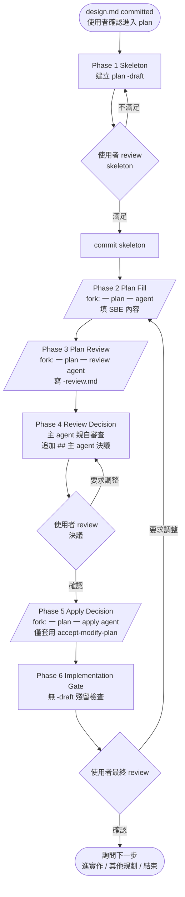
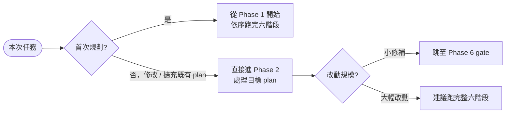
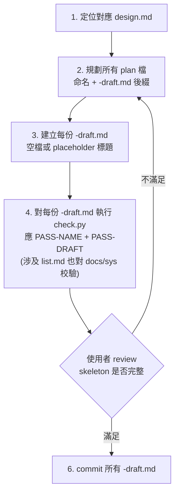
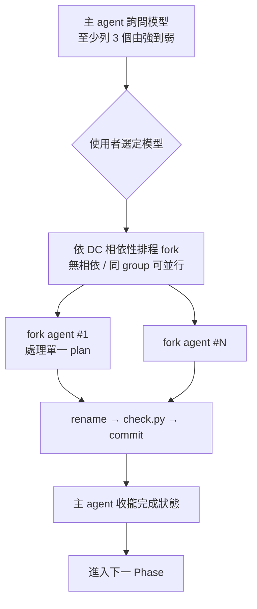
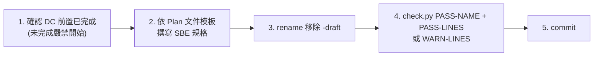
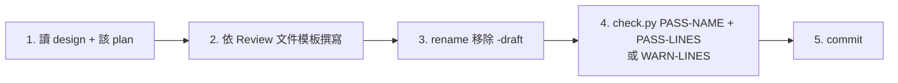
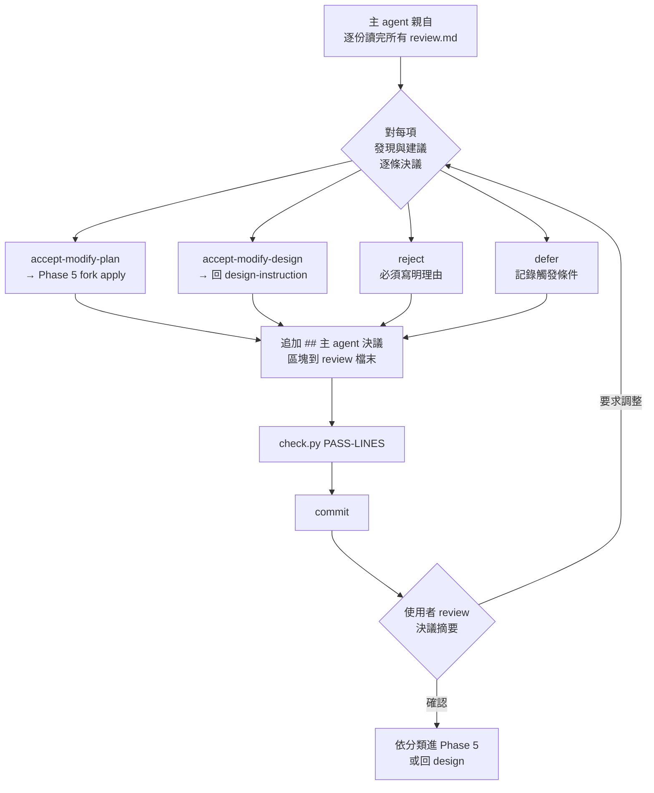
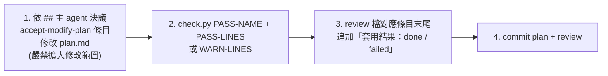
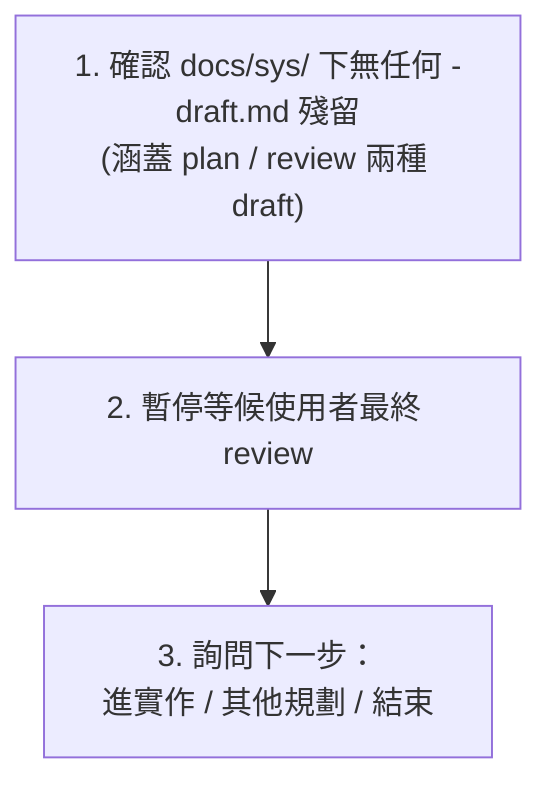

# plan.md 撰寫指引

> 想先看完整端到端範例（含 plan 模板、SBE 寫法、`.SEQUENCE` 拆分），參考 [example_zhTW.md](example_zhTW.md)。

> 進入此文件代表：你準備 **新增 / 修改 / 擴充** 任一份 `plan.md`。
> 對應的 `design.md` 必須先存在且為 `leaf`（`god-view` 目錄 **嚴禁** 出現任何 `plan.md` 與對應的 `plan*-review*.md`）；若尚未存在或需要同步調整，回到 [design-instruction_zhTW.md](design-instruction_zhTW.md)。

## 六階段總覽



圖中 `[/.../]` 為 fork 並行階段（強制詢問模型、一 plan 一 agent），矩形為 sequential，菱形為使用者 review gate。

**鐵則**：

- **禁止** 跳過 Phase 1 直接寫 SBE — 會失去 skeleton review 與 DC 並行排程能力。
- **禁止** 跳過 Phase 3 / 4 直接進實作；**禁止** 由 fork agent 評斷自己寫的 plan；**禁止** 在使用者未確認決議前進 Phase 5。

## 進入點選擇



## Phase 1: Skeleton（規劃 plan 結構，sequential）

進入條件：對應 `design.md` 已 commit、使用者確認進入 plan 階段，且該 design 為 `leaf`。



規範：

- `leaf` design 必有對應 `plan.md`，且 `plan.md` 必須與 `design.md` 同一個 `docs/sys/`；缺失即代表功能未實現。
- 命名遵循 [name-rules_zhTW.md](name-rules_zhTW.md)：`<DIRS>[-DC.SUBNAME]-plan[-SUBNAME[.SEQUENCE]]-draft.md`。
- 步驟 3 **禁止** 撰寫 SBE 規格等實際內容（這階段只建骨架）。
- 步驟 4 **嚴禁** AI 自行比對檔名 / 路徑，合法性一律以 `check.py` 回報為準。`<SKILL_ROOT>` 解析方式見 SKILL「腳本執行慣例」。

## Phase 2 / 3 / 5 通用 fork 模式

Phase 2（Plan Fill）、Phase 3（Plan Review）、Phase 5（Apply Decision）共用同一套 fork 流程骨幹，差別只在「context 最小集」與「單一任務步驟」。



各 Phase 共通鐵則：

- **強制 fork**：一個 plan 對應一個獨立 fork agent；不論 plan 之間是否有 DC 關聯都適用。
- **DC 相依性 必須遵守**：主 agent 依 DC 編碼排程 — 高權重位數依賴低權重位數，前置未完成不得 fork 依賴者。
- **模型必須詢問**：啟動 fork 前主 agent **必須** 詢問使用者「該階段 fork agent 使用哪個模型」並 **至少** 列 3 個由強到弱選項供選擇（最強 / 平衡 / 最快，以執行環境當下可用清單為準，例如 Opus 4.7 / Sonnet 4.6 / Haiku 4.5）；使用者未明確選定前 **嚴禁** 啟動 fork。
- **Context 純淨**：fork agent 取得的 context **必須** 僅含該 Phase 規定的最小集；**嚴禁** 夾帶其他 plan、其他子模組、或與本 plan 無關的專案規範。
- **逐份 review 集中於 Phase 4**：Phase 2 / 3 / 5 內 **不需** 逐份暫停 review，避免打斷並行流程。
- **主 agent 責任**：詢問模型 → 排程 fork → 收攏狀態 → 觸發下一 Phase；**禁止** 沉默等待或讓流程自然停止。

## Phase 2: Plan Content Fill

進入條件：Phase 1 skeleton 已 commit。

context 最小集（每個 fork agent）：

1. 對應 `design.md` 內容（或檔案路徑）。
2. 該 plan 的 `-draft.md` 檔案路徑。
3. 下方單一任務步驟的執行規則。

單一 `-draft.md` 填充任務步驟：



模型選項示例：Opus 4.7（SBE 複雜、實作面向多）/ Sonnet 4.6（一般複雜度）/ Haiku 4.5（SBE 單純或重複）。

**結束判定**：所有 plan `-draft.md` 都已 rename，全部 plan `check.py` 通過。

## Phase 3: Plan Review

進入條件：Phase 2 結束。

額外 skeleton 動作（sequential）：主 agent 為每份 `<plan-base>.md` 建立 `<plan-base>-review-draft.md` 空檔，對每份執行 `check.py` 應 `PASS-NAME` + `PASS-DRAFT`。命名規則見 [name-rules_zhTW.md](name-rules_zhTW.md) 的 `review.md` 章節（review **嚴禁** 自帶 SUBNAME / SEQUENCE）。

context 最小集（每個 review fork agent）：

1. 對應 `design.md` 內容（或檔案路徑）。
2. 對應 `<plan-base>.md` 內容（或檔案路徑）。
3. `<plan-base>-review-draft.md` 檔案路徑。
4. 下方單一任務步驟的執行規則。

額外鐵則：**嚴禁** 由「曾經填寫該 plan 的 fork agent」回頭 review 自己寫的 plan；review fork agent **必須** 與該 plan 的 fill agent 為不同實例，避免自我盲點。

單一 review 任務步驟：



模型選項示例：Opus 4.7（深挖 SBE 邏輯漏洞、覆蓋率不足、潛在競態）/ Sonnet 4.6（一般複雜度）/ Haiku 4.5（plan 結構單純）。

**結束判定**：所有 `*-review-draft.md` 都已 rename，全部 review `check.py` 通過。

## Phase 4: Review Decision（主 agent 親自審查 + 使用者確認）

進入條件：Phase 3 結束。



鐵則：

- 主 agent **必須親自** 逐份讀完所有 `<plan-base>-review.md`；**嚴禁** fork 子 agent 代為決議，否則跨 plan 的全域視角會丟失。
- 每份 review 中的 **每一項** 「發現與建議」都 **必須** 對應一筆 `## 主 agent 決議` 條目。
- Review Gate 暫停時，**必須** 把每份 plan 的決議摘要（四類計數 + 重點）呈現給使用者；使用者未確認前 **嚴禁** 進 Phase 5。

### 決議分類

- `accept-modify-plan`：接受建議，修改對應 plan 內容；Phase 5 fork apply agent 套用。
- `accept-modify-design`：接受建議，但需上層 `design.md` 同步調整；**必須** 暫停本流程並告知使用者，回 [design-instruction_zhTW.md](design-instruction_zhTW.md) 處理。design 改完後，受影響的 plan 通常需要重跑 Phase 2-4。
- `reject`：不接受建議；**必須** 寫明理由。
- `defer`：接受但延後處理；記錄理由與後續觸發條件，本輪 Phase 5 不處理。

### 主 agent 決議模板（追加於 review 檔末尾）

````markdown
## 主 agent 決議

### 1. <對應「發現與建議」的編號>

- 決議：<accept-modify-plan / accept-modify-design / reject / defer>
- 理由：<為何如此決議，可引用 design / 既有規範或實作面權衡>
- 套用動作：<accept-modify-plan 時填具體要改什麼，後續 Phase 5 fork agent 直接依此執行；其他類型可省略>

### 2. <對應「發現與建議」的編號>

- 決議：...
- 理由：...
- 套用動作：...
````

## Phase 5: Apply Decision

進入條件：Phase 4 決議已 commit、且經使用者確認。

適用範圍：

- **僅** 針對 `accept-modify-plan` 項目；`reject` / `defer` 跳過；`accept-modify-design` 由主 agent 另行回 [design-instruction_zhTW.md](design-instruction_zhTW.md) 處理（本 Phase 不涵蓋）。
- 某份 plan 的所有決議皆非 `accept-modify-plan` 時，該 plan 在 Phase 5 不需 fork apply agent。

context 最小集（每個 apply fork agent）：

1. 對應 `design.md` 內容（或檔案路徑）。
2. 對應 `<plan-base>.md` 內容（或檔案路徑）。
3. 對應 `<plan-base>-review.md` 內容（或檔案路徑）；其中 `## 主 agent 決議` 區塊是 **唯一** 套用指示來源。
4. 下方單一任務步驟的執行規則。

單一 apply 任務步驟：



**結束判定**：所有 `accept-modify-plan` 決議都已套用，相關 plan 與 review `check.py` 通過，無未處理決議殘留。

## Phase 6: Implementation Gate

進入條件：Phase 5 結束。



殘留檢查指令（依執行環境擇一）：

- POSIX (bash / zsh)：`find <docs/sys 路徑> -name "*-draft.md"`
- Windows PowerShell：`Get-ChildItem -Path <docs/sys 路徑> -Filter "*-draft.md" -Recurse`
- 跨平台：`python -c "import pathlib; [print(p) for p in pathlib.Path('<docs/sys 路徑>').rglob('*-draft.md')]"`

鐵則：**禁止** 未經同意自行進入實作。若使用者同意進入實作，執行者 **必須** 以 TDD 方式撰寫實作（先寫失敗測試，再以最小實作通過，最後 refactor），**禁止** 跳過 red 階段；詳見下方「實作階段紀律」章節。

## 必含要素

- 實作邊界：列出涉及的 package / module / 檔案路徑。**實作落地（commit 後）**，本節每一條路徑 **必須** 改寫為可解析的 markdown link 指向實際檔案或目錄。link 的存在與有效性即視為「該 plan 項目已實作」的單一憑據 — link 缺失或失效，代表該項尚未實作或實作與 plan 偏移。詳見下方「實作邊界作為實作索引」。
- 介面定義：要新增或修改的 function / type / interface 簽章。
- 系統面需求對應實作：對應 `design.md` 中「系統面需求」的每一項，列出本次採用的實作技術（如以資料庫 unique index 實作冪等、以 scheduler 實作排程、以 distributed lock 防 race 等）。design 為「需要什麼」，plan 為「怎麼做」。
- SBE 規格：每個行為以「Input → Output」格式呈現，範例必須具體可執行。
- 外部依賴：所需的其他 package、外部服務、前置 plan。

## 文件模板

### Plan 文件模板（Phase 2 撰寫）

````markdown
# <DIRS>[-DC.SUBNAME] plan[-SUBNAME[.SEQUENCE]]

> 對應 design：[<DIRS>[-DC.SUBNAME]-design.md](<相對路徑>)

## 實作邊界

- package / module：<路徑>
- 涉及檔案：<檔案路徑列表>

## 介面定義

<列出新增 / 修改的 function、type、interface 簽章。>

## 系統面需求對應

- <design 系統面需求類別>：<本次採用的實作技術>
- <design 系統面需求類別>：<本次採用的實作技術>

## SBE 規格

### 1. <行為描述>

- Input：<具體可執行的值>
- Output：<具體回傳值與副作用>

### 2. <行為描述>

- Input：...
- Output：...

## 外部依賴

- <依賴的 package / 外部服務 / 前置 plan>
````

章節標題與順序 **嚴禁** 變更，以保持所有 plan 文件格式一致。

### Review 文件模板（Phase 3 撰寫；Phase 4 由主 agent 追加決議區塊）

````markdown
# <DIRS>[-DC.SUBNAME] plan[-SUBNAME[.SEQUENCE]] review

> 對應 plan：[<plan 檔名>](<plan 檔名>)
> 對應 design：[<DIRS>[-DC.SUBNAME]-design.md](<相對路徑>)

## 審查摘要

<一段話總結 plan 整體品質與本次 review 重點，例如 SBE 覆蓋率、邊界 case 充分性、與 design 一致性、是否有實作技術疑慮等。>

## 發現與建議

### 1. <主題：發現的性質 / 段落>

- 觀察：<具體描述觀察到的問題、可優化點、或潛在風險>
- 建議：<具體可執行的改善方向（如：補某邊界 SBE、修錯誤的 input 範例、釐清不明確的介面定義）>
- 影響範圍：<僅本 plan / 也需動到 design / 跨多個 plan（需上層 design 處理）>

### 2. <下一項主題>

- 觀察：...
- 建議：...
- 影響範圍：...

<!-- Phase 4 由主 agent 追加 ## 主 agent 決議 區塊；Phase 5 由 apply agent 追加每項的「套用結果」。 -->
````

## 禁止內容（屬 `design.md` 範疇）

- 重複論述「為什麼要做這個功能」 — 直接引用 `design.md`。
- 抽象的 user story — 應已在對應 `design.md` 中定義。

## SBE 撰寫要點

每組 SBE **必須** 滿足：

1. 具體輸入：給可貼上即可執行的值（如 `userID = "u-12345"`），不寫抽象描述（如 `合法的 userID`）。
2. 具體輸出：明確列出回傳值與副作用（如 `回傳成功；目標儲存層新增一筆紀錄`）。
3. 覆蓋邊界：除 happy path 外，至少包含一組失敗或邊界 case。

## 實作階段紀律

Phase 3 Implementation Gate 結束且使用者同意進入實作後，執行者（主 agent 或 fork agents）**必須** 以 TDD 紀律執行：

1. **Red**：先針對下一個未實作的 SBE 寫一支會失敗的測試，**必須** 親眼確認測試確實失敗（且失敗訊息符合預期，例如「function 不存在」「回傳值不符」），才可進入 Green。
2. **Green**：以「能讓該測試通過」的最小實作完成功能；**禁止** 一次寫超過該測試需要的 code，**禁止** 為了「順手」加未被任何紅燈測試覆蓋的分支或欄位。
3. **Refactor**：在所有測試保持綠燈的前提下整理結構、命名、重複；refactor 過程中 **禁止** 改變任何 SBE 行為。
4. 一輪完成後回到 Red，覆蓋下一條 SBE，直到 plan 內所有 SBE 都有對應的「先寫」測試與通過實作。

`plan.md` 內的 SBE 規格已提供 input / output 範例，可直接成為第一輪 red 測試。**嚴禁** 「實作優先、事後補測」 — 那種模式產生的 test 跟著實作的偶然形狀走，而非規格本意，違反 TDD 的核心精神（測試先行才能逼出規格與實作的偏移）。

當 fork agents 並行做 Phase 2 / 實作，每個 fork agent **必須** 在自己的範圍內獨立踩 TDD；主 agent 整合時 **必須** 驗證 plan 的每組 SBE 都有對應 test，且 test 是「先寫的」（紅 → 綠軌跡），而非實作後補的。

**補救路徑**：若實作已經（部分或完全）落地而未踩 TDD（既有 code 或為趕速度的 shortcut），執行者 **必須** 先跑補救審查（remediation audit）才能視為實作完成：以 TDD 紅綠燈視角開審查員 agent，列出 SBE / 分支 / 邊界 gap，逐條以「失敗測試先行」方式補齊。Audit + 補測是可挽救的路徑，**不是** 略過 TDD 的免費通行證。

## 實作邊界作為實作索引

實作邊界（Implementation Boundary）章節同時擔任 **plan 項目對應實際 code 的單一索引**。規則：

- **Phase 1 / Phase 2（撰寫規格 / SBE 階段）**：路徑以 inline code 列出（如 `` `pkg/foo/bar.go` ``），不期望 link，因為實際 code 可能尚未存在。
- **實作落地後（post-merge）**：每條路徑 **必須** 改寫為可解析的 markdown link 指向實際檔案或目錄。若路徑指向特定方法，link 指到所在檔案，於文字描述中標示方法名稱；**不依賴** 平台特定的行號錨點（如 `#L42`）— 行號隨 code 變動會失效。

**為何重要**：閱讀 plan 的人能透過直接點 link 確認「這項是否已實作」。link 失效立刻浮現偏移狀況 — 無需額外的追蹤表或狀態欄位。Plan **本身** 即是實作索引。

**作業規則**：實作真正落 commit 後，作者 **必須** 跑一次回填，將路徑改為 markdown link，並以獨立的 `docs:` commit 提交（與實作 commit 分開）。此回填屬於完成 plan 的必要步驟，**非** 可選的修飾。

## 拆分判斷

當 `check.py` 回報 `WARN-LINES` 時建議拆分（非強制；視主題是否能合理切割）。拆分順序：

1. 首選：以 `SUBNAME` 區分主題 — 例如以 func name 命名（須轉為 snake_case），`<DIRS>-plan-<func_name>.md`；SUBNAME 僅允許 `[a-z0-9_]`，camelCase / kebab-case 皆違規。
2. 次選：同 `SUBNAME` 下再用序列號 — 當單一 `SUBNAME` 內仍有大量 SBE test case，以 `.01`、`.02` 等分檔（SEQUENCE 用 `.NN` 不是 `-NN`）。

## 完成檢查

### Phase 2 每份 plan 內容完成檢查

- [ ] 對應 `design.md` 存在
- [ ] 每個行為都有具體 input / output 範例
- [ ] design 中每一項「系統面需求」都有對應的實作技術說明
- [ ] 不含「為什麼要做」的抽象論述
- [ ] 已 rename 移除 `-draft` 後綴
- [ ] `check.py` 回報 `PASS-NAME` + `PASS-LINES`，或 `WARN-LINES` 但已合理拆分
- [ ] 若 `design.md` 同步需調整（fill 過程發現），已完成同步

### Phase 3 每份 review 內容完成檢查

- [ ] 對應 `plan.md` 與 `design.md` 都已仔細閱讀
- [ ] 每項「發現與建議」都含「觀察」「建議」「影響範圍」三欄
- [ ] **未** 觸及其他 plan 或跨 plan 比較（跨 plan 議題請寫在影響範圍欄並交由主 agent 處理）
- [ ] 已 rename 移除 `-review-draft.md` 的 `-draft` 後綴
- [ ] `check.py` 回報 `PASS-NAME` + `PASS-LINES`（或 `WARN-LINES` 但已合理切割）

### Phase 4 每份 review 決議完成檢查（主 agent）

- [ ] 對 review 中每一項「發現與建議」都已寫下對應的 `## 主 agent 決議` 條目
- [ ] 每筆決議皆為四類之一（accept-modify-plan / accept-modify-design / reject / defer）並含理由
- [ ] `accept-modify-plan` 的「套用動作」已具體到可被 fork agent 機械化執行
- [ ] 決議摘要已提交給使用者確認

### Phase 5 每份 plan 套用完成檢查

- [ ] 僅依 `## 主 agent 決議` 中 `accept-modify-plan` 條目修改 plan
- [ ] review 檔對應條目末尾已追加「套用結果」
- [ ] 修改後 plan 的 `check.py` 重跑通過
- [ ] 若同步觸發 design 調整，已標記為 `accept-modify-design` 並回 design-instruction

### Phase 6 實作 gate + 落地後檢查

- [ ] 實作階段已嚴格依 TDD 紅綠燈紀律執行：每組 SBE 都有先寫的失敗測試 → 最小實作通過 → refactor；無「實作優先、事後補測」（或若未踩 TDD，已完成補救審查 + 失敗測試先行回填，才視為實作完成）
- [ ] 對應實作落 commit 之後，「實作邊界」每一條路徑已回填為可解析的 markdown link（獨立 `docs:` commit）
