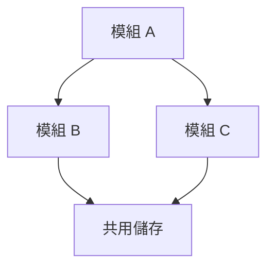
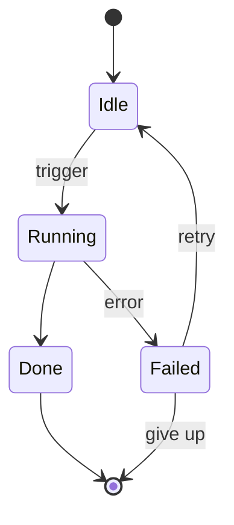
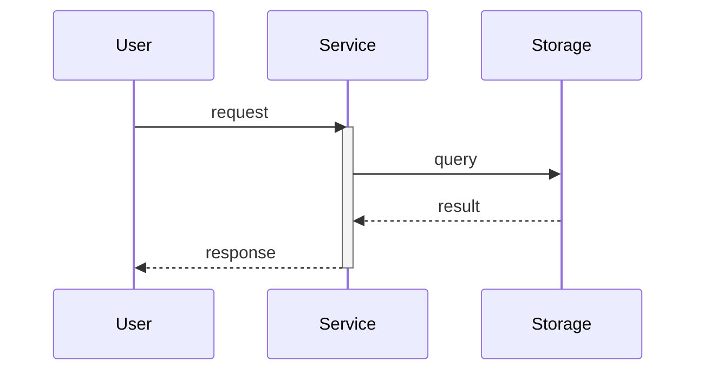

# visual.md Authoring Guide

> Entering this document means: the upper-level design flow has decided to build a visualization supplement (`-design-visual.md`) for some `design.md`. **NEVER** load this reference unless that decision is already made — most small features do not need a visual; a one-paragraph design with a single user story is fine on its own.
>
> visual is the **third document type** in this skill, alongside `design.md` (SA, text only) and `plan.md` (SD, SBE). It is human-facing like design, but its job is purely visualization: mermaid diagrams + brief textual notes. **MUST NOT** duplicate design's narrative; **MUST NOT** leak plan's implementation detail.

## Filename Recap

- Format: `<DIRS>[-DC.SUBNAME]-design-visual[-draft].md` (full rule in [name-rules.md](name-rules.md)).
- One `design.md` corresponds to **at most one** visual; **no SUBNAME / SEQUENCE** is allowed — all diagrams live in a single file.
- visual **MUST** correspond to an existing or simultaneously created `<DIRS>[-DC.SUBNAME]-design.md`; orphan visual files are **STRICTLY FORBIDDEN**.
- Both `leaf` and `god-view` designs are eligible. **god-view design is strongly encouraged** to ship a visual, because structural visualization (module dependency, integrated data flow) is exactly what a god-view layer needs.

## When to Build a View (Trigger Conditions)

Build a visual when **any** of the following applies. If none applies, **MUST NOT** build a visual — text alone is enough.

1. **Module dependency**: non-trivial dependency chain between packages / modules / components, where text alone would obscure the structure.
2. **Cross-component sequence**: ≥3 components / services involved in a request-response or event timing flow.
3. **Process branching**: a processing flow with explicit conditional branches that prose cannot describe cleanly.
4. **State machine / lifecycle**: an entity (order, session, job, connection, etc.) transitions between multiple states, with entry / exit / self-loop / exceptional paths.
5. **Data flow pipeline**: a pipeline where direction and edge labels both carry meaning.
6. **Entity-relationship model**: ≥3 entities connected via foreign keys or aggregation.

For a god-view design, **strongly recommended** to at least render "module dependency" and "integrated data flow".

## Mermaid Diagram Type Selection

Pick the right diagram type; one diagram should convey one concept. Combine multiple types only when each adds independent insight; **STRICTLY FORBIDDEN** to stack diagrams just to look thorough.

| Situation | Diagram type | When to use |
|---|---|---|
| Module dependency, call hierarchy | `flowchart TD` | Package / module dependency chain is not obvious |
| Cross-service sequence interaction | `sequenceDiagram` | ≥3 components in a timing interaction |
| **State machine / lifecycle** | `stateDiagram-v2` | Entity transitions across branching states; covers entry / exit / self-loop / exception paths |
| Database schema, entity relationships | `erDiagram` | Data model with multiple foreign-key relationships |
| Processing pipeline | `flowchart LR` | Linear processing flow where direction and labels both matter |
| Decision logic, branching flow | `flowchart TD` | Conditional branches that prose cannot describe cleanly |

## Required Output Spec

The following rules are **MUST** items, validated by reviewer and by self-check:

- **MUST** include `## 快速導覽` near the top, using markdown links pointing at every `##` section (one section per diagram or topic).
- Every top-level section **MUST** end with `[返回開頭](#快速導覽)`.
- Between any two top-level sections **MUST** insert a standalone `---` horizontal separator (placed after the back-to-top link, before the next heading).
- Every mermaid diagram **MUST** be followed by brief textual notes covering the diagram's focus / boundary / caveats. **STRICTLY FORBIDDEN** to merely repeat design's narrative; **STRICTLY FORBIDDEN** to draw decorative diagrams unrelated to the feature.
- Node labels use 繁體中文; identifiers stay in English. Complex systems split into multiple diagrams; each diagram focuses on one concept.

### Mermaid Authoring Notes (Internalized — Do Not Cross-Link to Other Skills)

- Diamond `{}` nodes **STRICTLY FORBIDDEN** to contain bare parentheses inside; parser will interpret `()` as rounded-rectangle tokens. Wrap the entire label in double quotes (e.g. `T1{"是否實作 X？"}`) or use `&#40;` / `&#41;` HTML entities.
- Box `[]` nodes containing double quotes: use `&quot;` instead of `\"`.
- Box `[]` nodes containing `{` / `}`: use `&#123;` / `&#125;`.
- When using `style` to colorize a node, **MUST** specify both `fill` (background) and `color` (text) so it remains readable in light / dark mode. Use same-color-family pairing (light fill + dark text).
- Direct dependency: solid `-->`. Optional / indirect: dashed `-.->`.
- Keep diagram depth within 3-4 levels for readability. Use `subgraph` to group when nodes ≥6.
- sequenceDiagram: use `activate` / `deactivate` and `note` to highlight key behaviors.

## Forbidden Content

- **STRICTLY FORBIDDEN** to include `## User Story` / `## System Requirements` / `## Acceptance Criteria` / `## Premises and Constraints` — these belong to `design.md`. visual is a visualization supplement, not a parallel SA document.
- **STRICTLY FORBIDDEN** to include programming language, framework, function signature, API path, data structure, SBE input/output examples — these belong to `plan.md`. If the user wants to see implementation flow, they should read the plan, not the visual.
- **STRICTLY FORBIDDEN** for visual to exist without a corresponding `<DIRS>[-DC.SUBNAME]-design.md` (prefix must match exactly).

## Document Template

Section titles and ordering of structural anchors (`## 快速導覽`, back-to-top link, `---` separator) **MUST NOT** be changed. The diagram sections themselves are picked case-by-case from the trigger conditions; the template below shows a typical mix (module dependency + state machine + sequence).

````markdown
# <DIRS>[-DC.SUBNAME] design visual

## 快速導覽

- [模組相依](#模組相依)
- [狀態機](#狀態機)
- [主要流程](#主要流程)

## 模組相依



<簡短說明：此圖呈現什麼、邊界 / 注意事項。>

[返回開頭](#快速導覽)

---

## 狀態機



<簡短說明：狀態定義、進入 / 終止條件、自迴圈、retry 與例外路徑。>

[返回開頭](#快速導覽)

---

## 主要流程



<簡短說明：時序、活躍區段、可選 vs 必經路徑。>

[返回開頭](#快速導覽)
````

## Completion Checklist

- [ ] `check.py` reports `[PASS-NAME]` + `[PASS-METADATA]` + `[PASS-VISUAL]` for the visual file.
- [ ] The corresponding `<DIRS>[-DC.SUBNAME]-design.md` exists (visual MUST NOT be orphaned).
- [ ] `## 快速導覽` is present and covers every top-level `##` section in the file.
- [ ] Every top-level section ends with `[返回開頭](#快速導覽)`.
- [ ] Standalone `---` separator exists between every pair of top-level sections.
- [ ] No design-level content (`## User Story` / `## System Requirements` / `## Acceptance Criteria` / `## Premises and Constraints`).
- [ ] No plan-level content (programming language, function signature, API path, SBE examples).
- [ ] Every mermaid diagram is accompanied by brief textual notes; notes do not merely repeat design's narrative.
- [ ] Node labels are 繁體中文; identifiers remain English.
- [ ] If still in draft (`*-design-visual-draft.md`), rename to drop `-draft` before treating as delivered.
