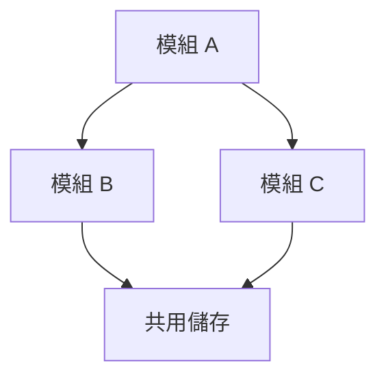
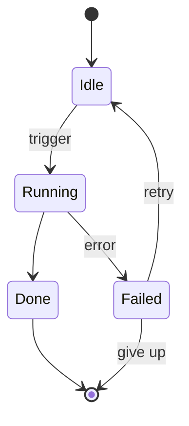
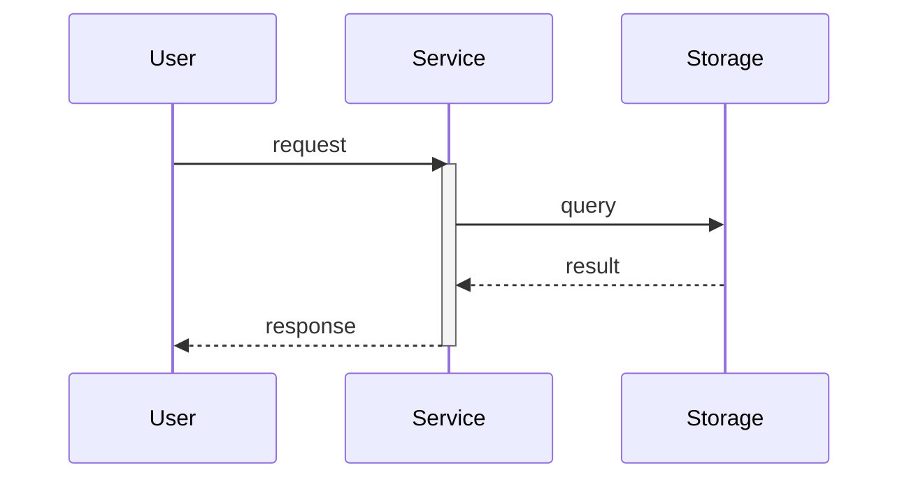

# visual.md 撰寫指引

> 進入此文件代表：上層 design flow 已決定為某份 `design.md` 建立視覺化補充（`-design-visual.md`）。**禁止** 推測性載入 — 多數小型 feature 並不需要 visual；單段功能目的加一條 user story 的 design 用純文字就夠了。
>
> visual 是本 skill 的 **第三種文件類型**，與 `design.md`（SA，純文字）和 `plan.md`（SD，SBE）並列。它跟 design 一樣面向人類，但職責純粹是視覺化：mermaid 圖 + 少量補充文字。**嚴禁** 重複 design 的敘事；**亦嚴禁** 洩漏 plan 的實作細節。

## 檔名規範簡述

- 格式：`<DIRS>[-DC.SUBNAME]-design-visual[-draft].md`（完整規範見 [name-rules_zhTW.md](name-rules_zhTW.md)）。
- 一份 `design.md` 最多對應一份 visual；**不允許** 自帶 SUBNAME / SEQUENCE —— 所有圖集中於單一檔案。
- visual **必須** 對應一份已存在或同步建立的 `<DIRS>[-DC.SUBNAME]-design.md`；孤立的 visual 檔 **嚴禁** 存在。
- `leaf` 與 `god-view` design 皆可配備 visual。**god-view design 強烈建議** 配備 visual —— 結構視覺化（模組相依、整體 data flow）正是 god-view 最需要的。

## 何時建立 visual（觸發情境）

當以下任一條件成立時建議建立 visual；皆未命中時 **嚴禁** 強制建立。

1. **模組相依**：模組 / 套件 / 元件之間有非平凡的相依鏈，純文字無法呈現結構。
2. **跨元件時序**：≥3 個元件 / 服務的請求-回應或事件時序互動。
3. **流程分支**：有明確條件分支的處理流程，文字難以描述清楚。
4. **狀態機 / 生命週期**：實體（order、session、job、connection 等）在多個狀態間轉換，含進入 / 終止 / 自迴圈 / 例外路徑。
5. **資料流 pipeline**：方向與標籤都重要的資料處理流水線。
6. **資料模型實體關係**：≥3 個實體間有外鍵或聚合關係。

對 god-view design **強烈建議** 至少呈現「模組相依」與「整體 data flow」。

## mermaid 圖類型選擇

挑對的圖；一張圖只專注一個概念。多種類型只在「各自帶來獨立洞見」時才組合使用；**嚴禁** 為了顯得完整而堆圖。

| 情境 | 圖表類型 | 使用時機 |
|---|---|---|
| 模組相依、呼叫層級 | `flowchart TD` | 套件 / 模組間相依鏈不直觀時 |
| 跨服務時序互動 | `sequenceDiagram` | ≥3 個元件之間的時序互動 |
| **狀態機 / 生命週期** | `stateDiagram-v2` | 實體在有分支的狀態間流轉、含進入 / 終止 / 自迴圈 |
| 資料庫 schema、實體關係 | `erDiagram` | 多外鍵關係的資料模型 |
| 處理 pipeline | `flowchart LR` | 方向與標籤都重要的線性處理流程 |
| 決策邏輯、分支流程 | `flowchart TD` | 文字難以說清楚的條件分支 |

## 必要輸出規格

以下規則皆為 **必須** 項，由 reviewer 與自我檢查共同驗證：

- **必須** 在文件頂部提供 `## 快速導覽`，使用 markdown link 指向每個 `##` 主章節（每張圖或主題一個章節）。
- 每個主章節 **必須** 以 `[返回開頭](#快速導覽)` 結尾。
- 任何兩個主章節之間 **必須** 插入獨立一行的 `---` 水平分隔線（放在回頂連結之後、下一個標題之前）。
- 每張 mermaid 圖 **必須** 跟著一段簡短補充文字說明該圖的重點 / 邊界 / 注意事項；**嚴禁** 只重複 design 的段落內容；**嚴禁** 為了湊圖而畫與功能無關的裝飾圖。
- Node label 使用繁體中文，identifier 維持英文；複雜系統拆成多張圖，每張圖只專注一個概念。

### mermaid 撰寫注意事項（內化規範，不引用其他 skill）

- 菱形節點 `{}` 內 **嚴禁** 放裸括號：`()` 會被 parser 當作圓角矩形 token。改用雙引號包住整段文字（例：`T1{"是否實作 X？"}`），或以 `&#40;` / `&#41;` HTML entity 取代。
- 方框 `[]` 內含雙引號：使用 `&quot;` 取代 `\"`。
- 方框 `[]` 內含 `{` / `}`：使用 `&#123;` / `&#125;`。
- 使用 `style` 為節點加底色時，**必須** 同時指定 `fill`（底色）與 `color`（文字色），確保 light / dark mode 都可讀；採同色系深淺配色（淺底色 + 同色系深色文字）。
- 直接相依用實線 `-->`，可選 / 間接關係用虛線 `-.->`。
- 圖的深度控制在 3-4 層以維持可讀性；節點 ≥6 時用 `subgraph` 分群。
- sequenceDiagram 用 `activate` / `deactivate` 與 `note` 標示關鍵行為。

## 嚴禁內容

- **嚴禁** 出現 `## User Story` / `## 系統面需求` / `## 驗收條件` / `## 前提與限制` 等屬於 design 主檔的章節 —— visual 是視覺化補充，不是平行的 SA 文件。
- **嚴禁** 出現程式語言、framework、function 簽名、API 路徑、資料結構、SBE 輸入/輸出範例等屬於 plan 的內容 —— 若使用者想看實作流程，應該讀 plan，而不是 visual。
- **嚴禁** visual 在沒有對應 `<DIRS>[-DC.SUBNAME]-design.md` 的情況下存在（前綴必須完全一致）。

## 文件模板

結構錨點（`## 快速導覽`、回頂連結、`---` 分隔線）的章節標題與順序 **嚴禁** 變更。圖章節本身依「視情況而定」原則從觸發條件挑選；以下範本呈現一個典型組合（模組相依 + 狀態機 + sequence）。

````markdown
# <DIRS>[-DC.SUBNAME] design visual

## 快速導覽

- [模組相依](#模組相依)
- [狀態機](#狀態機)
- [主要流程](#主要流程)

## 模組相依



<簡短說明：此圖呈現什麼、邊界 / 注意事項。>

[返回開頭](#快速導覽)

---

## 狀態機



<簡短說明：狀態定義、進入 / 終止條件、自迴圈、retry 與例外路徑。>

[返回開頭](#快速導覽)

---

## 主要流程



<簡短說明:時序、活躍區段、可選 vs 必經路徑。>

[返回開頭](#快速導覽)
````

## 完成檢查

- [ ] `check.py` 對 visual 檔回報 `[PASS-NAME]` + `[PASS-METADATA]` + `[PASS-VISUAL]`。
- [ ] 對應的 `<DIRS>[-DC.SUBNAME]-design.md` 已存在（visual 嚴禁孤立）。
- [ ] `## 快速導覽` 存在，並涵蓋所有主章節。
- [ ] 每個主章節結尾有 `[返回開頭](#快速導覽)`。
- [ ] 每個主章節之間有獨立一行的 `---` 分隔線。
- [ ] visual 內無 design 層級內容（`## User Story` / `## 系統面需求` / `## 驗收條件` / `## 前提與限制`）。
- [ ] visual 內無 plan 層級內容（程式語言、function 簽名、API 路徑、SBE 範例）。
- [ ] 每張 mermaid 圖都附有文字補充說明，非單純重複 design 段落。
- [ ] Node label 為繁體中文、identifier 維持英文。
- [ ] 若交付前仍為 `*-design-visual-draft.md`，已 rename 移除 `-draft` 後綴。
